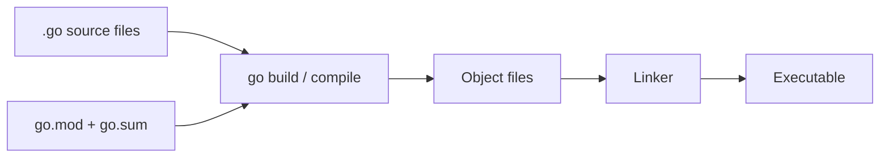

# Module 1 — Go Fundamentals & Tooling

## TL;DR

Go is a statically typed, compiled language designed for simplicity, fast builds, and first-class concurrency. Master the `go` toolchain (`mod`, `build`, `test`, `vet`, `fmt`) and project layout (`cmd/`, `internal/`, `pkg/`) before writing application code.

## Concept

Go prioritizes readability and explicitness over clever abstractions. A typical project uses **Go Modules** (`go.mod`) for dependency management, replacing the legacy GOPATH workspace. The standard layout separates entry points (`cmd/`), private code (`internal/`), and optionally reusable packages (`pkg/`).

Key toolchain commands:

| Command | Purpose |
|---------|---------|
| `go mod init` | Initialize a module |
| `go build` | Compile binary |
| `go run` | Compile and run |
| `go test` | Run tests |
| `go vet` | Static analysis for suspicious constructs |
| `gofmt` / `goimports` | Format code and manage imports |

## How It Really Works (Internals)



- **Compilation**: Go compiles quickly because it has no templates/macros and uses a simple dependency graph.
- **go.mod**: Declares module path and minimum Go version; `go.sum` stores cryptographic checksums of dependencies.
- **Vendoring**: `go mod vendor` copies dependencies into `vendor/` for reproducible offline builds.
- **internal/**: The compiler enforces that packages under `internal/` can only be imported by code within the parent tree.

## Why / When / Trade-offs

- **Go Modules vs GOPATH**: Modules provide per-project dependency isolation; GOPATH was a single global workspace — use modules always for new projects.
- **Standard layout**: Not enforced by the compiler, but widely adopted — helps onboarding and tooling.
- **gofmt**: Non-negotiable in teams — eliminates style debates.
- **go vet**: Catches printf mismatches, unreachable code, suspicious struct tags — run in CI.

## Worked Scenario

You're bootstrapping a payment microservice:

```
payment-service/
├── cmd/
│   └── server/
│       └── main.go          # entry point only
├── internal/
│   ├── handler/             # HTTP handlers
│   ├── service/             # business logic
│   └── repository/          # data access
├── go.mod
└── go.sum
```

`main.go` wires dependencies; nothing in `internal/` is importable by other modules.

## Gotchas & Failure Modes

- Importing `internal/` packages from outside the module tree — compile error.
- Forgetting `go mod tidy` after adding/removing imports — bloated `go.sum` or missing deps.
- Committing binaries — add `bin/` to `.gitignore`.
- Using `GOPATH` mode accidentally (`GO111MODULE=off`) — always use modules.

## Interview Q&A

**Q: How do Go modules differ from GOPATH?**
A: GOPATH was a single workspace where all code lived under `$GOPATH/src`. Go Modules (since 1.11, default 1.16+) give each project its own `go.mod` with explicit versioned dependencies, enabling reproducible builds anywhere on disk.
↳ How do you handle a private module dependency? Use `GOPRIVATE` env var and configure git credentials or a module proxy.

**Q: How do you handle versioning in Go modules?**
A: Semantic import versioning — v2+ requires `/v2` suffix in module path. Use git tags (`v1.2.3`) for releases; `go get module@v1.2.3` pins versions.

**Q: What is the purpose of `go vet`?**
A: Static analysis that catches bugs `go build` misses: printf format mismatches, struct tags, copy locks, unreachable code.

## Verify

```bash
cd labs/00-setup
go run ./hello
go version
go env GOMOD
```

## Further Reading

- [Effective Go](https://go.dev/doc/effective_go)
- [Go Modules Reference](https://go.dev/ref/mod)
- [Standard Go Project Layout](https://github.com/golang-standards/project-layout)
