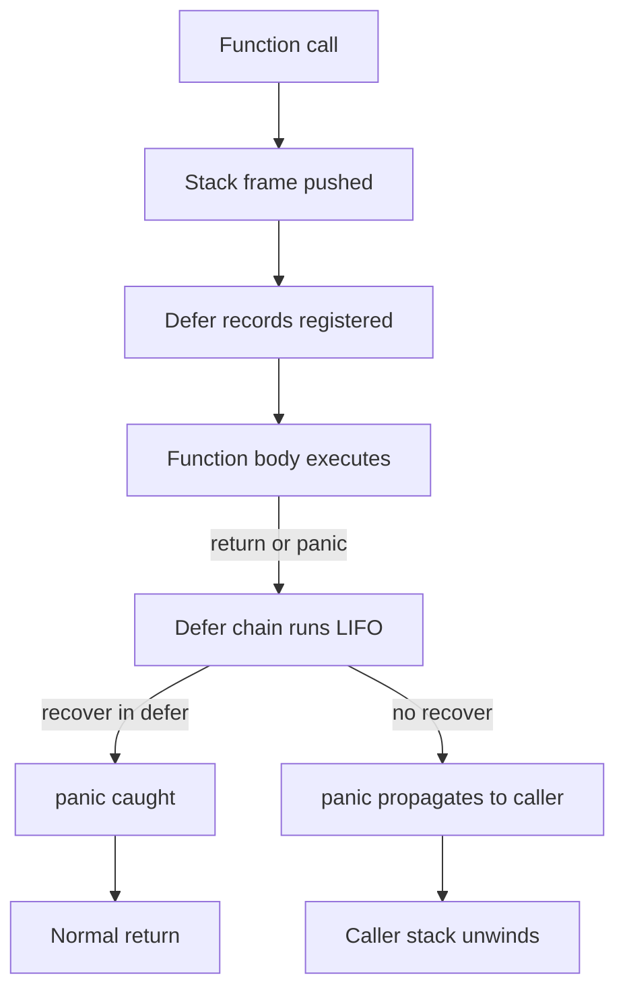

# Module 3 — Functions, Methods & defer/panic/recover

## TL;DR

Go functions are first-class values: they support variadics, closures over lexical scope, and higher-order patterns (callbacks, decorators, functional options). Methods attach behavior to named types via value or pointer receivers. Use `defer` for scoped cleanup, reserve `panic`/`recover` for truly unrecoverable invariants or HTTP middleware boundaries — never for normal control flow.

## Concept

**Variadic functions** accept zero or more trailing arguments of the same type, packed into a slice inside the function:

```go
func sum(nums ...int) int {
    total := 0
    for _, n := range nums {
        total += n
    }
    return total
}
// sum(1, 2, 3)  or  sum(slice...)
```

**Closures** capture variables from enclosing scope by reference — the loop-variable capture bug is a classic interview trap:

```go
funcs := make([]func(), 3)
for i := 0; i < 3; i++ {
    i := i // shadow to capture per-iteration value
    funcs[i] = func() { fmt.Println(i) }
}
```

**Methods** are functions with a receiver `(t T)` or `(t *T)`. Pointer receivers are required when the method mutates state, when the receiver is large, or for consistency across a type's method set.

**defer / panic / recover**: `defer` schedules LIFO cleanup at function return. `panic` unwinds the stack; `recover` only works inside a deferred function during that unwind.

## How It Really Works (Internals)



| Mechanism | Runtime behavior |
|-----------|------------------|
| Closure | Heap-allocated struct holding captured vars + function pointer |
| Method call | Compiler rewrites `v.M()` → `T.M(v)`; interface calls use itab dispatch |
| `defer` | Arguments evaluated immediately; call deferred until return |
| `panic` | Stops normal execution; runs defers; prints stack if uncaught |

Method sets determine interface satisfaction: value type `T` gets methods with value receivers; `*T` gets both value and pointer receiver methods.

## Why / When / Trade-offs

- **Variadics**: Clean APIs (`fmt.Println`, `append`) — but lose compile-time arity checking; prefer explicit structs for many optional params.
- **Closures**: Enable functional options, middleware, test fixtures — watch for accidental capture and goroutine leaks.
- **Value vs pointer receiver**: Value = copy on each call (immutable semantics, small structs); pointer = shared mutation, avoids copy, required for `sync.Mutex` embedded in struct.
- **defer**: Excellent for `Close()`, unlock, trace spans — has small overhead; don't defer in tight hot loops.
- **panic/recover**: Idiomatic only at package boundaries (e.g., `net/http` recovers per handler). Libraries should return `error`.

## Worked Scenario

A retry decorator with functional options and deferred metrics:

```go
type RetryConfig struct {
    MaxAttempts int
    Backoff     time.Duration
}

type RetryOption func(*RetryConfig)

func WithMaxAttempts(n int) RetryOption {
    return func(c *RetryConfig) { c.MaxAttempts = n }
}

func WithBackoff(d time.Duration) RetryOption {
    return func(c *RetryConfig) { c.Backoff = d }
}

func Retry(ctx context.Context, opts ...RetryOption) func(func() error) error {
    cfg := RetryConfig{MaxAttempts: 3, Backoff: 100 * time.Millisecond}
    for _, o := range opts {
        o(&cfg)
    }
    return func(op func() error) error {
        var err error
        defer func(start time.Time) {
            metrics.Record("retry.duration", time.Since(start), err)
        }(time.Now())

        for attempt := 1; attempt <= cfg.MaxAttempts; attempt++ {
            if err = op(); err == nil {
                return nil
            }
            select {
            case <-ctx.Done():
                return ctx.Err()
            case <-time.After(cfg.Backoff):
            }
        }
        return fmt.Errorf("after %d attempts: %w", cfg.MaxAttempts, err)
    }
}

type Ledger struct{ balance int }

func (l *Ledger) Deposit(amount int) { l.balance += amount }
func (l Ledger) Balance() int         { return l.balance } // value receiver: read-only
```

HTTP middleware recovering panics:

```go
func recoverMiddleware(next http.Handler) http.Handler {
    return http.HandlerFunc(func(w http.ResponseWriter, r *http.Request) {
        defer func() {
            if v := recover(); v != nil {
                log.Printf("panic: %v\n%s", v, debug.Stack())
                http.Error(w, "internal error", http.StatusInternalServerError)
            }
        }()
        next.ServeHTTP(w, r)
    })
}
```

## Gotchas & Failure Modes

- **Loop variable capture** in closures spawned inside `for` loops (fixed in Go 1.22+ per-iteration semantics, but know the history).
- **defer in loops** accumulates all defers until function exit — can exhaust file descriptors.
- **defer argument evaluation**: `defer f(i)` captures `i` at defer registration, not at execution.
- **Nil pointer receiver**: `(*T)(nil).Method()` panics if method dereferences receiver.
- **recover outside defer** has no effect.
- **Swallowing panics** without logging loses critical production signals.

## Interview Q&A

**Q: When should you use a pointer receiver vs a value receiver?**
A: Pointer when mutating receiver state, when receiver is large, when type contains `sync.Mutex` or similar non-copyable fields, or when consistency demands all methods on `*T`. Value when type is small immutable value (e.g., `time.Time`-like) and methods are read-only.
↳ Does a value receiver method satisfy an interface requiring mutation? No — if the interface needs mutation, you need pointer receiver and a `*T` value to call through.

**Q: What happens when you defer a function that closes over variables?**
A: Deferred calls run at function return in LIFO order. Arguments to the deferred function are evaluated immediately at the `defer` statement; only the call is delayed.
↳ What's wrong with `defer os.Remove(f.Name())` before checking `f` creation error? `f` may be nil — defer still evaluates `f.Name()` and panics.

**Q: When is panic/recover appropriate?**
A: Rarely — package init failures, impossible internal invariants, or framework boundaries (HTTP servers, template engines). Application code should return errors.
↳ Can you recover from panic in a different goroutine? No — `recover` only catches panics unwinding the same goroutine's stack.

**Q: How do variadic functions interact with slices?**
A: `fn(slice...)` expands a slice into variadic args. Inside the function, the parameter is a `[]T` — modifying it does not affect the caller's slice unless you mutate shared backing array elements.

## Verify

```bash
cd labs/01-basics
go run ./functions
go test ./... -run TestClosure -v
go test ./... -run TestDefer -v
```

## Further Reading

- [Go Spec — Function declarations](https://go.dev/ref/spec#Function_declarations)
- [Defer, Panic, and Recover](https://go.dev/blog/defer-panic-and-recover)
- [Go Wiki — MethodSets](https://go.dev/ref/spec#Method_sets)
