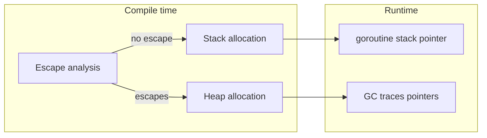

# Module 4 — Pointers & Value Semantics

## TL;DR

Go is pass-by-value for everything — including pointers (the pointer value is copied). Use pointers to mutate caller state, avoid large copies, or share mutable data. The compiler's **escape analysis** decides stack vs heap allocation; you cannot rely on `new` vs `&` syntax for placement. Understand value semantics before interfaces, slices, and concurrency.

## Concept

```go
func swap(a, b *int) {
    *a, *b = *b, *a
}

type Config struct {
    Timeout time.Duration
}

func apply(cfg *Config) {
    cfg.Timeout *= 2 // mutates caller's struct through pointer
}
```

| Operation | Meaning |
|-----------|---------|
| `&x` | Address of `x` (if addressable) |
| `*p` | Dereference `p` |
| `new(T)` | Allocate zeroed `T`, return `*T` — equivalent to `new(T)` ≈ local + `&` |
| `nil` pointer | Zero value; dereferencing panics |

**Value semantics**: assignment and function calls copy the bits. For a struct, the entire struct copies. For a slice, the 24-byte header copies but shares the backing array. For a pointer, the address copies — both copies alias the same heap object.

**Stack vs heap**: Goroutine stacks start small (~2 KB) and grow dynamically. Heap objects are GC-managed. Escape analysis marks values that outlive their declaring scope (returned pointers, captured by closures, sent to channels, interface assignments of concrete pointers).

## How It Really Works (Internals)



Inspect escapes:

```bash
go build -gcflags="-m -m" ./...
```

Common escape triggers:

| Pattern | Typical outcome |
|---------|-----------------|
| `return &local` | Escapes to heap |
| `fmt.Println(local)` | Often escapes (interface arg) |
| Closure captures `&x` | Escapes |
| Slice/map with pointer elements | Elements may escape |
| Large struct returned by value | May stay on stack |

Go has no `malloc`/`free`. The GC is concurrent tri-color mark-and-sweep with write barriers — pointer writes matter for GC correctness (why `unsafe` is dangerous).

## Why / When / Trade-offs

- **Pointer receivers**: Mutate in place; avoid copying large structs (threshold ~ few hundred bytes is a rule of thumb, profile for hot paths).
- **Pointer fields**: Shared ownership — no deep copy on assignment; aliasing bugs possible.
- **Value types**: Safer concurrency for small immutable data; copies are predictable.
- **Nil pointers**: Represent optional/missing — idiomatic with `if p != nil`.
- **Trade-off**: More pointers = more GC pressure and aliasing; fewer pointers = more copying.

## Worked Scenario

Optional configuration with pointer fields (distinguish zero from unset):

```go
type ServerConfig struct {
    Port        int
    ReadTimeout *time.Duration // nil = use default
}

func (c ServerConfig) readTimeout() time.Duration {
    if c.ReadTimeout != nil {
        return *c.ReadTimeout
    }
    return 30 * time.Second
}

func growSlice(s []int) []int {
    s = append(s, 99) // may reallocate; caller's slice var unchanged unless returned
    return s
}

func mutateSlice(s []int) {
    if len(s) > 0 {
        s[0] = 99 // mutates shared backing array — caller sees change
    }
}
```

Escape analysis example:

```go
// Escapes: returned pointer outlives function
func newUser(name string) *User {
    u := User{Name: name}
    return &u
}

// Does not escape: pointer stays local
func printUser(u *User) {
    fmt.Println(u.Name)
}
```

## Gotchas & Failure Modes

- **Nil pointer dereference** — #1 production panic; always guard or use zero-value constructors.
- **Taking address of map element** — not allowed (elements may move during growth).
- **Taking address of range variable** — classic bug; `for _, v := range items { go func() { use(&v) }() }` — all goroutines see last `v`.
- **Pointer equality vs value equality**: Two different allocations with same content are not `==`.
- **Assuming `new` means heap**: Allocation site is escape analysis, not syntax.
- **Copying structs with `sync.Mutex`**: Mutex must not be copied after first use — use pointer receivers and embed carefully.

## Interview Q&A

**Q: Is Go pass-by-reference or pass-by-value?**
A: Always pass-by-value. Pointers are values (memory addresses) copied at call time. Mutations through a pointer affect shared heap data.
↳ So slices are pass-by-reference? No — the slice header (ptr, len, cap) is copied; it points to a shared backing array. Mutating elements is visible; `append` that reallocates is not.

**Q: How does escape analysis work and why should you care?**
A: The compiler decides whether a variable can live on the stack (cheap, freed on return) or must move to the heap (GC overhead). Care for hot-path allocations and when reviewing `go build -gcflags=-m` output in performance work.
↳ Does returning a pointer to a local always heap-allocate? Yes, in practice — the local escapes.

**Q: When would you use `new(T)` vs `&T{}`?**
A: Nearly interchangeable. `&T{}` allows non-zero initialization. `new(T)` returns `*T` zero value. Style: prefer `&T{}` or constructors.
↳ What about `make`? `make` only applies to slices, maps, and channels — not general allocation.

**Q: What's the difference between stack and goroutine stack growth?**
A: Each goroutine has its own stack that starts small and grows/shrinks dynamically (copied to larger arenas). This differs from fixed thread stacks (often 1–8 MB) in OS threads.

## Verify

```bash
cd labs/01-basics
go run ./pointers
go build -gcflags="-m" ./pointers
go test ./... -run TestPointer -v
```

## Further Reading

- [Go FAQ — Pointers](https://go.dev/doc/faq#Pointers)
- [Go Blog — Escape Analysis](https://go.dev/blog/escape-analysis)
- [Go Spec — Address operators](https://go.dev/ref/spec#Address_operators)
