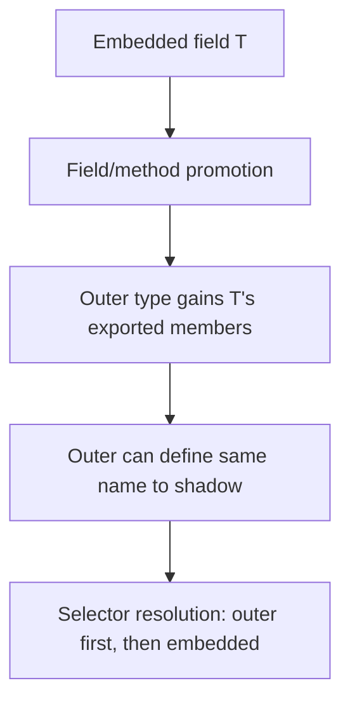

# Module 5 — Structs & Composition

## TL;DR

Structs group named fields with optional **struct tags** for serialization and validation. Go favors **composition over inheritance** via embedding: promoted fields and methods enable mixin-style reuse without subclassing. Prefer named struct types over anonymous structs for APIs; use anonymous structs for tests and one-off table-driven cases.

## Concept

```go
type User struct {
    ID        int64     `json:"id" db:"user_id"`
    Email     string    `json:"email" validate:"required,email"`
    CreatedAt time.Time `json:"created_at"`
}
```

**Struct tags** are string metadata on fields, interpreted at runtime via reflection (`encoding/json`, ORMs, validators). Tags are not enforced by the compiler.

**Embedding** (anonymous fields):

```go
type Logger struct{}

func (Logger) Log(msg string) { fmt.Println(msg) }

type Service struct {
    Logger // embedded — promotes Log method
    repo   Repository
}

func (s *Service) Run() {
    s.Log("starting") // promoted call
}
```

**Named vs anonymous structs**:

```go
// Named — reusable, documentable
type Point struct{ X, Y float64 }

// Anonymous — local, ad hoc
filter := struct {
    MinAge int
    Active bool
}{MinAge: 18, Active: true}
```

## How It Really Works (Internals)



| Composition pattern | Mechanism |
|---------------------|-----------|
| Embedding struct | Anonymous field; inner type's fields promoted |
| Embedding interface | Outer satisfies interface if inner methods implemented |
| Field shadowing | Outer field with same name hides embedded |
| Method promotion | Embedded methods callable on outer type |
| `json.Marshal` | Reflects tags; omitempty skips zero values |

Embedding is **not inheritance** — no substitutability hierarchy, no virtual dispatch chain. The outer type is a distinct type; embedding is syntactic sugar for delegation.

Memory layout: fields laid out sequentially with alignment padding. Embedded field occupies one field slot in the struct layout.

## Why / When / Trade-offs

- **Struct tags**: Decouple wire format from Go field names — essential for APIs and DB mapping.
- **Embedding vs named field**: Embed for "is-a-part-of" mixin (logging, mutex); named field for "has-a" when API should be explicit (`s.logger.Info()`).
- **Embedding `sync.Mutex`**: Idiomatic in private structs; must use pointer receivers and never copy the struct.
- **Anonymous structs**: Great for test tables; avoid in public package APIs.
- **Trade-off**: Promotion can create surprising API surface — embedding too many types obscures origin of methods.

## Worked Scenario

HTTP handler embedding middleware context:

```go
type BaseHandler struct {
    log *slog.Logger
}

func (h *BaseHandler) writeJSON(w http.ResponseWriter, status int, v any) {
    w.Header().Set("Content-Type", "application/json")
    w.WriteHeader(status)
    if err := json.NewEncoder(w).Encode(v); err != nil {
        h.log.Error("encode response", "err", err)
    }
}

type UserHandler struct {
    *BaseHandler // embed pointer — promotes writeJSON
    store UserStore
}

func (h *UserHandler) GetUser(w http.ResponseWriter, r *http.Request) {
    id := r.PathValue("id")
    u, err := h.store.Find(r.Context(), id)
    if err != nil {
        http.Error(w, err.Error(), http.StatusNotFound)
        return
    }
    h.writeJSON(w, http.StatusOK, u)
}
```

Embedding interface for optional behavior:

```go
type Validator interface {
    Validate() error
}

type Request struct {
    Validator // zero value nil — must check before calling
    Payload   []byte
}

func process(r Request) error {
    if v, ok := r.Validator.(interface{ Validate() error }); ok && v != nil {
        if err := v.Validate(); err != nil {
            return err
        }
    }
    return nil
}
```

## Gotchas & Failure Modes

- **Embedding nil pointer** — promoted methods panic on nil receiver.
- **Copied struct with embedded mutex** — `sync.Mutex` copied = undefined behavior.
- **JSON omitempty on slices/maps**: `nil` and empty both omitted — sometimes you need `[]T{}` explicitly.
- **Tag typos** silently ignored by `encoding/json` — use linters (`tagalign`, custom vet checks).
- **Field shadowing** hides embedded fields — `Outer.Inner` still accessible explicitly.
- **Comparable structs**: only if all fields comparable — no slices, maps, or funcs inside.

## Interview Q&A

**Q: How does embedding differ from inheritance?**
A: Embedding promotes fields/methods for convenience but creates no subtype relationship. `*Dog` embedding `Animal` doesn't make `Dog` an `Animal` in a type hierarchy — it's composition with syntactic sugar.
↳ Can you override an embedded method? You can define a method on the outer type with the same name — it shadows the promoted method for external calls through the outer type.

**Q: How do struct tags work?**
A: String literals after field types, parsed at runtime via reflection. `encoding/json` reads `json:"name,omitempty"` to control marshaling. No compile-time validation unless you use tools.
↳ What's the cost of reflection-based marshaling? Higher than codegen (e.g., `easyjson`, `protobuf`) — relevant for hot paths.

**Q: When should you embed vs use a named field?**
A: Embed for mixin behavior you want promoted (mutex, logging helpers). Use named fields when the relationship should be explicit in the API or you want to avoid method namespace pollution.
↳ Is embedding an interface idiomatic? Occasionally — for optional plugin-style behavior, but nil embedded interface is a footgun.

**Q: Are struct comparisons deep?**
A: `==` compares fields recursively for comparable structs. Slices, maps, and functions inside make the struct non-comparable (compile error).

## Verify

```bash
cd labs/03-interfaces
go run ./structs
go test ./... -run TestEmbedding -v
go test ./... -run TestStructTags -v
```

## Further Reading

- [Effective Go — Structs](https://go.dev/doc/effective_go#structs)
- [Go Spec — Struct types](https://go.dev/ref/spec#Struct_types)
- [Go Blog — Laws of Reflection](https://go.dev/blog/laws-of-reflection)
