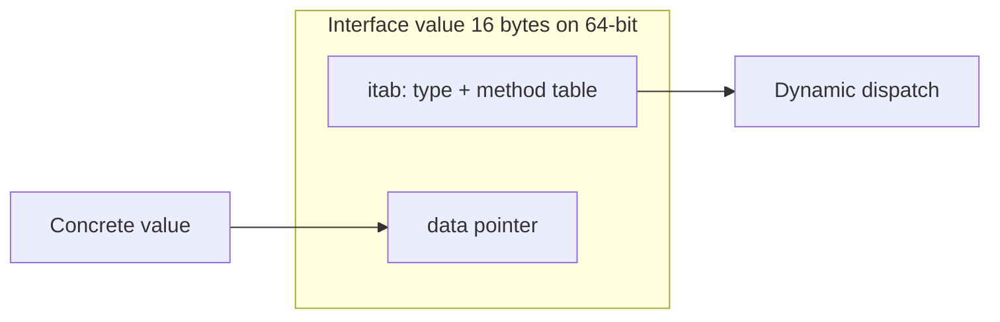

# Module 6 — Interfaces & Polymorphism

## TL;DR

Interfaces are **implicitly satisfied** — no `implements` keyword. A value of interface type holds `(type, data)` — the **nil interface trap** catches many seniors. Use type assertions and type switches for concrete recovery; design small interfaces at consumer side. Empty interface `any` is the union of all types.

## Concept

```go
type Reader interface {
    Read(p []byte) (n int, err error)
}

// *File satisfies Reader without declaration
func drain(r Reader) error {
    _, err := io.Copy(io.Discard, r)
    return err
}
```

**Interface value internals**:

```go
var r Reader        // nil interface: (nil, nil)
var f *os.File      // nil pointer
var r2 Reader = f   // non-nil interface containing nil pointer: ( *os.File, nil )
// r2 == nil is FALSE — classic trap
```

**Type assertion**:

```go
v, ok := w.(http.ResponseWriter)
if !ok { /* handle */ }

switch x := v.(type) {
case *bytes.Buffer:
    return x.Len()
case string:
    return len(x)
default:
    return 0
}
```

## How It Really Works (Internals)



| Interface kind | Representation |
|----------------|----------------|
| Non-empty interface | itab + data word |
| `any` / empty interface | eface: `_type` + data word |
| Nil interface | both words nil |
| Typed nil in interface | type word set, data word nil |

**Implicit satisfaction**: Compiler verifies method set at assignment/return. Method set of `T` excludes pointer-receiver methods; `*T` includes both.

**Dispatch**: Direct calls are statically resolved; interface calls jump through itab function pointers — small but non-zero cost.

## Why / When / Trade-offs

- **Small interfaces** (`io.Reader`, `io.Writer`) — compose at call site; accept interfaces, return structs.
- **Consumer-defined interfaces**: `package` defines `Store` with only methods it needs — avoids god interfaces.
- **any**: Escape hatch for generics-era `map[string]any` JSON — prefer concrete types or generics when shape is known.
- **Trade-offs**: Interface abstraction prevents inlining; excessive interfaces obscure data flow. Don't interface everything preemptively.

## Worked Scenario

Storage abstraction with type-safe recovery:

```go
type Event struct {
    ID   string
    Kind string
}

type EventStore interface {
    Save(ctx context.Context, e Event) error
    Load(ctx context.Context, id string) (Event, error)
}

type memoryStore struct {
    mu   sync.RWMutex
    data map[string]Event
}

func NewMemoryStore() EventStore {
    return &memoryStore{data: make(map[string]Event)}
}

func (m *memoryStore) Save(ctx context.Context, e Event) error {
    m.mu.Lock()
    defer m.mu.Unlock()
    m.data[e.ID] = e
    return nil
}

func (m *memoryStore) Load(ctx context.Context, id string) (Event, error) {
    m.mu.RLock()
    defer m.mu.RUnlock()
    e, ok := m.data[id]
    if !ok {
        return Event{}, fmt.Errorf("event %q: %w", id, ErrNotFound)
    }
    return e, nil
}

// Type assertion for optional capability
type Pinger interface {
    Ping(ctx context.Context) error
}

func healthCheck(store EventStore) error {
    if p, ok := store.(Pinger); ok {
        return p.Ping(context.Background())
    }
    return nil
}
```

Nil interface guard:

```go
func describe(r Reader) string {
    if r == nil {
        return "nil interface"
    }
    // r may still hold typed nil — use reflection or avoid storing typed nils
    v := reflect.ValueOf(r)
    if v.Kind() == reflect.Pointer && v.IsNil() {
        return "typed nil pointer in interface"
    }
    return fmt.Sprintf("%T", r)
}
```

## Gotchas & Failure Modes

- **Typed nil in interface** breaks `if x == nil` checks.
- **Returning concrete nil pointer as interface** — always return `nil` interface explicitly or return concrete type.
- **Pointer vs value satisfaction** — `var _ http.Handler = MyHandler{}` fails if `ServeHTTP` has pointer receiver.
- **Large interfaces** — hard to mock, violate ISP; split them.
- **Type assertion without `ok`** panics on mismatch.
- **Comparing interfaces** — dynamic types must be identical and comparable; panics if dynamic type is not comparable.

## Interview Q&A

**Q: Explain the nil interface trap.**
A: An interface is nil only when both type and data words are nil. Assigning a typed nil pointer (`var f *File; var r Reader = f`) yields a non-nil interface `( *File, nil )` that will panic on method call.
↳ How do you prevent it? Return `nil` interface from functions, not typed nil pointers; or check with reflection in defensive code.

**Q: Why are Go interfaces implicit?**
A: Decoupling — implementations don't depend on interface packages (no import cycles). Interfaces are satisfied accidentally when useful, enabling duck typing with compile-time checks.
↳ What's the downside? You can't tell from the implementing type's source which interfaces it satisfies — documentation and compiler assignment checks only.

**Q: When do you use type assertion vs type switch?**
A: Assertion for single known type recovery. Switch for multiple concrete types in generic handlers (JSON decode hooks, fmt.Stringer chains).
↳ What's the performance cost of interface calls? One indirect jump through itab; usually negligible unless proven hot by profiling.

**Q: How do generics change interface design?**
A: Generics handle type-parametric algorithms (`slices.Sort`); interfaces still model runtime polymorphism and IO boundaries. Prefer generics for compile-time type sets; interfaces for behavior contracts across packages.

## Verify

```bash
cd labs/03-interfaces
go run ./polymorphism
go test ./... -run TestInterface -v
go test ./... -run TestNilInterface -v
```

## Further Reading

- [Effective Go — Interfaces](https://go.dev/doc/effective_go#interfaces)
- [Go FAQ — Nil interface values](https://go.dev/doc/faq#nil_error)
- [Go Data Structures — Interfaces](https://research.swtch.com/interfaces)
