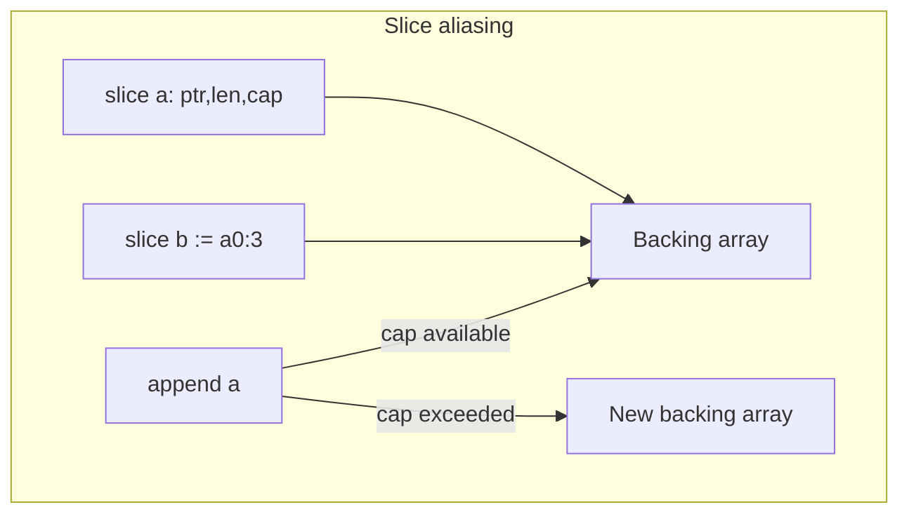

# Module 7 — Slices & Maps Internals

## TL;DR

A slice is a **header** (pointer, len, cap) over a backing array — not a dynamic array by itself. `append` may reallocate, leaving other subslices aliasing stale memory. Maps are hash tables with randomized iteration, not thread-safe, and have subtle `nil` vs empty semantics. Master aliasing before writing concurrent or API code.

## Concept

```go
s := make([]int, 0, 10) // len 0, cap 10
s = append(s, 1, 2, 3)

m := make(map[string]int)
m["go"] = 1
v, ok := m["go"] // ok false if missing
```

**Slice header** (conceptually):

```go
type slice struct {
    ptr *T
    len int
    cap int
}
```

**Map**: reference type; `nil` map panics on write; read returns zero value.

## How It Really Works (Internals)



| Operation | Complexity | Notes |
|-----------|------------|-------|
| `s[i]` | O(1) | Bounds checked |
| `append` | O(1) amortized | Realloc ~2x growth |
| `copy(dst, src)` | O(min(len)) | Does not append |
| `m[k] = v` | O(1) avg | Hash + probe |
| `delete(m, k)` | O(1) avg | Lazy deletion |
| `range map` | O(n) | Random order |

**append algorithm**: If `len < cap`, write at `ptr+len`, increment len. Else allocate new array (typically 2× cap for small slices), copy, append. Other slices sharing old array remain unchanged.

**Map internals**: Bucket-based hash table (see `runtime/map.go`). Load factor triggers growth. Iteration order randomized per map instance. Keys must be comparable.

**Memory**: `make([]T, n, c)` allocates backing array once. `make(map[K]V, hint)` preallocates buckets.

## Why / When / Trade-offs

- **Slices over arrays** for APIs — arrays are rare (`[N]byte` for crypto).
- **Preallocate** with known size: `make([]T, 0, n)` avoids repeated realloc.
- **Subslicing** for zero-copy views — dangerous if underlying data mutates unexpectedly.
- **Maps** for fast lookups — not ordered; use `slices.Sort` on keys for deterministic iteration.
- **sync.Map** / sharded maps for concurrent read-heavy caches — not a drop-in replacement.

## Worked Scenario

Append pitfall and safe patterns:

```go
func appendBug() {
    base := []int{1, 2, 3}
    sub := base[0:2]        // shares backing array
    base = append(base, 99) // may write into shared array if cap allows
    // sub may now be [1, 99] unexpectedly
}

func safeClone(in []int) []int {
    out := make([]int, len(in))
    copy(out, in)
    return out
}

func filter(in []int, pred func(int) bool) []int {
    out := in[:0] // reuse backing array if caller owns in
    for _, v := range in {
        if pred(v) {
            out = append(out, v)
        }
    }
    return out
}
```

Map as set and counting:

```go
type Set[T comparable] map[T]struct{}

func (s Set[T]) Add(v T) { s[v] = struct{}{} }

func wordFreq(words []string) map[string]int {
    freq := make(map[string]int, len(words))
    for _, w := range words {
        freq[w]++
    }
    return freq
}
```

Full slice expression (cap limit):

```go
data := make([]byte, 10)
view := data[2:5:5] // len 3, cap 3 — append won't clobber data[5:]
```

## Gotchas & Failure Modes

- **append reassignment**: Always `s = append(s, x)` — `append` may return new header.
- **Shared backing array** after subslicing + append.
- **Nil slice JSON** → `null`; empty slice `[]T{}` → `[]`.
- **Slicing beyond capacity** — compile/runtime panic.
- **Map concurrent read/write** — data race; use `sync.Mutex` or `sync.Map`.
- **Ranging while deleting** — safe in Go: `delete` during `range` is defined.
- **Large map memory** — buckets don't shrink; recreate map to release.

## Interview Q&A

**Q: What's in a slice header and what happens on append?**
A: Pointer, length, capacity. Append increments len if room; otherwise allocates larger backing array, copies elements, returns new header.
↳ If two slices share a backing array and one appends within cap, what happens? Both see the new element — shared mutation.

**Q: How do maps work internally?**
A: Hash table with buckets, overflow chains, incremental growth. Hash seed randomizes iteration. O(1) average insert/lookup/delete.
↳ Can map keys be slices? No — keys must be comparable; slices are not.

**Q: nil slice vs empty slice?**
A: Both `len == 0`. `nil` has no backing array; `make([]T, 0)` has allocated zero-length array (still non-nil header). Matter for JSON, DB NULL, and some APIs.
↳ Is a nil map the same as empty map? For reads, yes (zero value). Writes to nil map panic; empty map `make(map[K]V)` is writable.

**Q: How do you avoid append aliasing bugs?**
A: `copy` to new slice, use full slice expression `s[low:high:max]`, or document ownership transfer. In APIs, return new slices rather than subslicing internal buffers.

## Verify

```bash
cd labs/02-slices-maps
go run ./slices
go run ./maps
go test ./... -run TestAppend -v
go test ./... -run TestMap -v
```

## Further Reading

- [Go Slices: usage and internals](https://go.dev/blog/slices-intro)
- [Go Maps in Action](https://go.dev/blog/maps)
- [runtime/map.go](https://go.dev/src/runtime/map.go)
