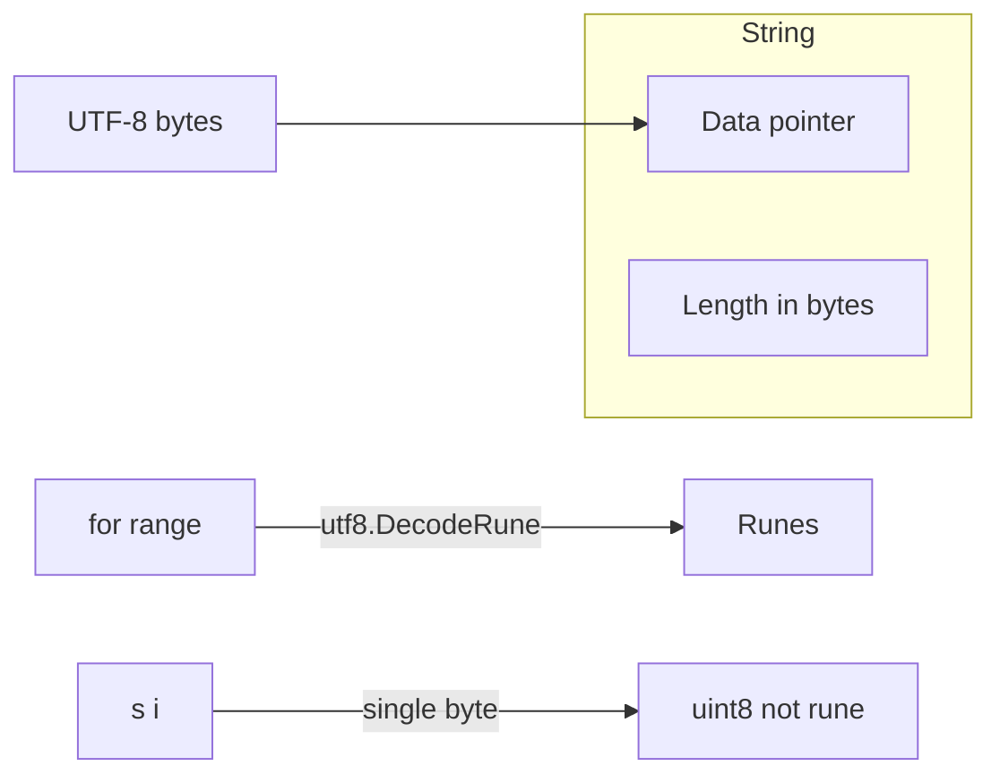

# Module 8 — Strings, Runes & Encoding

## TL;DR

Go strings are **immutable UTF-8 byte sequences** — not arrays of characters. Indexing `s[i]` yields a byte, not a rune. Use `range` over strings for runes, `[]byte` for wire/binary I/O, `[]rune` for character-level editing. Invalid UTF-8 is allowed but functions like `range` and `utf8.DecodeRune` handle replacement semantics.

## Concept

```go
s := "Hello, 世界" // UTF-8 encoded
fmt.Println(len(s))        // bytes, not runes
fmt.Println(utf8.RuneCountInString(s))

for i, r := range s {
    fmt.Printf("%d: %c (%U)\n", i, r, r) // i is byte offset
}
```

| Type | Role |
|------|------|
| `string` | Immutable UTF-8 text |
| `byte` (`uint8`) | Raw octet |
| `rune` (`int32`) | Unicode code point |
| `[]byte` | Mutable byte slice — convert without copy via `unsafe` only in hot paths |
| `[]rune` | Mutable code point slice — one rune per element, 4 bytes each |

**Conversion**:

```go
b := []byte(s)     // allocates copy
s2 := string(b)    // allocates copy
rs := []rune(s)    // decodes UTF-8 to runes
s3 := string(rs)   // encodes back to UTF-8
```

## How It Really Works (Internals)



| Encoding | Properties |
|----------|------------|
| UTF-8 | Variable width 1–4 bytes; ASCII compatible |
| `range` on string | Decodes UTF-8; returns byte index, rune value |
| Invalid UTF-8 | `range` yields U+FFFD; `utf8.ValidString` checks |

**Immutability**: String headers can share backing bytes (substring shares array). Mutating `[]byte(s)` copy is safe; casting mutated `[]byte` to `string` without copy requires `unsafe` and breaks immutability assumptions.

**Builder pattern**: `strings.Builder` accumulates in a `[]byte` buffer, converts to string once — O(n) vs O(n²) for `+=` in loops.

## Why / When / Trade-offs

- **Strings for text keys and messages** — immutable, comparable, hashable (map keys).
- **`[]byte` for protocols** — HTTP bodies, protobuf, crypto — mutable zero-copy reads.
- **`[]rune`** — reverse, insert at rune index, glyph counting — costs 4× memory vs UTF-8.
- **`strings.Builder` / `bytes.Buffer`** — efficient concatenation.
- **Trade-off**: Byte indexing is O(1); rune indexing is O(n) unless you build an offset table.

## Worked Scenario

Safe truncation and normalization:

```go
func truncateRunes(s string, max int) string {
    if utf8.RuneCountInString(s) <= max {
        return s
    }
    runes := []rune(s)
    return string(runes[:max]) + "…"
}

func isASCII(s string) bool {
    for i := 0; i < len(s); i++ {
        if s[i] >= utf8.RuneSelf {
            return false
        }
    }
    return true
}

func buildQuery(parts []string) string {
    var b strings.Builder
    b.Grow(len(parts) * 8)
    for i, p := range parts {
        if i > 0 {
            b.WriteByte('&')
        }
        b.WriteString(url.QueryEscape(p))
    }
    return b.String()
}
```

Byte vs rune iteration performance:

```go
// Count spaces — bytes OK for ASCII
func countASCIISpaces(s string) int {
    n := 0
    for i := 0; i < len(s); i++ {
        if s[i] == ' ' {
            n++
        }
    }
    return n
}

// Unicode-aware
func countUnicodeSpaces(s string) int {
    n := 0
    for _, r := range s {
        if unicode.IsSpace(r) {
            n++
        }
    }
    return n
}
```

## Gotchas & Failure Modes

- **`s[i]` is a byte** — splitting UTF-8 multibyte sequences corrupts strings.
- **Rune index ≠ byte index** — `s[5]` and "fifth rune" differ for non-ASCII.
- **`len([]rune(s))` allocates** — use `utf8.RuneCountInString` for count only.
- **Comparing strings** is byte-wise — normalize (NFC) for user-facing equality.
- **`range` on string copies nothing** but decoding has CPU cost.
- **Empty string vs nil**: `""` is valid; no `nil` string type.

## Interview Q&A

**Q: How are strings represented in Go?**
A: Immutable byte sequence (UTF-8 by convention). Header is pointer + length. Substrings share backing arrays.
↳ Are strings copy-on-write? No — immutability means sharing is safe; any mutation goes through `[]byte` copy.

**Q: When do you use []byte vs string vs []rune?**
A: `string` for immutable text and map keys; `[]byte` for I/O buffers and binary; `[]rune` when you need random access by character or rune-level editing.
↳ What's the cost of `[]rune(s)`? O(n) time and up to 4× memory for mostly-ASCII text.

**Q: What happens if a string contains invalid UTF-8?**
A: It's still a valid `string`. `range` replaces invalid sequences with U+FFFD. Many stdlib functions document their behavior; use `utf8.ValidString` at boundaries.
↳ Should you reject invalid UTF-8 at API boundaries? Often yes for external input — validate early.

**Q: Why is string concatenation in a loop slow?**
A: Strings are immutable — each `+=` allocates a new string and copies. Use `strings.Builder` with `Grow` estimate.
↳ How does Builder avoid extra allocations? It accumulates in internal `[]byte`, single allocation to `string` at `String()`.

## Verify

```bash
cd labs/01-basics
go run ./strings
go test ./... -run TestUTF8 -v
go test ./... -run TestRune -v
```

## Further Reading

- [Go Blog — Strings, bytes, runes and characters](https://go.dev/blog/strings)
- [Unicode UTF-8 FAQ](https://utf8everywhere.org/)
- [package utf8](https://pkg.go.dev/unicode/utf8)
