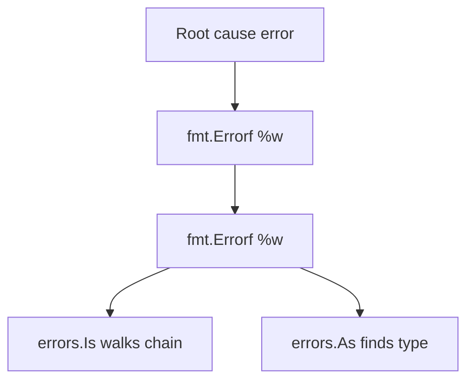

# Module 9 — Error Handling

## TL;DR

Errors are values implementing `error` (`Error() string`). Return errors explicitly — no exceptions. Use `fmt.Errorf` with `%w` to wrap errors for `errors.Is` and `errors.As` chain traversal. Define sentinel errors (`var ErrNotFound = errors.New(...)`) or custom types for domain semantics. Handle errors once at boundaries; don't log and return.

## Concept

```go
type error interface {
    Error() string
}

func loadConfig(path string) (*Config, error) {
    data, err := os.ReadFile(path)
    if err != nil {
        return nil, fmt.Errorf("load config %q: %w", path, err)
    }
    // ...
    return &cfg, nil
}
```

**Wrapping** (Go 1.13+):

```go
if errors.Is(err, os.ErrNotExist) { /* handle missing file */ }

var pathErr *os.PathError
if errors.As(err, &pathErr) { /* inspect path */ }
```

**Custom errors**:

```go
type ValidationError struct {
    Field string
    Msg   string
}

func (e *ValidationError) Error() string {
    return fmt.Sprintf("%s: %s", e.Field, e.Msg)
}
```

## How It Really Works (Internals)



| API | Purpose |
|-----|---------|
| `errors.New` / `fmt.Errorf` | Create error values |
| `%w` | Wrap with unwrap chain |
| `%v` | Format without unwrap |
| `errors.Is(err, target)` | Sentinel equality through chain |
| `errors.As(err, *Target)` | Typed error in chain |
| `errors.Unwrap` | Single-level unwrap |

Wrapped errors form a linked list via `Unwrap() error`. `Is` uses `==` and `Unwrap`; `As` assigns if `errors.As` matches type in chain.

**Nil error**: `return nil` — never return `fmt.Errorf` with nil wrap incorrectly. Interface nil trap applies: `var err *PathError = nil; return err` returns non-nil `error`.

## Why / When / Trade-offs

- **Sentinel errors** (`io.EOF`, `sql.ErrNoRows`) — simple `errors.Is` checks; avoid for errors needing context.
- **Custom types** — attach fields (HTTP status, field name); use `errors.As`.
- **Wrapping** — add context at each layer ("query user", "open db") — aids debugging without losing root cause.
- **panic vs error** — panic for programmer bugs; errors for expected failures (network, validation).
- **Trade-off**: Verbose `if err != nil` — mitigated by early return, helpers, and generics in Go 1.20+ (`cmp.Or` patterns).

## Worked Scenario

Layered service with typed errors:

```go
var (
    ErrNotFound   = errors.New("not found")
    ErrConflict   = errors.New("conflict")
)

type APIError struct {
    Code    int
    Message string
    Cause   error
}

func (e *APIError) Error() string {
    if e.Cause != nil {
        return fmt.Sprintf("%s: %v", e.Message, e.Cause)
    }
    return e.Message
}

func (e *APIError) Unwrap() error { return e.Cause }

func (r *UserRepo) Find(ctx context.Context, id string) (User, error) {
    row, err := r.db.QueryContext(ctx, "SELECT ... WHERE id = ?", id)
    if err != nil {
        return User{}, fmt.Errorf("query user %s: %w", id, err)
    }
    defer row.Close()
    if !row.Next() {
        return User{}, fmt.Errorf("user %s: %w", id, ErrNotFound)
    }
    // scan...
    return u, nil
}

func handleHTTP(w http.ResponseWriter, err error) {
    var api *APIError
    switch {
    case errors.Is(err, ErrNotFound):
        http.Error(w, "not found", http.StatusNotFound)
    case errors.As(err, &api):
        http.Error(w, api.Message, api.Code)
    default:
        log.Printf("internal: %v", err)
        http.Error(w, "internal error", http.StatusInternalServerError)
    }
}
```

Join errors (Go 1.20):

```go
err := errors.Join(validateName(u), validateEmail(u))
```

## Gotchas & Failure Modes

- **Returning typed nil pointer as error** — non-nil interface; return `nil` explicitly.
- **`%v` instead of `%w`** — breaks `Is`/`As` chain.
- **Comparing errors with `==`** on wrapped errors — fails; use `errors.Is`.
- **Log and return** — duplicates logs; log at top level or use structured wrapping.
- **Swallowing errors** — `_ = fn()` without justification.
- **Over-wrapping** — redundant messages; wrap at package boundaries with actionable context.
- **Custom error without `Unwrap`** — `As` still works on outer type; chain stops unless you implement `Unwrap`.

## Interview Q&A

**Q: How does error wrapping work in Go?**
A: `fmt.Errorf("context: %w", err)` creates an error implementing `Unwrap() error`. `errors.Is` and `errors.As` traverse the chain.
↳ What's the difference between `%w` and `%v`? `%w` preserves unwrap chain; `%v` stringifies inner error only.

**Q: When do you use sentinel errors vs custom types?**
A: Sentinels for simple control flow (`io.EOF`). Custom types when callers need structured data (field, status code, retryable flag).
↳ How do you mark an error retryable? Custom type with `Retryable() bool` or interface assertion at handler.

**Q: Explain the nil error interface trap.**
A: `var e *MyError = nil; return e` returns non-nil `error` because interface holds typed nil. Return `nil` or `(*MyError)(nil)` only when return type is concrete.
↳ Does `return fmt.Errorf("...: %w", nil)` work? Wrapping nil often yields nil in Go 1.20+ — but don't rely on it; check err first.

**Q: How do you handle errors in concurrent code?**
A: First error wins pattern with `errgroup`, channel of errors, or `sync.Once` to capture. Always cancel siblings on failure via `context`.

## Verify

```bash
cd labs/04-errors
go run ./wrapping
go test ./... -run TestErrorsIs -v
go test ./... -run TestCustomError -v
```

## Further Reading

- [Go Blog — Error handling and Go](https://go.dev/blog/error-handling-and-go)
- [Go 1.13 Errors](https://go.dev/blog/go1.13-errors)
- [package errors](https://pkg.go.dev/errors)
