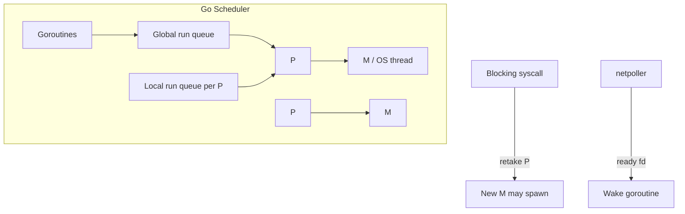

# Module 10 — Goroutines & the Scheduler

## TL;DR

Goroutines are lightweight tasks scheduled by the Go runtime on OS threads via the **G-M-P model**. They are not threads — thousands are cheap. `GOMAXPROCS` sets logical processors (P) for parallel execution. Blocking syscalls and CGO can spawn extra threads. Understand scheduling before diagnosing latency, goroutine leaks, and CPU underutilization.

## Concept

```go
go func() {
    process(job)
}()

var wg sync.WaitGroup
wg.Add(1)
go func() {
    defer wg.Done()
    work()
}()
wg.Wait()
```

| Term | Meaning |
|------|---------|
| G | Goroutine — user task |
| M | Machine — OS thread |
| P | Processor — context for running Go code |
| `GOMAXPROCS` | Max Ps executing Go code simultaneously (default `NumCPU`) |

**Goroutine vs thread**: Goroutine starts ~2 KB stack (grows dynamically); thread ~1–8 MB fixed. Scheduler multiplexes many Gs onto fewer Ms.

## How It Really Works (Internals)



**Scheduling points**: Function calls, channel ops, lock contention, `runtime.Gosched()`, GC safepoints. Cooperative with preemption since Go 1.14 (async preemption on loops).

**Blocking I/O**: Network I/O uses integrated netpoller (epoll/kqueue/IOCP) — goroutine parks, thread not blocked. **Blocking syscall** (file I/O on some platforms, CGO) detaches P, M blocks, runtime may create another M.

**Work stealing**: Idle P steals Gs from other P's local queues or global queue — load balancing.

## Why / When / Trade-offs

- **Goroutines for concurrency** — cheap fan-out for I/O-bound work.
- **GOMAXPROCS** — default is fine for most apps; tune for CPU-bound batch jobs or container CPU limits.
- **Don't**: one goroutine per tiny CPU task without bounds — use worker pools.
- **Thread pool not needed** — runtime is the pool.
- **Trade-off**: More goroutines than work = scheduling overhead and memory; too few = underutilized I/O parallelism.

## Worked Scenario

Bounded fan-out with semaphore:

```go
func fetchAll(ctx context.Context, urls []string) ([]Result, error) {
    sem := make(chan struct{}, 10) // max 10 concurrent
    results := make([]Result, len(urls))
    g, ctx := errgroup.WithContext(ctx)

    for i, url := range urls {
        i, url := i, url
        g.Go(func() error {
            select {
            case sem <- struct{}{}:
                defer func() { <-sem }()
            case <-ctx.Done():
                return ctx.Err()
            }
            res, err := fetch(ctx, url)
            if err != nil {
                return err
            }
            results[i] = res
            return nil
        })
    }
    if err := g.Wait(); err != nil {
        return nil, err
    }
    return results, nil
}
```

Observing scheduler:

```go
func main() {
    fmt.Println("GOMAXPROCS:", runtime.GOMAXPROCS(0))
    fmt.Println("NumCPU:", runtime.NumCPU())
    fmt.Println("NumGoroutine:", runtime.NumGoroutine())
}
```

## Gotchas & Failure Modes

- **Goroutine leaks** — blocked forever on channel/mutex without cancel path.
- **Main exits** — kills all goroutines; always `Wait()` or drain.
- **Closure capture bugs** — loop variables (historical; Go 1.22+ per-iteration).
- **CPU-bound infinite loop** without preemption points (rare post-1.14) can starve others.
- **runtime.LockOSThread** — pins goroutine to thread; needed for some graphics/OpenGL; misuse exhausts threads.
- **File I/O blocking** — can consume Ms; use `SetDeadline` or dedicated pools for massive parallel disk I/O.

## Interview Q&A

**Q: Explain the G-M-P model.**
A: G is goroutine, M is OS thread, P is logical processor holding run queues and local state. Go code runs on G scheduled onto M, which must hold P. Ps are limited by `GOMAXPROCS`.
↳ What happens when a goroutine blocks on syscall? P is detached and handed to another M; blocked M may cause runtime to spawn extra threads.

**Q: How do goroutines differ from OS threads?**
A: Smaller stacks, cheaper creation, cooperative/preemptive scheduling by Go runtime, multiplexed on fewer threads. Threads are kernel-scheduled with higher overhead.
↳ How many goroutines is too many? Depends on work — 100k blocked on I/O may be fine; 100k CPU-spinning is catastrophic. Profile `runtime.NumGoroutine` and scheduler latency.

**Q: What does GOMAXPROCS control?**
A: Number of Ps — goroutines executing Go bytecode in parallel. Does not limit goroutine count; only parallel execution of Go code.
↳ In a Kubernetes pod limited to 2 CPUs, what should GOMAXPROCS be? Often 2, or use uber-go/automaxprocs to match cgroup quota.

**Q: How does the netpoller integrate with the scheduler?**
A: When goroutine waits on network I/O, it's parked; netpoller registers fd; when ready, G is requeued — M not blocked for network waits.

## Verify

```bash
cd labs/05-goroutines-channels
go run ./goroutines
go test ./... -run TestGoroutine -v
GOMAXPROCS=2 go run ./scheduler-demo
```

## Further Reading

- [Go Scheduler Design Doc](https://go.dev/s/go11sched)
- [Go Blog — The Go scheduler](https://go.dev/blog/wazero)
- [Analysis of the Go runtime scheduler](https://www.ardanlabs.com/blog/2018/08/scheduling-in-go-part1.html)
