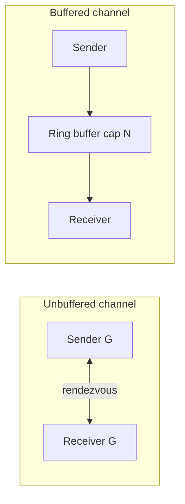

# Module 11 — Channels & select

## TL;DR

Channels are typed conduits for communication between goroutines — "don't communicate by sharing memory; share memory by communicating." **Unbuffered** channels synchronize (rendezvous); **buffered** channels decouple send/receive up to capacity. `select` multiplexes channel operations with pseudo-random tie-breaking. Fan-out/fan-in patterns scale pipelines; always pair with cancellation.

## Concept

```go
ch := make(chan int)      // unbuffered — sync
buf := make(chan int, 10) // buffered — async until full

ch <- 42    // blocks until receiver ready (unbuffered)
v := <-ch   // blocks until sender ready

close(ch)   // no more sends; receivers drain then get zero value + ok=false
```

**select**:

```go
select {
case msg := <-ch:
    handle(msg)
case ch <- val:
    // sent
case <-ctx.Done():
    return ctx.Err()
default:
    // non-blocking attempt
}
```

## How It Really Works (Internals)



| Property | Unbuffered | Buffered |
|----------|------------|----------|
| Sync | Direct handoff | Send proceeds until full |
| Zero value | `make(chan T)` | `make(chan T, n)` |
| Close | Receivers get (zero, false) | Same |
| Send on closed | panic | panic |
| Receive on closed | (zero, false) after drain | Same |
| nil channel | block forever on send/recv | block forever |

**Channel structure**: Mutex-protected buffer (if any), send/receive queues (sudog structs linking waiting goroutines). Unbuffered: sender copies directly to receiver's stack slot.

**select**: All channel ops evaluated; if multiple ready, one chosen pseudo-randomly (fairness). `default` makes non-blocking.

**Fan-out**: Multiple workers read from same input channel. **Fan-in**: Merge multiple outputs via `select` or another goroutine forwarding to one channel.

## Why / When / Trade-offs

- **Unbuffered**: Strong synchronization, backpressure implicit — sender rate matches receiver.
- **Buffered**: Smooth bursts; size = max in-flight without blocking producer — tune carefully.
- **Channels vs mutex**: Channels for ownership transfer and pipeline stages; mutex for shared state caches.
- **Close**: Only by sender; signals completion to receivers. Never close from receiver side.
- **Trade-off**: Channel-heavy designs can be harder to debug than mutex + cond; use `go test -race`.

## Worked Scenario

Pipeline with fan-out/fan-in and cancellation:

```go
func pipeline(ctx context.Context, in <-chan int) <-chan int {
    out := make(chan int)
    go func() {
        defer close(out)
        for {
            select {
            case v, ok := <-in:
                if !ok {
                    return
                }
                select {
                case out <- v * 2:
                case <-ctx.Done():
                    return
                }
            case <-ctx.Done():
                return
            }
        }
    }()
    return out
}

func fanOut(ctx context.Context, in <-chan Job, workers int) <-chan Result {
    out := make(chan Result)
    var wg sync.WaitGroup
    worker := func() {
        defer wg.Done()
        for job := range in {
            select {
            case out <- process(job):
            case <-ctx.Done():
                return
            }
        }
    }
    wg.Add(workers)
    for i := 0; i < workers; i++ {
        go worker()
    }
    go func() {
        wg.Wait()
        close(out)
    }()
    return out
}

func merge(cs ...<-chan int) <-chan int {
    out := make(chan int)
    var wg sync.WaitGroup
    multiplex := func(c <-chan int) {
        defer wg.Done()
        for v := range c {
            out <- v
        }
    }
    wg.Add(len(cs))
    for _, c := range cs {
        go multiplex(c)
    }
    go func() {
        wg.Wait()
        close(out)
    }()
    return out
}
```

## Gotchas & Failure Modes

- **Send on closed channel** — panic.
- **Close closed channel** — panic.
- **Leak**: sender blocked, no receiver — use `ctx.Done()` in select.
- **Range without close** — blocks forever.
- **Buffered deadlock**: all goroutines blocked on full channel — classic dining philosophers.
- **select with nil channel** — that case never runs (useful for disabling cases).
- **Forgotten `default`** in tight loops — CPU spin.

## Interview Q&A

**Q: Buffered vs unbuffered channels?**
A: Unbuffered synchronizes sender and receiver at handoff. Buffered allows sends up to capacity without receiver present.
↳ When is buffer size 0 vs 1 vs N? 0 for sync; 1 for single in-flight token; N for burst tolerance — measure, don't guess.

**Q: Who should close a channel?**
A: The sender, when no more values will be sent. Receivers detect completion via `v, ok := <-ch`. Closing signals completion; never close from consumer.
↳ What if multiple senders? Close only when all senders done — often use `sync.WaitGroup` + single closer goroutine.

**Q: How does select choose among ready cases?**
A: If one case ready, execute it. If multiple, pseudo-random choice for fairness. If none and no default, block.
↳ Can you prioritize cases? Not natively — use separate select, nested logic, or multiple goroutines.

**Q: Fan-in vs fan-out use cases?**
A: Fan-out: parallelize work across workers (CPU/IO). Fan-in: aggregate results from parallel stages into single stream (merge, reduce).

## Verify

```bash
cd labs/05-goroutines-channels
go run ./channels
go run ./select
go test ./... -run TestChannel -v
go test ./... -run TestFanInOut -v
```

## Further Reading

- [Go Blog — Pipelines and cancellation](https://go.dev/blog/pipelines)
- [Go Concurrency Patterns](https://go.dev/talks/2012/concurrency.slide)
- [Go Spec — Channel types](https://go.dev/ref/spec#Channel_types)
