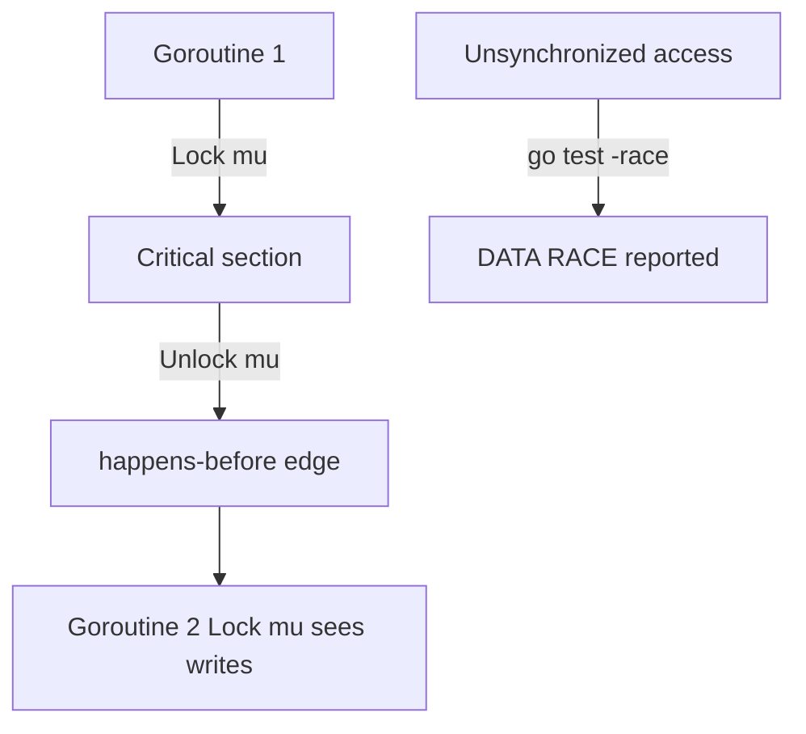

# Module 12 — Sync Primitives & Memory Model

## TL;DR

The Go memory model defines **happens-before** relationships for visibility of writes across goroutines. Use `sync.Mutex` for shared mutable state, `sync.WaitGroup` for goroutine completion, `sync.Once` for one-time init, and `sync/atomic` for lock-free counters/flags. Always run `go test -race` in CI — the race detector finds unsynchronized access at runtime.

## Concept

```go
var mu sync.Mutex
var cache map[string]string

func get(key string) string {
    mu.Lock()
    defer mu.Unlock()
    return cache[key]
}

var wg sync.WaitGroup
wg.Add(1)
go func() {
    defer wg.Done()
    work()
}()
wg.Wait()

var once sync.Once
once.Do(func() { initExpensive() })

var count atomic.Int64
count.Add(1)
```

**Happens-before** (selected rules):

- Unlock on mutex M happens-before Lock on M in another goroutine.
- Send on channel happens-before receive completes.
- `wg.Done()` happens-before `wg.Wait()` returns.
- `close(ch)` happens-before receive that gets zero value.

## How It Really Works (Internals)



| Primitive | Use case | Notes |
|-----------|----------|-------|
| `Mutex` / `RWMutex` | General shared state | Prefer defer Unlock; no copy after use |
| `WaitGroup` | Wait for N goroutines | Add before spawn; Done in goroutine |
| `Once` | Lazy init, singleton | Exactly once even under concurrency |
| `atomic` | Counters, flags, pointers | No mutex overhead; limited operations |
| `Cond` | Wait for condition | Must hold associated mutex |

**Mutex**: Futex-based sleep/wake on contention. **RWMutex**: multiple readers OR one writer.

**Race detector**: Instruments memory accesses at compile time (2–10× slowdown); detects concurrent read+write or write+write without synchronization.

**atomic**: Hardware CAS instructions; `atomic.Int64`, `atomic.Pointer[T]` (Go 1.19+) provide typed API.

## Why / When / Trade-offs

- **Mutex**: Default choice for shared maps, caches, connection pools.
- **RWMutex**: Read-heavy workloads — writers still exclusive; reader starvation possible under constant writes.
- **atomic**: High-frequency stats, feature flags, lock-free queues (advanced) — harder to reason about than mutex.
- **Channels**: Transfer ownership; mutex protects shared in-place mutation.
- **Trade-off**: Fine-grained locks reduce contention but increase deadlock risk — lock ordering discipline.

## Worked Scenario

Thread-safe cache with singleflight-style dedup:

```go
type Cache struct {
    mu    sync.RWMutex
    items map[string]string
}

func (c *Cache) Get(key string) (string, bool) {
    c.mu.RLock()
    v, ok := c.items[key]
    c.mu.RUnlock()
    return v, ok
}

func (c *Cache) Set(key, val string) {
    c.mu.Lock()
    c.items[key] = val
    c.mu.Unlock()
}

var (
    initOnce sync.Once
    instance *Cache
)

func Instance() *Cache {
    initOnce.Do(func() {
        instance = &Cache{items: make(map[string]string)}
    })
    return instance
}

type Metrics struct {
    requests atomic.Uint64
    errors   atomic.Uint64
}

func (m *Metrics) Record(err error) {
    m.requests.Add(1)
    if err != nil {
        m.errors.Add(1)
    }
}
```

Lock ordering to prevent deadlock:

```go
// Always acquire muA before muB
func transfer(a, b *Account, amount int) {
    first, second := a, b
    if uintptr(unsafe.Pointer(a)) > uintptr(unsafe.Pointer(b)) {
        first, second = b, a
    }
    first.mu.Lock()
    defer first.mu.Unlock()
    second.mu.Lock()
    defer second.mu.Unlock()
    // transfer...
}
```

## Gotchas & Failure Modes

- **Copied mutex** — `sync.Mutex` must not be copied after first use; use pointer receivers.
- **wg.Add after Wait** — panic or race; Add before starting goroutine.
- **Unlock without Lock** — panic.
- **Defer in hot path** — acceptable for mutex; measure if nanoseconds matter.
- **atomic mixed with non-atomic fields** — still need mutex for compound invariants.
- **False sense of safety** — race-free on individual fields but broken invariants across fields.
- **Relying on map iteration order** — unrelated but often concurrent with maps + mutex.

## Interview Q&A

**Q: Explain happens-before in Go.**
A: Partial order guaranteeing that if A happens-before B, A's memory writes are visible to B. Established by mutex, channels, atomic ops, WaitGroup, Once, etc.
↳ Does a write without synchronization guarantee visibility? No — another goroutine may see stale cache without happens-before edge.

**Q: Mutex vs channel for synchronization?**
A: Mutex protects shared state in place. Channels pass ownership of data. Use mutex for caches; channels for pipeline stages and work distribution.
↳ Can you implement mutex with channel? Yes (buffer-1 channel as token) — educational, not idiomatic.

**Q: When use atomic vs mutex?**
A: Atomic for simple counters, flags, pointer swaps where invariant is single-word. Mutex for multi-field invariants and complex structures.
↳ Is atomic always faster? Often for simple ops; mutex contention with futex is cheap when uncontended. Profile.

**Q: How does the race detector work?**
A: Compiler instruments accesses; runtime tracks goroutine IDs; concurrent unsynchronized read/write on same address reports DATA RACE with stack traces.
↳ Does it catch all races? Only executed paths in test run — need comprehensive tests and integration coverage.

## Verify

```bash
cd labs/06-sync-memory-model
go run ./mutex
go test ./... -race -v
go test ./... -run TestWaitGroup -v
go test ./... -run TestAtomic -v
```

## Further Reading

- [Go Memory Model](https://go.dev/ref/mem)
- [Go Blog — Introducing the Go Race Detector](https://go.dev/blog/race-detector)
- [package sync](https://pkg.go.dev/sync)
