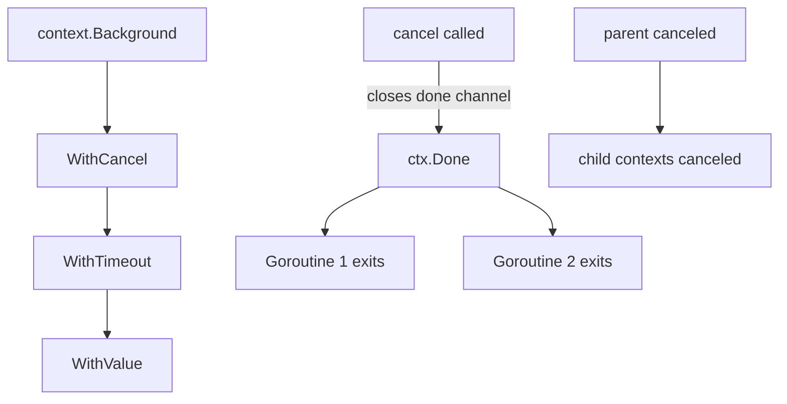

# Module 13 — context Package

## TL;DR

`context.Context` carries **deadlines**, **cancellation signals**, and **request-scoped values** across API boundaries and goroutines. Pass `ctx` as the first parameter. Always call `cancel()` from `WithCancel`/`WithTimeout`/`WithDeadline` to release resources. Never store contexts in structs. Propagate cancellation to child operations and respect `ctx.Done()` in long-running work.

## Concept

```go
ctx, cancel := context.WithTimeout(parent, 5*time.Second)
defer cancel()

req, err := http.NewRequestWithContext(ctx, "GET", url, nil)

select {
case <-ctx.Done():
    return ctx.Err() // context.Canceled or context.DeadlineExceeded
case result := <-ch:
    return result, nil
}
```

| Constructor | Purpose |
|-------------|---------|
| `context.Background()` | Root for main, init, tests |
| `context.TODO()` | Placeholder when unsure |
| `WithCancel(parent)` | Explicit cancel function |
| `WithTimeout(parent, d)` | Cancel after duration |
| `WithDeadline(parent, t)` | Cancel at absolute time |
| `WithValue(parent, key, val)` | Request-scoped data |

## How It Really Works (Internals)



**Context tree**: Child inherits cancellation from parent. Canceling parent cancels all descendants. `Done()` returns `<-chan struct{}` closed once when context is canceled.

**Cancellation propagation**: `cancel` function closes internal channel, sets error (`Canceled` or `DeadlineExceeded`). Timer goroutine for timeout/deadline.

**Values**: Immutable linked list — lookup walks parent chain. Keys should be unexported types to avoid collisions. **Not for optional parameters** — use function args.

**HTTP**: `Request.Context()` carries per-request ctx; server cancels on client disconnect.

## Why / When / Trade-offs

- **Cancellation**: Stop wasted work when user aborts, timeout hits, or shutdown begins.
- **Deadlines**: Enforce SLAs on downstream calls — propagate to DB, RPC, HTTP.
- **Values**: Trace IDs, auth principals — only data that flows across API boundaries.
- **Don't**: Pass `nil` context — use `context.TODO()`. Store in structs. Pass logger/config via context (use explicit deps).
- **Trade-off**: `WithValue` is untyped — abuse creates implicit APIs; prefer explicit parameters for business data.

## Worked Scenario

HTTP handler with timeout and graceful cleanup:

```go
func (s *Server) handleSearch(w http.ResponseWriter, r *http.Request) {
    ctx, cancel := context.WithTimeout(r.Context(), 3*time.Second)
    defer cancel()

    type result struct {
        data []Item
        err  error
    }
    ch := make(chan result, 1)
    go func() {
        data, err := s.search(ctx, r.URL.Query())
        ch <- result{data, err}
    }()

    select {
    case <-ctx.Done():
        http.Error(w, "timeout", http.StatusGatewayTimeout)
        return
    case res := <-ch:
        if res.err != nil {
            http.Error(w, res.err.Error(), http.StatusInternalServerError)
            return
        }
        json.NewEncoder(w).Encode(res.data)
    }
}

func (s *Server) search(ctx context.Context, q url.Values) ([]Item, error) {
    ctx, span := tracer.Start(ctx, "search")
    defer span.End()

  rows, err := s.db.QueryContext(ctx, "SELECT ...", q.Get("q"))
    if err != nil {
        return nil, err
    }
    defer rows.Close()

    var items []Item
    for rows.Next() {
        if err := ctx.Err(); err != nil {
            return nil, err // stop early on cancel
        }
        var it Item
        if err := rows.Scan(&it.ID, &it.Name); err != nil {
            return nil, err
        }
        items = append(items, it)
    }
    return items, rows.Err()
}
```

Custom context key pattern:

```go
type ctxKey int

const requestIDKey ctxKey = iota

func withRequestID(ctx context.Context, id string) context.Context {
    return context.WithValue(ctx, requestIDKey, id)
}

func requestIDFrom(ctx context.Context) (string, bool) {
    id, ok := ctx.Value(requestIDKey).(string)
    return id, ok
}
```

## Gotchas & Failure Modes

- **Leaked cancel** — always `defer cancel()` even if child times out first.
- **Ignoring `ctx` in DB/RPC calls** — uses `context.Background()` internally, ignores parent deadline.
- **Checking only at start** — long loops must poll `ctx.Err()` or use `select`.
- **WithValue key collisions** — use unexported custom types.
- **Nil context** — panics in some stdlib calls.
- **Cancel does not kill goroutines** — cooperative; must respect `Done()`.
- **Passing values for DI** — anti-pattern; pollutes call graph.

## Interview Q&A

**Q: What is context for?**
A: Cancellation, deadlines, and request-scoped values propagated across goroutines and API layers. Standard first parameter for I/O functions.
↳ Should context be stored in a struct? No — pass per call to keep lifetime and cancellation scope clear.

**Q: How does cancellation propagate?**
A: Parent cancel closes parent Done; child contexts created with WithCancel/Timeout inherit and cancel when parent does. Calling child's cancel only affects that subtree.
↳ What's the difference between Canceled and DeadlineExceeded? `context.Canceled` from explicit cancel; `DeadlineExceeded` from timeout/deadline.

**Q: When should you use context.WithValue?**
A: Cross-cutting request metadata (trace ID, auth token for downstream). Not for optional func parameters or large config objects.
↳ How do you avoid key collisions? Unexported typed keys in your package.

**Q: How does HTTP server shutdown relate to context?**
A: `Server.Shutdown(ctx)` gracefully drains connections with deadline. `RegisterOnShutdown` hooks run; in-flight requests use `Request.Context()` canceled on connection close.

## Verify

```bash
cd labs/07-context
go run ./cancellation
go run ./deadline
go test ./... -run TestContext -v
go test ./... -run TestTimeout -v
```

## Further Reading

- [package context](https://pkg.go.dev/context)
- [Go Blog — context](https://go.dev/blog/context)
- [context package source](https://go.dev/src/context/context.go)
