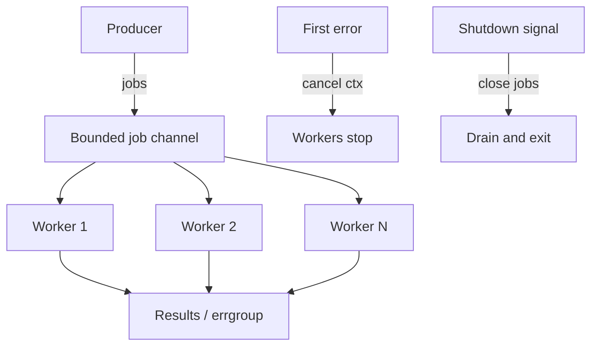

# Module 14 — Concurrency Patterns

## TL;DR

Production Go combines goroutines, channels, mutexes, and `context` into repeatable patterns: **worker pools**, **bounded buffers**, **errgroup** for error propagation, and **graceful shutdown**. Choose channels for ownership transfer and pipelines; mutexes for shared caches. Always bound concurrency, cancel on first error, and drain resources on shutdown.

## Concept

| Pattern | Purpose |
|---------|---------|
| Worker pool | Fixed N goroutines processing jobs |
| Bounded buffer | Limit in-flight work / memory |
| Fan-out / fan-in | Parallelize and merge |
| errgroup | Wait for goroutines, cancel on error |
| Pipeline | Stage-based processing via channels |
| Graceful shutdown | Stop accept, drain, timeout exit |

```go
g, ctx := errgroup.WithContext(ctx)
for _, job := range jobs {
    g.Go(func() error { return process(ctx, job) })
}
if err := g.Wait(); err != nil { return err }
```

## How It Really Works (Internals)



**Worker pool**: N goroutines `for job := range jobs` — jobs channel closed to signal stop. Semaphore `chan struct{}` with cap N limits concurrent goroutines without fixed workers.

**Bounded buffer**: Buffered channel capacity = max queue depth. Blocks producer when full — natural backpressure.

**errgroup**: Wraps `WaitGroup` + cancelable context. First non-nil error triggers context cancel; `Wait()` returns that error.

**Channels vs mutex**:

| Scenario | Prefer |
|----------|--------|
| Pipeline stages, work queues | Channels |
| Shared cache, connection pool map | Mutex |
| Rate limiting | Semaphore channel or `golang.org/x/time/rate` |
| One-shot init | `sync.Once` |

**Graceful shutdown**: `signal.Notify` → cancel root ctx → `close(jobs)` → `wg.Wait()` with timeout fallback → `server.Shutdown(ctx)`.

## Why / When / Trade-offs

- **Worker pool**: CPU/IO parallelism with bounded resource use — prefer over unbounded `go` per request.
- **errgroup**: Cleaner than manual `WaitGroup` + error channel + `sync.Once`.
- **Bounded queues**: Prevent OOM under load spikes — reject or block at boundary.
- **Graceful shutdown**: Kubernetes sends SIGTERM — finish in-flight, stop accepting new.
- **Trade-off**: Channel pipelines are elegant but harder to step-debug; mutex + cond simpler for shared state.

## Worked Scenario

Worker pool with errgroup and graceful shutdown:

```go
type Server struct {
    jobs    chan Job
    wg      sync.WaitGroup
    workers int
}

func NewServer(workers, queueSize int) *Server {
    return &Server{
        jobs:    make(chan Job, queueSize),
        workers: workers,
    }
}

func (s *Server) Start(ctx context.Context) {
    for i := 0; i < s.workers; i++ {
        s.wg.Add(1)
        go func() {
            defer s.wg.Done()
            for {
                select {
                case job, ok := <-s.jobs:
                    if !ok {
                        return
                    }
                    if err := job.Run(ctx); err != nil {
                        slog.Error("job failed", "err", err)
                    }
                case <-ctx.Done():
                    return
                }
            }
        }()
    }
}

func (s *Server) Submit(job Job) error {
    select {
    case s.jobs <- job:
        return nil
    default:
        return ErrQueueFull // bounded buffer rejection
    }
}

func (s *Server) Shutdown(ctx context.Context) error {
    close(s.jobs) // no more jobs
    done := make(chan struct{})
    go func() {
        s.wg.Wait()
        close(done)
    }()
    select {
    case <-done:
        return nil
    case <-ctx.Done():
        return ctx.Err()
    }
}
```

Parallel fetch with errgroup:

```go
func fetchAll(ctx context.Context, ids []string) (map[string]Item, error) {
    g, ctx := errgroup.WithContext(ctx)
    g.SetLimit(10) // Go 1.20+ bounded concurrency

    mu := sync.Mutex{}
    out := make(map[string]Item, len(ids))

    for _, id := range ids {
        id := id
        g.Go(func() error {
            item, err := fetchItem(ctx, id)
            if err != nil {
                return fmt.Errorf("fetch %s: %w", id, err)
            }
            mu.Lock()
            out[id] = item
            mu.Unlock()
            return nil
        })
    }
    if err := g.Wait(); err != nil {
        return nil, err
    }
    return out, nil
}
```

HTTP server graceful shutdown:

```go
func run(ctx context.Context, srv *http.Server) error {
    go func() {
        <-ctx.Done()
        shutCtx, cancel := context.WithTimeout(context.Background(), 30*time.Second)
        defer cancel()
        srv.Shutdown(shutCtx)
    }()
    if err := srv.ListenAndServe(); err != http.ErrServerClosed {
        return err
    }
    return nil
}
```

## Gotchas & Failure Modes

- **Unbounded goroutines** under traffic — OOM and scheduler thrashing.
- **errgroup without context** — failures don't cancel siblings; wasted work.
- **Closing jobs channel twice** — panic.
- **Shutdown without draining** — truncated responses; use `Shutdown` not `Close`.
- **Mutex + channel deadlock** — lock held while sending on unbuffered channel.
- **Forgotten SetLimit** — errgroup spawns unbounded goroutines for large slices.
- **QueueFull without retry/backoff** — clients need handling strategy.

## Interview Q&A

**Q: How do you implement a worker pool in Go?**
A: Fixed worker goroutines reading from `jobs` channel; producers send jobs; close channel to signal shutdown; `WaitGroup` waits for workers. Alternative: semaphore-limited `go` per task.
↳ When use semaphore vs fixed workers? Fixed workers for steady throughput and less scheduling overhead; semaphore for bursty work with cap.

**Q: errgroup vs WaitGroup + error channel?**
A: errgroup integrates first-error wins and context cancellation. Less boilerplate than manual error channel + `sync.Once`.
↳ Does errgroup limit concurrency? Not by default — use `SetLimit(n)` since Go 1.20.

**Q: Channels vs mutex for a shared cache?**
A: Mutex — multiple readers/writers on same map. Channels if one goroutine owns cache and others send request/response messages (actor model).
↳ When is actor model better? Serializing complex state mutations, avoiding lock contention — at cost of message-passing overhead.

**Q: Describe graceful shutdown in a Kubernetes service.**
A: Trap SIGTERM, stop accepting (`Shutdown`), wait for in-flight with timeout, cancel background ctx, flush telemetry, exit 0 before `terminationGracePeriodSeconds`.
↳ What if Shutdown times out? Log remaining work, exit — platform sends SIGKILL after grace period.

## Verify

```bash
cd labs/12-concurrency-patterns
go run ./worker-pool
go run ./graceful-shutdown
go test ./... -race -v
go test ./... -run TestErrGroup -v
```

## Further Reading

- [Go Blog — Pipelines and cancellation](https://go.dev/blog/pipelines)
- [golang.org/x/sync/errgroup](https://pkg.go.dev/golang.org/x/sync/errgroup)
- [Graceful shutdown in Go](https://pkg.go.dev/net/http#Server.Shutdown)
