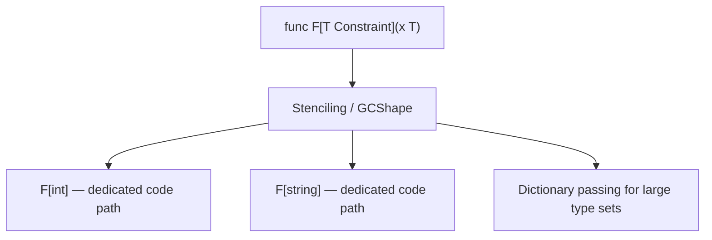

# Module 15 — Generics

## TL;DR

Go 1.18+ generics let you write type-safe, reusable code with **type parameters** and **constraints**. Use them when the same algorithm applies to multiple types; avoid them when interfaces or code generation are simpler. The `comparable` constraint is required for `==` on type parameters.

## Concept

Generics introduce type parameters in square brackets:

```go
func Max[T constraints.Ordered](a, b T) T {
    if a > b {
        return a
    }
    return b
}
```

**Constraints** define what operations a type parameter supports:

| Constraint | Allows |
|------------|--------|
| `any` | All types (no operations) |
| `comparable` | `==` and `!=` |
| `constraints.Ordered` | `<`, `>`, `<=`, `>=` (from `golang.org/x/exp/constraints` or std in 1.21+) |
| Custom interface | Methods or union of types (`~int \| ~float64`) |

**Type sets** (Go 1.18+): a constraint is a set of types. `~T` means "underlying type T" — so `~int` matches `type MyInt int`.

```go
type Number interface {
    ~int | ~int64 | ~float64
}

func Sum[T Number](vals []T) T {
    var total T
    for _, v := range vals {
        total += v
    }
    return total
}
```

## How It Really Works (Internals)



- **Stenciling**: The compiler generates specialized code for each concrete type instantiation used in a package. First use of `Max[int]` and `Max[float64]` may produce two monomorphized versions.
- **GC shapes**: Types with identical memory layout (e.g., all pointers) may share one instantiation — reduces binary bloat.
- **No runtime type parameters**: Generics are a compile-time feature; no JVM-style erasure at runtime.
- **Constraint satisfaction** is checked at compile time — if `T` doesn't satisfy the constraint, the call site fails to compile.
- **`comparable`**: Built-in constraint for types that support `==`. Structs containing slices, maps, or funcs are NOT comparable.

## Why / When / Trade-offs

| Use generics when | Prefer alternatives when |
|-------------------|--------------------------|
| Container types (`Set[T]`, `Stack[T]`) | Single-type container is enough |
| Generic algorithms (`Map`, `Filter`, `Reduce`) | `interface{}` + type assertion is rare path |
| Shared data structures across packages | Interface with one method suffices |
| Compile-time type safety for APIs | `go generate` or hand-written duplicates are clearer |

**Trade-offs:**
- **Pros**: Type safety, less boilerplate, better IDE support than `interface{}`.
- **Cons**: Harder to read for juniors, compile-time errors can be cryptic, binary size grows with many instantiations.
- **Rule of thumb**: If you write the same function three times for different types, consider generics.

## Worked Scenario

Building a type-safe in-memory cache with TTL:

```go
package cache

import (
    "sync"
    "time"
)

type entry[V any] struct {
    value     V
    expiresAt time.Time
}

type Cache[K comparable, V any] struct {
    mu    sync.RWMutex
    items map[K]entry[V]
    ttl   time.Duration
}

func New[K comparable, V any](ttl time.Duration) *Cache[K, V] {
    return &Cache[K, V]{
        items: make(map[K]entry[V]),
        ttl:   ttl,
    }
}

func (c *Cache[K, V]) Set(key K, value V) {
    c.mu.Lock()
    defer c.mu.Unlock()
    c.items[key] = entry[V]{value: value, expiresAt: time.Now().Add(c.ttl)}
}

func (c *Cache[K, V]) Get(key K) (V, bool) {
    c.mu.RLock()
    defer c.mu.RUnlock()
    e, ok := c.items[key]
    if !ok || time.Now().After(e.expiresAt) {
        var zero V
        return zero, false
    }
    return e.value, true
}
```

Usage:

```go
userCache := cache.New[string, User](5 * time.Minute)
userCache.Set("user:42", User{ID: 42, Name: "Alice"})
```

## Gotchas & Failure Modes

- **Cryptic compiler errors**: "type X does not satisfy constraint Y" — read the constraint definition first.
- **`comparable` excludes slices, maps, funcs**: Cannot use `[]byte` as a map key in `Cache[[]byte, V]` — use `string` or a wrapper.
- **Cannot use methods with type parameters on non-generic receivers** in older patterns — methods on generic types work: `func (c *Cache[K,V]) Get(...)`.
- **Over-generic APIs**: `func Process[T any](x T)` with no constraint adds zero value — use `any` only when truly unconstrained.
- **Type inference limits**: `Max(1, 2)` works; complex cases may need explicit `Max[int](a, b)`.
- **No specialization**: Unlike C++ templates, you cannot specialize `Foo[int]` differently from `Foo[string]` at compile time.

## Interview Q&A

**Q: When would you use generics vs interfaces in Go?**
A: Generics when the algorithm is identical across types and you need compile-time type safety (containers, utilities). Interfaces when behavior varies via methods — `io.Reader` is the canonical example. Generics parametrize types; interfaces parametrize behavior.
↳ Can you combine them? Yes — `func Decode[T any](r io.Reader) (T, error)` constrains input via interface, output via type param.

**Q: What is the `comparable` constraint and when is it required?**
A: It's the set of types supporting `==` and `!=`. Required for map keys, `sync.Map` keys, or any generic function using equality. Slices, maps, and funcs are not comparable.
↳ What about `==` on interfaces? Interface values are comparable if their dynamic types are comparable.

**Q: How does Go implement generics without a runtime cost?**
A: Compile-time stenciling generates specialized code per concrete type (or per GC shape). No boxing or reflection at runtime for generic calls — unlike Java generics erasure with autoboxing.
↳ Does this increase binary size? Yes, potentially — mitigated by GC-shape sharing and limiting instantiations.

**Q: Explain type sets and the `~` tilde operator.**
A: A constraint defines a type set. `~int` means any type whose underlying type is `int`, including `type UserID int`. Without `~`, only the exact type `int` matches.
↳ Why does this matter for APIs? Library authors can accept `type Money int64` without forcing callers to convert.

## Verify

```bash
cd labs/08-testing-benchmarks
go test ./... -run TestGeneric -v
go test -bench=BenchmarkGeneric -benchmem
```

## Further Reading

- [Go Generics Proposal](https://go.dev/design/43651-type-parameters)
- [Go Blog — When To Use Generics](https://go.dev/blog/when-generics)
- [Type Parameters Proposal — Type Sets](https://go.dev/design/45310-union-type-constraints)
