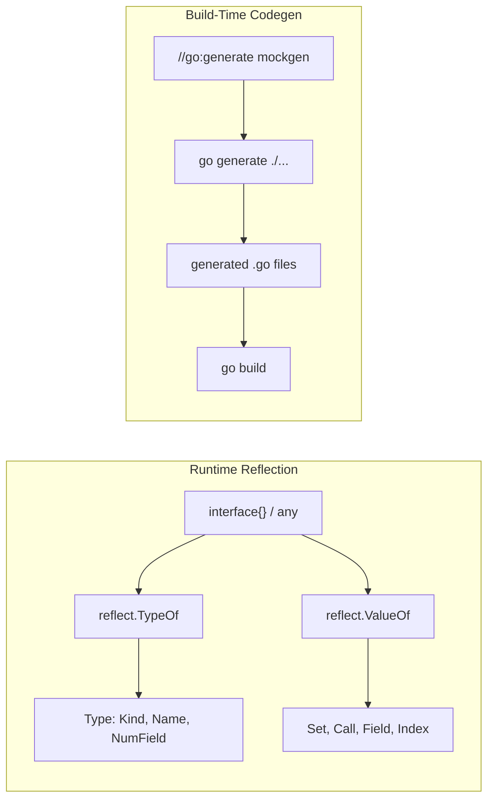

# Module 16 — Reflection & Code Generation

## TL;DR

**Reflection** (`reflect` package) inspects and manipulates types and values at runtime — powerful but slow and fragile. Prefer **code generation** (`go:generate`, `stringer`, `mockgen`) for repetitive boilerplate. Use reflection for serialization frameworks, ORMs, and testing utilities — not hot paths.

## Concept

**Reflection** lets you examine `Type` and `Value` at runtime:

```go
import "reflect"

func Inspect(v any) {
    t := reflect.TypeOf(v)   // type metadata
    val := reflect.ValueOf(v) // runtime value
    fmt.Println(t.Name(), t.Kind(), val.Interface())
}
```

**Code generation** produces Go source at build time:

```go
//go:generate stringer -type=Status
type Status int

const (
    StatusPending Status = iota
    StatusActive
    StatusClosed
)
```

| Tool | Purpose |
|------|---------|
| `stringer` | Generate `String()` for enums |
| `mockgen` | Generate mock implementations from interfaces |
| `go generate` | Trigger any code generator via `//go:generate` directives |

## How It Really Works (Internals)



**Reflection internals:**
- Every `interface{}` holds a `(type, data)` pair — reflection unpacks this.
- `reflect.Value` must be **addressable** to call `Set()` — pass pointers.
- `Kind` vs `Type`: `Kind` is the underlying category (`Struct`, `Slice`); `Type` includes named types (`time.Time` has `Kind=Struct`).
- Reflection cannot access unexported fields from another package.

**Codegen internals:**
- `go generate` runs generators listed in `//go:generate` comments — not part of `go build`.
- Generated files typically use `// Code generated by ... DO NOT EDIT.` header.
- CI should run `go generate ./...` and fail if `git diff` is non-empty.

## Why / When / Trade-offs

| Approach | When | Trade-off |
|----------|------|-----------|
| Reflection | Frameworks (JSON, ORM, DI), dynamic plugins | Slow (~10-100x), no compile-time safety |
| Codegen | Mocks, enums, repetitive CRUD | Build step complexity, generated file noise |
| Hand-written | Simple cases, hot paths | Verbose but clear |

**Senior engineer rule**: If you reach for reflection in application code, ask whether an interface or codegen solves it. Reflection belongs in libraries, not business logic.

## Worked Scenario

Custom struct tag validator using reflection + mockgen for testing:

```go
// validator.go
package validator

import (
    "fmt"
    "reflect"
    "strings"
)

func Validate(s any) error {
    v := reflect.ValueOf(s)
    if v.Kind() != reflect.Ptr || v.Elem().Kind() != reflect.Struct {
        return fmt.Errorf("validate: expected pointer to struct")
    }
    v = v.Elem()
    t := v.Type()

    for i := 0; i < v.NumField(); i++ {
        field := t.Field(i)
        tag := field.Tag.Get("validate")
        if tag == "" {
            continue
        }
        for _, rule := range strings.Split(tag, ",") {
            if err := applyRule(rule, v.Field(i)); err != nil {
                return fmt.Errorf("%s: %w", field.Name, err)
            }
        }
    }
    return nil
}

func applyRule(rule string, fv reflect.Value) error {
    switch rule {
    case "required":
        if fv.IsZero() {
            return fmt.Errorf("required field is zero")
        }
    }
    return nil
}
```

```go
// repository.go
package repo

type UserRepository interface {
    FindByID(id string) (User, error)
}

//go:generate mockgen -source=repository.go -destination=mocks/mock_repository.go -package=mocks
```

```go
// status.go
//go:generate stringer -type=OrderStatus -trimprefix=OrderStatus
type OrderStatus int

const (
    OrderStatusPending OrderStatus = iota
    OrderStatusShipped
    OrderStatusDelivered
)
```

After `go generate ./...`, `OrderStatus(0).String()` returns `"Pending"`.

## Gotchas & Failure Modes

- **Nil pointer reflection**: `reflect.ValueOf((*T)(nil))` has `Kind=Ptr` but `IsNil()=true` — dereferencing panics.
- **Unaddressable values**: Cannot `Set()` on values passed by value — use pointers.
- **Interface holding nil**: `var p *User; var i any = p` — `i == nil` is false (typed nil).
- **Generated files out of sync**: Always commit generated code or enforce in CI.
- **Reflection and inlining**: Hot loops with reflection defeat compiler optimizations.
- **`unsafe` + reflection**: `reflect.SliceHeader` patterns are deprecated — use `unsafe.Slice` (Go 1.17+).

## Interview Q&A

**Q: When should you use reflection vs code generation in Go?**
A: Reflection for truly dynamic scenarios (unknown struct shapes at compile time). Codegen for known patterns (mocks, stringers, protobuf). Reflection costs CPU and loses compile-time checks; codegen pays the cost once at build time.
↳ How do large Go projects handle this? Kubernetes and gRPC use extensive codegen; `encoding/json` uses reflection internally so callers don't.

**Q: What does `go:generate` do and how do you integrate it in CI?**
A: It's a directive processed by `go generate ./...`, not `go build`. CI runs generate and checks for diffs, or runs generate as a pre-build step. Keeps generated artifacts in sync with interfaces.
↳ Should generated files be committed? Yes, in most Go projects — reviewers see changes, builds don't need generator tools.

**Q: Explain the difference between `reflect.Type` and `reflect.Kind`.**
A: `Kind` is the primitive category (Int, Struct, Ptr). `Type` is the full type including name, package path, and methods. `time.Time` has `Kind=Struct` but `Type=time.Time`.
↳ How do you iterate struct fields? `for i := 0; i < v.NumField(); i++` on a `reflect.Value` with `Kind=Struct`.

**Q: What are the performance implications of reflection?**
A: Allocations, inability to inline, and interface conversion overhead. Benchmark before using in hot paths. `json.Marshal` reflection cost is why `json-iterator` and codegen serializers exist.
↳ How does Go 1.20+ help? Some reflection paths optimized; still slower than direct access.

## Verify

```bash
cd labs/08-testing-benchmarks
go generate ./...
go test ./... -run TestReflect -v
go test ./... -run TestMock -v
```

## Further Reading

- [Go Blog — Laws of Reflection](https://go.dev/blog/laws-of-reflection)
- [Go Generate Documentation](https://pkg.go.dev/cmd/go/internal/generate)
- [Uber mockgen](https://github.com/uber-go/mock)
- [stringer tool](https://pkg.go.dev/golang.org/x/tools/cmd/stringer)
