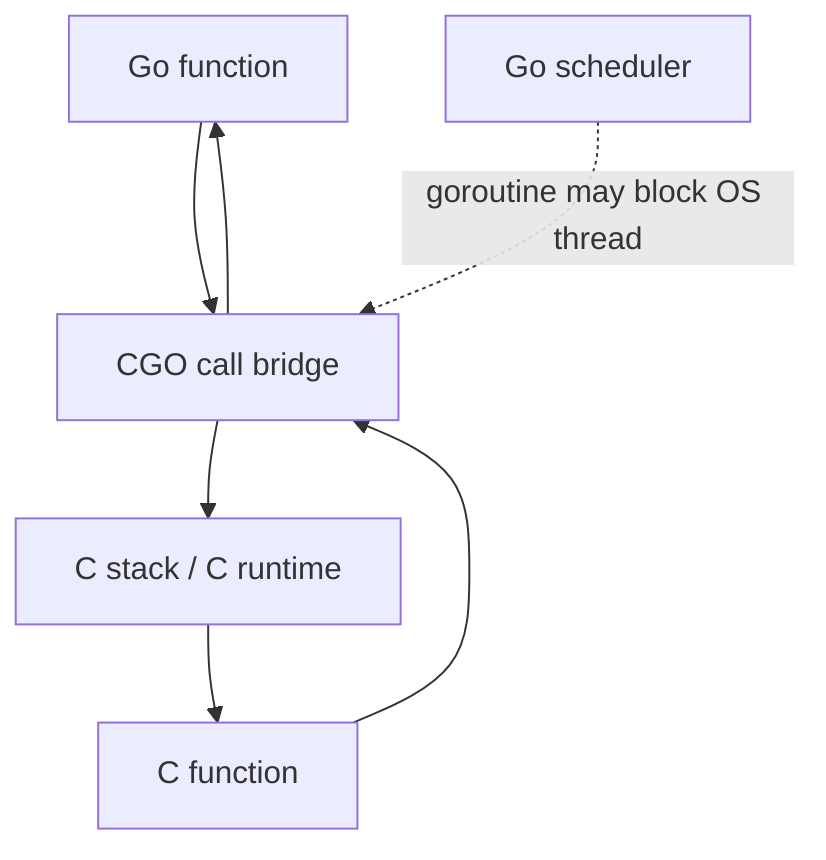

# Module 17 — CGO, FFI & Unsafe

## TL;DR

**CGO** calls C code from Go (and vice versa) via `import "C"`. It disables pure Go cross-compilation, adds call overhead, and complicates the memory model. Use **`unsafe`** sparingly for zero-copy interop. **Build tags** (`//go:build`) select platform-specific implementations at compile time.

## Concept

**CGO** bridges Go and C:

```go
/*
#include <stdio.h>
#include <stdlib.h>
*/
import "C"

func PrintFromC(msg string) {
    cs := C.CString(msg)
    defer C.free(unsafe.Pointer(cs))
    C.printf(C.CString("%s\n"), cs)
}
```

**Build tags** control which files compile:

```go
//go:build linux && amd64

package disk

func GetDiskUsage(path string) (uint64, error) { /* ... */ }
```

```go
//go:build !linux || !amd64

package disk

func GetDiskUsage(path string) (uint64, error) {
    return 0, errors.New("unsupported platform")
}
```

**unsafe** escapes Go's type safety:

```go
// Convert []byte to string without copy (Go 1.20+)
func BytesToString(b []byte) string {
    return unsafe.String(unsafe.SliceData(b), len(b))
}
```

## How It Really Works (Internals)



| Mechanism | Behavior |
|-----------|----------|
| `C.CString` / `C.GoString` | Allocates and copies across boundary |
| `C.CBytes` / `C.GoBytes` | Byte slice ↔ C heap copy |
| `unsafe.Pointer` | Raw memory address — no GC tracking |
| `//go:build` | Compile-time file selection (replaces `// +build`) |
| `GOOS` / `GOARCH` | Implicit build constraints |

**Critical internals:**
- CGO calls run on the **OS thread** — may block a scheduler thread; `runtime.LockOSThread()` needed for thread-local C state.
- Go pointers passed to C must not hold Go pointers (cgo pointer rules) — C memory cannot contain pointers to Go heap.
- Cross-compilation with CGO requires a C cross-compiler for the target — `CGO_ENABLED=0` disables CGO for pure Go builds.

## Why / When / Trade-offs

| Use CGO when | Avoid CGO when |
|--------------|----------------|
| Existing C/C++ library is the only option | Pure Go alternative exists |
| OS-specific syscalls not in `syscall`/`x/sys` | Cross-compilation is a requirement |
| Hardware/driver interfaces | Performance-critical hot loops |
| Legacy FFI integration | Team lacks C expertise |

**Build tags**: Standard pattern for multi-platform code — `file_linux.go`, `file_darwin.go`, `file_windows.go` without explicit tags (GOOS suffix convention).

## Worked Scenario

Platform-specific file locking with build tags and optional CGO:

```go
// flock_unix.go
//go:build unix

package flock

import (
    "golang.org/x/sys/unix"
    "os"
)

func Lock(f *os.File) error {
    return unix.Flock(int(f.Fd()), unix.LOCK_EX)
}

func Unlock(f *os.File) error {
    return unix.Flock(int(f.Fd()), unix.LOCK_UN)
}
```

```go
// flock_windows.go
//go:build windows

package flock

import (
    "os"
    "syscall"
)

func Lock(f *os.File) error {
    h := syscall.Handle(f.Fd())
    var ol syscall.Overlapped
    return syscall.LockFileEx(h, syscall.LOCKFILE_EXCLUSIVE_LOCK, 0, 1, 0, &ol)
}

func Unlock(f *os.File) error {
    h := syscall.Handle(f.Fd())
    var ol syscall.Overlapped
    return syscall.UnlockFileEx(h, 0, 1, 0, &ol)
}
```

Zero-copy string/bytes conversion for a high-throughput parser (use with care):

```go
func ParseToken(data []byte) string {
    // Safe only if 'data' is not modified while string is live
    start, end := findTokenBounds(data)
    return unsafe.String(unsafe.SliceData(data[start:end]), end-start)
}
```

## Gotchas & Failure Modes

- **Cross-compile breaks**: `CGO_ENABLED=1 GOOS=linux GOARCH=arm64 go build` needs ARM C toolchain.
- **Memory leaks**: Forgetting `C.free()` after `C.CString` / `C.malloc`.
- **Cgo pointer passing rules**: Passing Go pointer to C that outlives the call — GC may move objects (though Go heap doesn't compact, rules still enforced).
- **Deadlock with LockOSThread**: Forgetting to unlock OS thread in error paths.
- **unsafe.String invalidation**: If underlying `[]byte` is modified, string content changes unpredictably.
- **Build tag typos**: `//go:build` and `// +build` mismatch causes duplicate symbol errors.
- **Profiling noise**: CGO calls appear as `runtime.cgocall` in pprof — hard to attribute.

## Interview Q&A

**Q: What are the costs and risks of using CGO?**
A: Call overhead (~100ns+), OS thread consumption, loss of easy cross-compilation, mixed memory management, harder debugging. The Go runtime cannot preempt a goroutine during a C call on an OS thread.
↳ When is CGO acceptable in production? When wrapping mature C libs (SQLite, graphics, crypto hardware) with thin Go API and bounded call frequency.

**Q: Explain Go's cgo pointer passing rules.**
A: C code cannot retain pointers to Go memory after the call returns. Go code cannot store Go pointers in C-allocated memory. Violations cause runtime panics or subtle corruption.
↳ Why? The GC needs to track heap references — C memory is invisible to the GC.

**Q: How do build tags work and how do they differ from file naming conventions?**
A: `//go:build linux` is an explicit constraint on the file. `file_linux.go` uses implicit `GOOS=linux` constraint. Both are evaluated at compile time; only matching files are included.
↳ How do you test all build variants? CI matrix with different `GOOS`/`GOARCH` and tag combinations.

**Q: When is `unsafe` justified in Go?**
A: Low-level interop (syscall structures, zero-copy), standard library internals, performance-critical serialization. Never in application business logic without benchmarks proving need.
↳ What's the Go 1.20+ safe alternative to `reflect.SliceHeader`? `unsafe.String`, `unsafe.Slice`, `unsafe.StringData`, `unsafe.SliceData`.

## Verify

```bash
cd labs/11-profiling
go test ./... -tags=integration -v
go build -tags=profiling .
go test -bench=BenchmarkCGOOverhead -benchmem ./...
```

## Further Reading

- [CGO Documentation](https://pkg.go.dev/cmd/cgo)
- [Go Wiki — CGO](https://go.dev/wiki/cgo)
- [unsafe package](https://pkg.go.dev/unsafe)
- [Go Build Constraints](https://pkg.go.dev/go/build#hdr-Build_Constraints)
