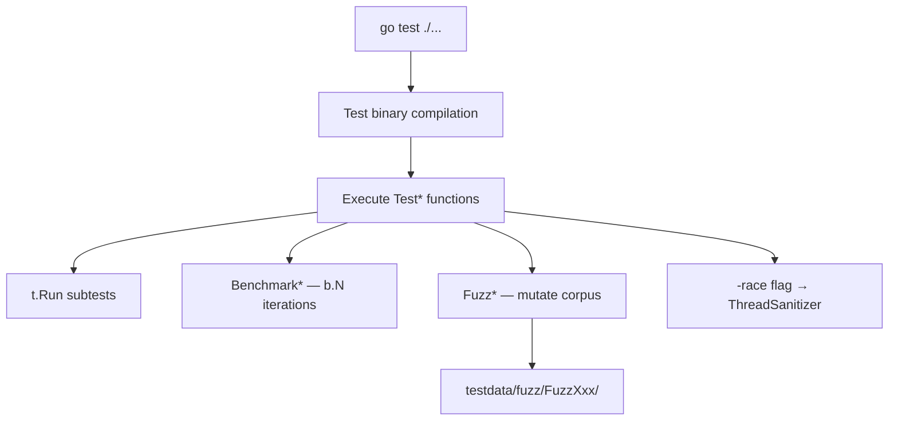

# Module 18 — Testing, Benchmarks & Fuzzing

## TL;DR

Go's testing is first-class: **table-driven tests** for coverage, **testify/mock** or **mockgen** for dependencies, **benchmarks** for performance regression, and **fuzzing** (Go 1.18+) for finding edge-case inputs. Write tests that verify behavior, not implementation. Run `go test -race` in CI always.

## Concept

**Table-driven tests** — the idiomatic pattern:

```go
func TestAdd(t *testing.T) {
    tests := []struct {
        name     string
        a, b     int
        expected int
    }{
        {"positive", 2, 3, 5},
        {"zero", 0, 0, 0},
        {"negative", -1, -1, -2},
    }
    for _, tt := range tests {
        t.Run(tt.name, func(t *testing.T) {
            if got := Add(tt.a, tt.b); got != tt.expected {
                t.Errorf("Add(%d,%d) = %d, want %d", tt.a, tt.b, got, tt.expected)
            }
        })
    }
}
```

| Technique | Purpose |
|-----------|---------|
| `t.Helper()` | Mark test helpers for accurate line numbers |
| `t.Parallel()` | Run subtests concurrently |
| `testify/assert` | Readable assertions (optional) |
| `httptest` | HTTP handler testing without network |
| `testing.B` | Benchmarks |
| `testing.F` | Fuzz tests |

**TDD in Go**: Write failing test → minimal implementation → refactor. Go's fast compile/test cycle makes TDD practical.

## How It Really Works (Internals)



- **Test binary**: `go test` compiles a separate binary with `testing` package linked in — not your production `main`.
- **Benchmarks**: `b.N` starts at 1, doubles until stable — measures ns/op, allocations with `-benchmem`.
- **Fuzzing**: Mutates seed corpus, minimizes failing inputs, stores in `testdata/fuzz/`.
- **Race detector**: Instruments memory accesses — ~5-10x slowdown, catches data races.
- **Coverage**: `-coverprofile=coverage.out` — aim for meaningful coverage, not 100% vanity.

## Why / When / Trade-offs

| Practice | Why | Trade-off |
|----------|-----|-----------|
| Table-driven | Add cases without new functions | Wide tables become hard to debug |
| Interface + mock | Isolate unit under test | Over-mocking tests implementation |
| Integration tests | Real DB/HTTP behavior | Slower, need test infrastructure |
| Benchmarks in CI | Catch regressions | Noisy on shared runners — use thresholds |
| Fuzzing | Find panics, crashes | Not a replacement for property-based design |

**Senior principle**: Test public behavior through exported APIs. Use `internal/` test packages (`package foo_test` with `import "module/internal/foo"`) only when white-box testing is necessary.

## Worked Scenario

Testing an HTTP handler with table-driven tests, mocks, and benchmarks:

```go
// service.go
package payment

type Processor interface {
    Charge(amount int64, currency string) (string, error)
}

type Handler struct {
    proc Processor
}

func (h *Handler) ServeHTTP(w http.ResponseWriter, r *http.Request) {
    var req struct {
        Amount   int64  `json:"amount"`
        Currency string `json:"currency"`
    }
    if err := json.NewDecoder(r.Body).Decode(&req); err != nil {
        http.Error(w, "bad request", http.StatusBadRequest)
        return
    }
    id, err := h.proc.Charge(req.Amount, req.Currency)
    if err != nil {
        http.Error(w, err.Error(), http.StatusPaymentRequired)
        return
    }
    json.NewEncoder(w).Encode(map[string]string{"id": id})
}
```

```go
// handler_test.go
package payment_test

func TestHandler_ServeHTTP(t *testing.T) {
    tests := []struct {
        name       string
        body       string
        mockCharge func(amount int64, currency string) (string, error)
        wantStatus int
        wantBody   string
    }{
        {
            name: "success",
            body: `{"amount":1000,"currency":"USD"}`,
            mockCharge: func(amount int64, currency string) (string, error) {
                return "ch_abc123", nil
            },
            wantStatus: http.StatusOK,
            wantBody:   `{"id":"ch_abc123"}`,
        },
        {
            name:       "invalid json",
            body:       `{bad`,
            wantStatus: http.StatusBadRequest,
        },
        {
            name: "declined",
            body: `{"amount":1000,"currency":"USD"}`,
            mockCharge: func(amount int64, currency string) (string, error) {
                return "", errors.New("card declined")
            },
            wantStatus: http.StatusPaymentRequired,
        },
    }

    for _, tt := range tests {
        t.Run(tt.name, func(t *testing.T) {
            t.Parallel()
            mock := &mockProcessor{charge: tt.mockCharge}
            h := payment.Handler{Proc: mock}
            req := httptest.NewRequest(http.MethodPost, "/charge", strings.NewReader(tt.body))
            rec := httptest.NewRecorder()
            h.ServeHTTP(rec, req)

            if rec.Code != tt.wantStatus {
                t.Errorf("status = %d, want %d", rec.Code, tt.wantStatus)
            }
            if tt.wantBody != "" && strings.TrimSpace(rec.Body.String()) != tt.wantBody {
                t.Errorf("body = %q, want %q", rec.Body.String(), tt.wantBody)
            }
        })
    }
}
```

```go
func FuzzParseAmount(f *testing.F) {
    f.Add("1000")
    f.Add("-1")
    f.Fuzz(func(t *testing.T, input string) {
        _, _ = ParseAmount(input) // must not panic
    })
}
```

```go
func BenchmarkCharge(b *testing.B) {
    h := payment.NewHandler(fakeProcessor{})
    body := `{"amount":1000,"currency":"USD"}`
    b.ResetTimer()
    for i := 0; i < b.N; i++ {
        req := httptest.NewRequest(http.MethodPost, "/", strings.NewReader(body))
        rec := httptest.NewRecorder()
        h.ServeHTTP(rec, req)
    }
}
```

## Gotchas & Failure Modes

- **Tests passing with `-race` off but race in production**: Always CI with `-race`.
- **`t.Parallel()` + shared state**: Race on mutable package-level variables.
- **Benchmarking debug builds**: Always `-bench` on release (default).
- **Fuzz tests without seed corpus**: Commit `testdata/fuzz/` for reproducibility.
- **Mocking everything**: Tests become coupled to call order, not behavior.
- **`time.Sleep` in tests**: Use `synctest` or inject clocks — flaky tests erode trust.
- **Global test pollution**: `os.Setenv`, `log.SetOutput` — use `t.Cleanup` to restore.

## Interview Q&A

**Q: Describe the table-driven test pattern and why it's idiomatic in Go.**
A: A slice of test cases with inputs and expected outputs, iterated with `t.Run` for named subtests. Idiomatic because Go lacks xUnit-style fixtures — tables are explicit, easy to extend, and support parallel subtests.
↳ How do you test errors? Include `wantErr error` or `wantErrString string` in the table; use `errors.Is` for sentinel errors.

**Q: How do Go benchmarks work and how do you interpret results?**
A: `func BenchmarkX(b *testing.B)` — the framework adjusts `b.N` until timing stabilizes. Report ns/op and B/op with `-benchmem`. Compare with `benchstat` across commits.
↳ How do you prevent compiler optimizations from skewing benchmarks? Assign results to package-level variable or use `b.KeepAlive()`.

**Q: What is fuzzing in Go and how does it differ from property-based testing?**
A: Go 1.18+ native fuzzing mutates inputs from a seed corpus to trigger panics. Property-based testing (gopter, rapid) asserts invariants across generated inputs. Fuzzing finds crashes; property testing verifies correctness properties.
↳ When do you stop fuzzing? Run in CI for N seconds (`-fuzztime=30s`); commit corpus and crashers.

**Q: How do you structure tests for a layered architecture?**
A: Unit tests per package with mocked interfaces at boundaries. Integration tests in `test/` or with `//go:build integration` tag. Use `httptest.Server` for HTTP, testcontainers for databases.
↳ What's the testing pyramid in Go microservices? Many unit, fewer integration, minimal E2E — fast feedback from `go test ./...`.

## Verify

```bash
cd labs/08-testing-benchmarks
go test ./... -v -race -cover
go test -bench=. -benchmem ./...
go test -fuzz=FuzzParse -fuzztime=30s ./...
```

## Further Reading

- [Go Testing Package](https://pkg.go.dev/testing)
- [Go Blog — Fuzzing](https://go.dev/blog/fuzz)
- [Table Driven Tests Wiki](https://go.dev/wiki/TableDrivenTests)
- [benchstat tool](https://pkg.go.dev/golang.org/x/perf/cmd/benchstat)
