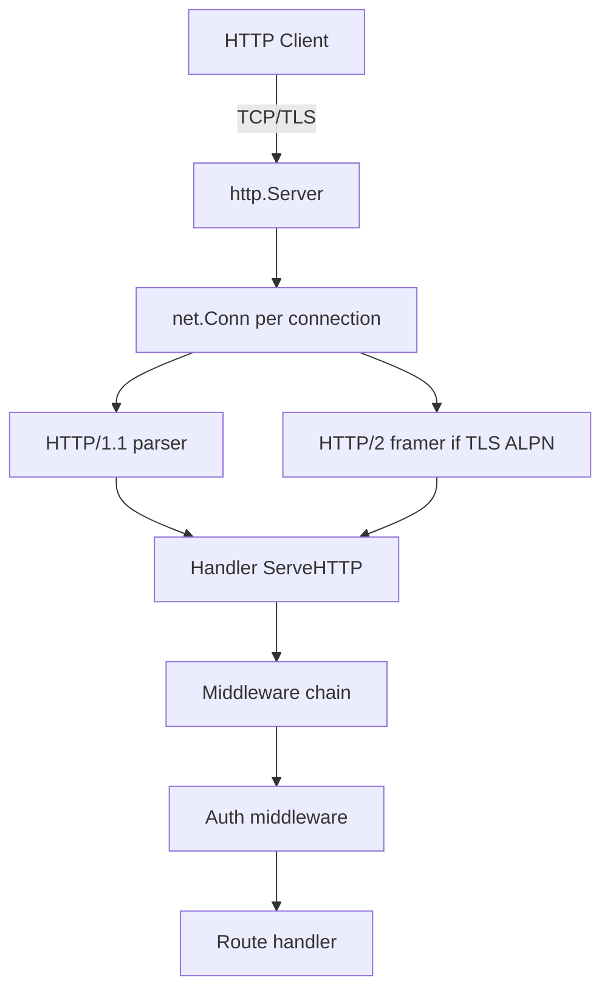

# Module 19 — Networking & HTTP

## TL;DR

Go's `net` and `net/http` packages provide production-grade TCP/UDP and HTTP servers with minimal dependencies. Master **middleware chains**, **graceful shutdown**, **TLS configuration**, and **HTTP/2** (enabled by default on HTTPS). Use `context` for request cancellation and timeouts at every layer.

## Concept

**TCP/UDP** — low-level networking:

```go
ln, err := net.Listen("tcp", ":8080")
conn, err := ln.Accept()
// or
conn, err := net.Dial("tcp", "host:port")
```

**HTTP server** — `net/http` is both client and server:

```go
mux := http.NewServeMux()
mux.HandleFunc("GET /health", func(w http.ResponseWriter, r *http.Request) {
    w.WriteHeader(http.StatusOK)
})

srv := &http.Server{
    Addr:         ":8080",
    Handler:      mux,
    ReadTimeout:  5 * time.Second,
    WriteTimeout: 10 * time.Second,
    IdleTimeout:  120 * time.Second,
}
log.Fatal(srv.ListenAndServe())
```

| Layer | Package / Feature |
|-------|-------------------|
| HTTP/1.1, HTTP/2 | `net/http` (H2 automatic on TLS) |
| WebSockets | `golang.org/x/net/websocket` or `github.com/gorilla/websocket` |
| TLS | `crypto/tls`, `ListenAndServeTLS` |
| Middleware | Handler wrapping: `func(next http.Handler) http.Handler` |
| Caching | `Cache-Control` headers, `ETag`, reverse proxy cache |

## How It Really Works (Internals)



- **One goroutine per connection** (HTTP/1) — can exhaust memory under high concurrency without timeouts.
- **HTTP/2**: Multiplexed streams on one connection — `MaxConcurrentStreams` limits abuse.
- **Handler interface**: `ServeHTTP(ResponseWriter, *Request)` — `ResponseWriter` wraps connection state.
- **Request context**: `r.Context()` carries deadline, cancellation, request-scoped values.
- **Graceful shutdown**: `srv.Shutdown(ctx)` stops accepting, waits for in-flight requests.
- **Reverse proxy**: `httputil.NewSingleHostReverseProxy` — modifies `Director` for headers.

## Why / When / Trade-offs

| Choice | When | Trade-off |
|--------|------|-----------|
| `net/http` stdlib | Most APIs, microservices | Verbose routing vs frameworks |
| chi / gin / echo | Complex routing, middleware ecosystems | Dependency, learning curve |
| Raw TCP | Custom protocols, gaming, IoT | You own framing, backpressure |
| WebSockets | Real-time bidirectional | Stateful, harder to scale |
| TLS termination at LB | Cloud deployments | mTLS between services is separate concern |

**Caching**: Prefer `Cache-Control: public, max-age=3600` for static assets; `ETag` for conditional GET; avoid caching authenticated responses without `Vary: Authorization`.

## Worked Scenario

Production HTTP API with middleware, graceful shutdown, and health checks:

```go
func main() {
    logger := slog.New(slog.NewJSONHandler(os.Stdout, nil))
    svc := NewUserService(db)

    mux := http.NewServeMux()
    mux.Handle("GET /api/v1/users/{id}", authMiddleware(logger)(getUserHandler(svc)))
    mux.HandleFunc("GET /healthz", func(w http.ResponseWriter, r *http.Request) {
        w.WriteHeader(http.StatusOK)
    })

    srv := &http.Server{
        Addr:              ":8080",
        Handler:           requestIDMiddleware(loggingMiddleware(logger)(mux)),
        ReadHeaderTimeout: 5 * time.Second,
        ReadTimeout:       10 * time.Second,
        WriteTimeout:      30 * time.Second,
        IdleTimeout:       120 * time.Second,
    }

    go func() {
        logger.Info("server starting", "addr", srv.Addr)
        if err := srv.ListenAndServe(); err != nil && !errors.Is(err, http.ErrServerClosed) {
            logger.Error("server error", "err", err)
            os.Exit(1)
        }
    }()

    quit := make(chan os.Signal, 1)
    signal.Notify(quit, syscall.SIGINT, syscall.SIGTERM)
    <-quit

    ctx, cancel := context.WithTimeout(context.Background(), 30*time.Second)
    defer cancel()
    if err := srv.Shutdown(ctx); err != nil {
        logger.Error("shutdown error", "err", err)
    }
    logger.Info("server stopped")
}

func authMiddleware(logger *slog.Logger, next http.Handler) http.Handler {
    return http.HandlerFunc(func(w http.ResponseWriter, r *http.Request) {
        token := r.Header.Get("Authorization")
        if token == "" {
            http.Error(w, "unauthorized", http.StatusUnauthorized)
            return
        }
        ctx := context.WithValue(r.Context(), userKey, parseToken(token))
        next.ServeHTTP(w, r.WithContext(ctx))
    })
}
```

TLS with modern cipher suites:

```go
srv := &http.Server{
    Addr:      ":443",
    Handler:   mux,
    TLSConfig: &tls.Config{
        MinVersion: tls.VersionTLS12,
        CurvePreferences: []tls.CurveID{tls.X25519, tls.CurveP256},
    },
}
srv.ListenAndServeTLS("cert.pem", "key.pem")
```

## Gotchas & Failure Modes

- **No timeouts**: Default `http.Client{}` has no timeout — always set `client.Timeout` or per-request context.
- **ResponseWriter write order**: Headers sent on first `Write` — check `WriteHeader` isn't called twice.
- **Draining body**: Must `io.Copy(io.Discard, r.Body)` before reusing connection.
- **Goroutine leak on hijack**: WebSocket upgrades bypass normal connection lifecycle.
- **Trusting `X-Forwarded-For`**: Spoofable unless set by trusted proxy — use `r.RemoteAddr` or configure trusted hops.
- **HTTP/2 GOAWAY**: Clients must handle connection draining during deploys.
- **Graceful shutdown too short**: In-flight long requests killed — tune shutdown timeout to P99 latency.

## Interview Q&A

**Q: How does Go's HTTP server handle concurrency?**
A: Each accepted connection typically gets a goroutine (HTTP/1). HTTP/2 multiplexes streams on fewer connections. Handler code should be goroutine-safe; per-request state lives in `*http.Request`.
↳ What limits goroutine explosion? Timeouts (`ReadTimeout`, `WriteTimeout`), connection limits via `net.Listen` wrappers, reverse proxy rate limiting.

**Q: Explain graceful shutdown in an HTTP server.**
A: On SIGTERM, call `server.Shutdown(ctx)` which closes the listener, waits for active requests up to ctx deadline, then returns. Kubernetes sends SIGTERM before removing pod from endpoints.
↳ What about long-lived WebSockets? Track active connections, close them explicitly, or use a longer terminationGracePeriodSeconds.

**Q: How is HTTP/2 enabled in Go?**
A: Automatic for HTTPS via ALPN (`h2`). For HTTP/2 cleartext (h2c), use `golang.org/x/net/http2` `h2c.NewHandler`. Client HTTP/2 enabled by default for HTTPS.
↳ Any HTTP/2 gotchas? Server push is deprecated in browsers; flow control can cause stalls if handlers don't read body.

**Q: How do you implement middleware in Go?**
A: Functions returning `http.Handler` that wrap the next handler — onion model. Alternative: decorator on `HandlerFunc`. Frameworks like chi provide `Use()` for chaining.
↳ How do you pass request-scoped data? `context.Context` via `r.WithContext` — never global variables.

## Verify

```bash
cd labs/09-http-api
go run ./cmd/server
curl -s http://localhost:8080/healthz
curl -s -H "Authorization: Bearer test" http://localhost:8080/api/v1/users/1
go test ./... -v -race
```

## Further Reading

- [net/http package](https://pkg.go.dev/net/http)
- [Go Blog — Timeouts](https://go.dev/blog/timeouts)
- [HTTP/2 in Go](https://pkg.go.dev/golang.org/x/net/http2)
- [RFC 9110 — HTTP Semantics](https://www.rfc-editor.org/rfc/rfc9110)
