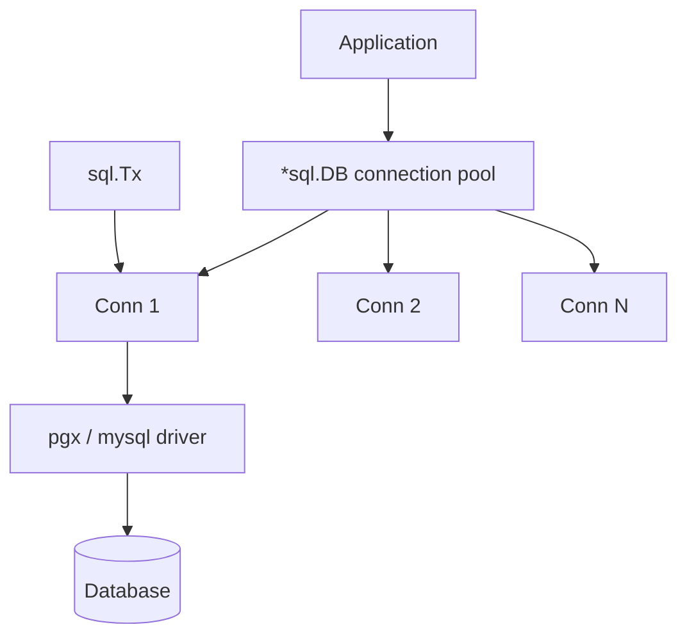

# Module 20 — Databases & ORM

## TL;DR

Use **`database/sql`** as the foundation — connection pooling, prepared statements, transactions. Layer **sqlx** for struct scanning or **GORM** for rapid development. Always use **context** for query timeouts, **migrations** for schema versioning, and understand **transaction isolation** before production.

## Concept

**database/sql** — the standard interface:

```go
db, err := sql.Open("postgres", dsn) // does NOT connect yet
err = db.PingContext(ctx)            // verifies connection
rows, err := db.QueryContext(ctx, "SELECT id, name FROM users WHERE active = $1", true)
```

**sqlx** — extends database/sql:

```go
var users []User
err := db.SelectContext(ctx, &users, "SELECT * FROM users WHERE org_id = $1", orgID)
```

**GORM** — full ORM:

```go
db.Where("active = ?", true).Find(&users)
db.Create(&user)
db.Delete(&user) // soft delete if gorm.DeletedAt field exists
```

| Layer | Use Case |
|-------|----------|
| `database/sql` | Maximum control, minimal deps |
| `sqlx` | SQL lovers who want struct mapping |
| `GORM` | CRUD-heavy apps, rapid prototyping |
| `goose` / `golang-migrate` | Schema migrations |

## How It Really Works (Internals)



- **`sql.DB` is a pool**, not a single connection — `SetMaxOpenConns`, `SetMaxIdleConns`, `SetConnMaxLifetime` tune behavior.
- **`sql.Open` is lazy** — first query or `Ping` actually connects.
- **Prepared statements**: `db.PrepareContext` — driver may cache; beware prepared statement limits on PgBouncer (transaction mode).
- **Transactions**: `db.BeginTx(ctx, &sql.TxOptions{Isolation: sql.LevelSerializable})` — always `defer tx.Rollback()` then `tx.Commit()`.
- **GORM soft delete**: Adds `deleted_at` column; queries auto-filter `WHERE deleted_at IS NULL`.
- **Migrations**: Versioned SQL files applied sequentially — never edit applied migrations.

## Why / When / Trade-offs

| Approach | Pros | Cons |
|----------|------|------|
| Raw SQL | Performance, clarity, full SQL features | Boilerplate, manual scanning |
| sqlx | Struct tags, named queries | Still write SQL |
| GORM | Associations, hooks, migrations | Magic behavior, N+1 queries, harder debugging |
| Stored procedures | DB-side logic | Testing, portability |

**Senior guidance**: Start with `database/sql` or sqlx. Add GORM only when team velocity outweighs control. Always log slow queries and monitor pool exhaustion.

## Worked Scenario

Repository pattern with transactions, context timeouts, and soft deletes:

```go
type User struct {
    ID        string
    Email     string
    Name      string
    CreatedAt time.Time
    DeletedAt sql.NullTime
}

type UserRepo struct {
    db *sql.DB
}

func (r *UserRepo) Create(ctx context.Context, u User) error {
    ctx, cancel := context.WithTimeout(ctx, 3*time.Second)
    defer cancel()

    _, err := r.db.ExecContext(ctx,
        `INSERT INTO users (id, email, name, created_at) VALUES ($1, $2, $3, $4)`,
        u.ID, u.Email, u.Name, u.CreatedAt,
    )
    return err
}

func (r *UserRepo) TransferCredits(ctx context.Context, from, to string, amount int64) error {
    ctx, cancel := context.WithTimeout(ctx, 10*time.Second)
    defer cancel()

    tx, err := r.db.BeginTx(ctx, &sql.TxOptions{Isolation: sql.LevelRepeatableRead})
    if err != nil {
        return err
    }
    defer tx.Rollback()

    var balance int64
    err = tx.QueryRowContext(ctx,
        `SELECT balance FROM accounts WHERE user_id = $1 FOR UPDATE`, from,
    ).Scan(&balance)
    if err != nil {
        return fmt.Errorf("lock from account: %w", err)
    }
    if balance < amount {
        return ErrInsufficientFunds
    }

    if _, err = tx.ExecContext(ctx,
        `UPDATE accounts SET balance = balance - $1 WHERE user_id = $2`, amount, from,
    ); err != nil {
        return err
    }
    if _, err = tx.ExecContext(ctx,
        `UPDATE accounts SET balance = balance + $1 WHERE user_id = $2`, amount, to,
    ); err != nil {
        return err
    }

    return tx.Commit()
}

func (r *UserRepo) SoftDelete(ctx context.Context, id string) error {
    _, err := r.db.ExecContext(ctx,
        `UPDATE users SET deleted_at = NOW() WHERE id = $1 AND deleted_at IS NULL`, id,
    )
    return err
}
```

Connection pool configuration for production:

```go
func ConfigureDB(db *sql.DB) {
    db.SetMaxOpenConns(25)                  // ≤ DB max_connections / num_instances
    db.SetMaxIdleConns(10)
    db.SetConnMaxLifetime(5 * time.Minute)  // rotate connections
    db.SetConnMaxIdleTime(1 * time.Minute)
}
```

Migration with goose:

```sql
-- migrations/001_create_users.sql
-- +goose Up
CREATE TABLE users (
    id         UUID PRIMARY KEY,
    email      TEXT NOT NULL UNIQUE,
    name       TEXT NOT NULL,
    created_at TIMESTAMPTZ NOT NULL DEFAULT NOW(),
    deleted_at TIMESTAMPTZ
);
-- +goose Down
DROP TABLE users;
```

## Gotchas & Failure Modes

- **Connection pool exhaustion**: `MaxOpenConns` too high × many pods > DB `max_connections`.
- **Forgot `Rollback`**: Leaked transactions hold locks — always `defer tx.Rollback()`.
- **GORM N+1**: `Preload("Orders")` or explicit joins — watch SQL logs.
- **NULL scanning**: Use `sql.NullString`, `sql.NullTime` — not plain `string`.
- **Context ignored**: Always `QueryContext`, never `Query` — cancellation won't work.
- **Migration drift**: Manual prod changes break `goose status` — migrations are source of truth.
- **PgBouncer + prepared statements**: Use `prefer_simple_protocol` or transaction pooling mode carefully.

## Interview Q&A

**Q: Explain how database/sql connection pooling works.**
A: `sql.DB` maintains a pool of established connections. `QueryContext` borrows a connection, returns it after use. `SetMaxOpenConns` caps concurrent DB connections; `SetConnMaxLifetime` forces reconnection to handle failover/LB rotation.
↳ How do you size the pool? `(DB max_connections - overhead) / number_of_app_instances`, validated under load test.

**Q: When would you choose GORM vs raw SQL?**
A: GORM for rapid CRUD, associations, and teams less fluent in SQL. Raw SQL/sqlx for complex queries, performance-critical paths, and when you need database-specific features (CTEs, window functions).
↳ How do you debug GORM? `db.Debug()` logs SQL; use hooks sparingly; prefer explicit queries for hot paths.

**Q: How do you handle transactions correctly in Go?**
A: `BeginTx` with context, `defer Rollback()` (no-op after Commit), propagate `tx` to repository methods or use a transaction manager. Choose isolation level based on consistency needs.
↳ What happens if context is cancelled mid-transaction? Driver should rollback; always pass ctx to `ExecContext`/`QueryContext`.

**Q: Explain soft deletes and their trade-offs.**
A: `deleted_at` timestamp instead of `DELETE` — preserves audit trail, enables undelete. Costs: unique constraints need partial indexes, queries must filter, tables grow.
↳ Alternative? Archive table + hard delete, or event sourcing for full history.

## Verify

```bash
cd labs/10-databases
docker compose up -d postgres
go run ./cmd/migrate up
go test ./... -v -tags=integration
go test -race ./internal/repository/...
```

## Further Reading

- [database/sql package](https://pkg.go.dev/database/sql)
- [jmoiron/sqlx](https://github.com/jmoiron/sqlx)
- [GORM Documentation](https://gorm.io/docs/)
- [pressly/goose migrations](https://github.com/pressly/goose)
