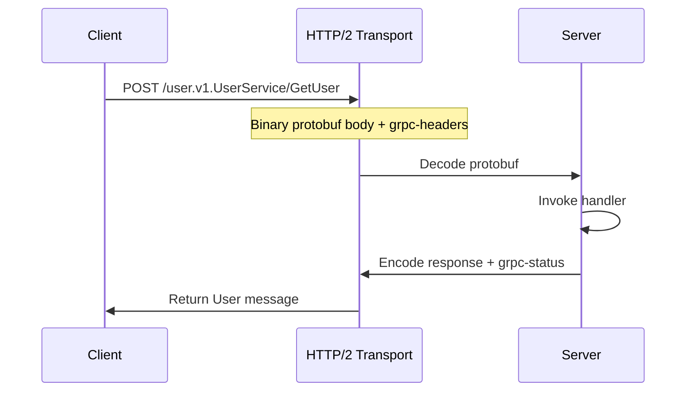

# Module 21 — gRPC & Protobuf

## TL;DR

**gRPC** is a high-performance RPC framework using **Protocol Buffers** for schema-first APIs. It supports unary, streaming, deadlines, and metadata. Choose gRPC for service-to-service communication; REST/JSON for public APIs and browsers. **GraphQL** suits flexible client-driven queries over aggregated data.

## Concept

**Protocol Buffers** — language-neutral schema:

```protobuf
syntax = "proto3";

package user.v1;

service UserService {
  rpc GetUser(GetUserRequest) returns (User);
  rpc ListUsers(ListUsersRequest) returns (stream User);
}

message User {
  string id = 1;
  string email = 2;
  string name = 3;
}
```

**gRPC in Go**:

```go
// Server
type server struct {
    userpb.UnimplementedUserServiceServer
    repo UserRepository
}

func (s *server) GetUser(ctx context.Context, req *userpb.GetUserRequest) (*userpb.User, error) {
    u, err := s.repo.FindByID(ctx, req.Id)
    if err != nil {
        return nil, status.Errorf(codes.NotFound, "user not found: %v", err)
    }
    return &userpb.User{Id: u.ID, Email: u.Email, Name: u.Name}, nil
}

grpcServer := grpc.NewServer(
    grpc.UnaryInterceptor(loggingInterceptor),
)
userpb.RegisterUserServiceServer(grpcServer, &server{repo: repo})
```

| RPC Type | Use Case |
|----------|----------|
| Unary | Request-response (most common) |
| Server streaming | Large result sets, live feeds |
| Client streaming | Bulk uploads |
| Bidirectional | Chat, real-time collaboration |

## How It Really Works (Internals)



- **HTTP/2 required**: gRPC runs over HTTP/2 — multiplexing, header compression (HPACK).
- **Code generation**: `protoc --go_out=. --go-grpc_out=. user.proto` produces `*.pb.go` and `*_grpc.pb.go`.
- **Status codes**: gRPC uses its own codes mapped from `status.Errorf(codes.X, ...)`.
- **Metadata**: Key-value headers (`metadata.NewOutgoingContext`) — like HTTP headers for auth, tracing.
- **Deadlines**: `ctx, cancel := context.WithTimeout(ctx, 3*time.Second)` — propagated automatically.
- **Interceptors**: Unary/stream interceptors for logging, auth, tracing — gRPC's middleware.

**gRPC vs REST:**

| Aspect | gRPC | REST |
|--------|------|------|
| Payload | Binary protobuf (compact) | JSON (human-readable) |
| Contract | `.proto` schema (strict) | OpenAPI (optional) |
| Browser | Needs grpc-web proxy | Native |
| Streaming | First-class | SSE, chunked |
| Tooling | protoc, buf | curl, Postman |

**GraphQL overview**: Single endpoint, client specifies fields — solves over-fetching. In Go: `gqlgen`, `99designs/gqlgen`. Best for BFF (Backend-for-Frontend) layers, not internal microservice mesh.

## Why / When / Trade-offs

- **gRPC**: Internal microservices, low latency, strong contracts, bi-directional streaming.
- **REST**: Public APIs, third-party integrations, caching with HTTP semantics.
- **GraphQL**: Mobile/web clients needing flexible queries over multiple backends.
- **Connect RPC / Twirp**: gRPC-compatible alternatives with better browser/JSON support.

## Worked Scenario

Complete gRPC service with interceptors, health checks, and graceful shutdown:

```go
func main() {
    lis, err := net.Listen("tcp", ":50051")
    if err != nil {
        log.Fatal(err)
    }

    grpcServer := grpc.NewServer(
        grpc.ChainUnaryInterceptor(
            recoveryInterceptor,
            loggingInterceptor,
            authInterceptor,
        ),
    )

    userpb.RegisterUserServiceServer(grpcServer, NewUserServer(repo))
    healthpb.RegisterHealthServer(grpcServer, health.NewServer())

    go func() {
        sig := make(chan os.Signal, 1)
        signal.Notify(sig, syscall.SIGINT, syscall.SIGTERM)
        <-sig
        log.Println("graceful stop initiated")
        grpcServer.GracefulStop()
    }()

    log.Println("gRPC server on :50051")
    if err := grpcServer.Serve(lis); err != nil {
        log.Fatal(err)
    }
}

func authInterceptor(ctx context.Context, req any, info *grpc.UnaryServerInfo, handler grpc.UnaryHandler) (any, error) {
    md, ok := metadata.FromIncomingContext(ctx)
    if !ok {
        return nil, status.Error(codes.Unauthenticated, "missing metadata")
    }
    tokens := md.Get("authorization")
    if len(tokens) == 0 || !validateToken(tokens[0]) {
        return nil, status.Error(codes.Unauthenticated, "invalid token")
    }
    return handler(ctx, req)
}

func recoveryInterceptor(ctx context.Context, req any, info *grpc.UnaryServerInfo, handler grpc.UnaryHandler) (resp any, err error) {
    defer func() {
        if r := recover(); r != nil {
            err = status.Errorf(codes.Internal, "panic: %v", r)
        }
    }()
    return handler(ctx, req)
}
```

Client with deadline and retry:

```go
conn, err := grpc.Dial("localhost:50051",
    grpc.WithTransportCredentials(insecure.NewCredentials()),
)
client := userpb.NewUserServiceClient(conn)

ctx, cancel := context.WithTimeout(context.Background(), 2*time.Second)
defer cancel()

user, err := client.GetUser(ctx, &userpb.GetUserRequest{Id: "user-42"})
if st, ok := status.FromError(err); ok && st.Code() == codes.NotFound {
    // handle not found
}
```

## Gotchas & Failure Modes

- **Proto breaking changes**: Never change field numbers — add new fields, reserve deprecated numbers.
- **Unimplemented embed**: Must embed `UnimplementedXServer` for forward compatibility.
- **Large messages**: Default 4MB limit — configure `MaxRecvMsgSize` / `MaxSendMsgSize`.
- **Load balancer idle timeout**: HTTP/2 connections dropped — use keepalive: `grpc.KeepaliveParams`.
- **Reflection in prod**: `reflection.Register` useful for dev — disable or restrict in production.
- **Error details**: Use `google.golang.org/genproto/googleapis/rpc/errdetails` for structured errors.
- **TLS/mTLS**: Production requires credentials — `credentials.NewTLS(tlsConfig)`.

## Interview Q&A

**Q: When would you choose gRPC over REST for microservices?**
A: gRPC for internal service-to-service: binary efficiency, strong typing via protobuf, streaming, built-in deadlines. REST for external/public APIs where browser compatibility and human debugging matter.
↳ What about API gateways? gRPC-gateway or Envoy transcoding exposes REST while backend stays gRPC.

**Q: How do you handle backward compatibility in protobuf?**
A: Add new fields with new numbers (never reuse), use `reserved` for removed fields, don't change wire types. Clients ignore unknown fields; servers should treat missing fields as defaults.
↳ What about removing a field? Mark deprecated, reserve number and name, remove in next major version.

**Q: Explain gRPC interceptors and how they compare to HTTP middleware.**
A: Interceptors wrap RPC handlers — unary and stream variants. Chain with `grpc.ChainUnaryInterceptor`. Same cross-cutting concerns: auth, logging, tracing, recovery.
↳ How do you propagate trace context? OpenTelemetry gRPC instrumentation injects/extracts from metadata.

**Q: What is GraphQL and when would you use it in a Go stack?**
A: Query language where clients request exact fields needed. Use at BFF layer aggregating multiple gRPC/REST backends. gqlgen generates Go resolvers from schema.
↳ Downsides? N+1 query problem (dataloaders), complexity, caching harder than REST.

## Verify

```bash
cd labs/15-grpc
buf generate
go run ./cmd/server
grpcurl -plaintext localhost:50051 list
grpcurl -plaintext -d '{"id":"user-42"}' localhost:50051 user.v1.UserService/GetUser
go test ./... -v
```

## Further Reading

- [gRPC Go Quick Start](https://grpc.io/docs/languages/go/quickstart/)
- [Protocol Buffers Style Guide](https://protobuf.dev/programming-guides/style/)
- [buf.build — Protobuf tooling](https://buf.build/docs)
- [gqlgen](https://gqlgen.com/)
