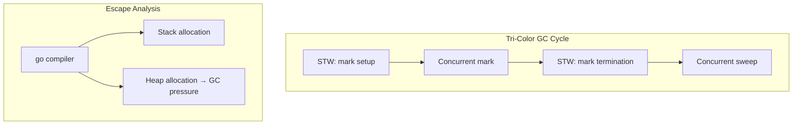

# Module 22 — GC, Runtime & Performance

## TL;DR

Go uses a **concurrent tri-color mark-and-sweep GC** with low pause times. Understand **escape analysis** to keep allocations off the heap, use **`sync.Pool`** for short-lived reusable objects, and profile with **pprof** before optimizing. Measure first — premature optimization wastes time.

## Concept

**Garbage Collection**: Go's GC is non-generational, concurrent, and tri-color:
1. **White**: Unreachable — candidates for collection
2. **Gray**: Reachable, children not yet scanned
3. **Black**: Reachable, fully scanned

**Escape analysis** (compile-time): Determines if a variable lives on stack or heap.

```go
func stackAlloc() int {
    x := 42  // stays on stack
    return x
}

func heapAlloc() *int {
    x := 42  // escapes to heap — returned pointer
    return &x
}
```

Check escapes: `go build -gcflags="-m" ./...`

**sync.Pool** — object reuse:

```go
var bufferPool = sync.Pool{
    New: func() any {
        return new(bytes.Buffer)
    },
}

func process(data []byte) {
    buf := bufferPool.Get().(*bytes.Buffer)
    buf.Reset()
    defer bufferPool.Put(buf)
    buf.Write(data)
    // ...
}
```

**pprof** — CPU, heap, goroutine, mutex profiles:

```bash
go test -cpuprofile=cpu.prof -bench=.
go tool pprof -http=:8080 cpu.prof
```

## How It Really Works (Internals)



| Mechanism | Detail |
|-----------|--------|
| GC trigger | `GOGC` (default 100) — heap doubles since last GC |
| Write barrier | Tracks pointer mutations during concurrent mark |
| STW pauses | Typically < 1ms on modern Go — mark termination |
| GOMAXPROCS | Controls OS threads for goroutine execution |
| GOMEMLIMIT | (Go 1.19+) Soft memory limit — GC runs more aggressively |

**CPU vs IO optimization:**
- **CPU-bound**: Reduce allocations, use `sync.Pool`, profile hot paths, avoid reflection.
- **IO-bound**: Connection pooling, batching, async I/O, proper timeouts — GC tuning won't help much.

## Why / When / Trade-offs

| Technique | When | Risk |
|-----------|------|------|
| `sync.Pool` | High-frequency short-lived allocations | Pool may be cleared on GC — don't store state |
| Stack allocation | Small, non-escaping values | Compiler decides — don't fight it |
| `GOGC=off` + manual GC | Latency-critical batch jobs | Memory grows until OOM |
| Preallocation | Known slice sizes | `make([]T, 0, capacity)` |
| Goroutine pools | Limit concurrency | `errgroup` with semaphore, worker pools |

**Rule**: Profile → identify bottleneck → fix → benchmark → repeat. Use `benchstat` for statistical comparison.

## Worked Scenario

Optimizing a JSON API handler — before and after profiling:

```go
// Before: allocations per request visible in -benchmem
func encodeUsersSlow(users []User) ([]byte, error) {
    return json.Marshal(users) // reflection per call
}

// After: preallocated buffer pool + json.Encoder
var bufPool = sync.Pool{
    New: func() any { return bytes.NewBuffer(make([]byte, 0, 4096)) },
}

func encodeUsersFast(users []User) ([]byte, error) {
    buf := bufPool.Get().(*bytes.Buffer)
    buf.Reset()
    defer bufPool.Put(buf)

    enc := json.NewEncoder(buf)
    if err := enc.Encode(users); err != nil {
        return nil, err
    }
    // Copy out — buffer returns to pool
    result := make([]byte, buf.Len())
    copy(result, buf.Bytes())
    return result, nil
}
```

Profiling integration in a server:

```go
import _ "net/http/pprof"

func main() {
    go func() {
        log.Println(http.ListenAndServe("localhost:6060", nil))
    }()
    // main server on :8080
}
```

```bash
# CPU profile 30 seconds
go tool pprof http://localhost:6060/debug/pprof/profile?seconds=30

# Heap profile
go tool pprof http://localhost:6060/debug/pprof/heap

# Goroutine dump
curl http://localhost:6060/debug/pprof/goroutine?debug=2
```

Worker pool to limit goroutine explosion:

```go
func processJobs(ctx context.Context, jobs <-chan Job, workers int) error {
    g, ctx := errgroup.WithContext(ctx)
    g.SetLimit(workers) // Go 1.20+

    for job := range jobs {
        g.Go(func() error {
            return handleJob(ctx, job)
        })
    }
    return g.Wait()
}
```

## Gotchas & Failure Modes

- **sync.Pool is not a cache**: Objects may be GC'd anytime — reset state on Get.
- **False sharing**: Adjacent goroutines writing to same cache line — rare but real in counters.
- **Goroutine leak**: Blocked on channel/send — shows in goroutine profile.
- **Optimizing cold paths**: Profile first — 80/20 rule applies.
- **GOMAXPROCS=1 in containers**: Go 1.22+ auto-detects cgroup limits; verify in K8s.
- **Large heap = longer GC**: More live objects = more mark work — reduce heap size, not just GOGC.
- **Mutex profile ignored**: Contention shows in `block` and `mutex` profiles — not CPU profile.

## Interview Q&A

**Q: Explain Go's garbage collector and its pause characteristics.**
A: Concurrent tri-color mark-and-sweep. Most marking runs alongside application goroutines. Brief STW phases for mark start/termination. Designed for sub-millisecond pauses at the cost of total GC CPU overhead (~25% of mutator work at GOGC=100).
↳ How does GOGC work? Target heap size = live heap × (1 + GOGC/100). Lower GOGC = more frequent GC, less memory.

**Q: What is escape analysis and why does it matter?**
A: Compiler analysis determining if a variable's address outlives its function. Non-escaping → stack allocation (free, fast). Escaping → heap allocation (GC pressure). Check with `go build -gcflags="-m"`.
↳ Common escape causes? Returning pointer to local, assigning to interface{}, closure capturing variable, `fmt.Sprintf` arguments.

**Q: When should you use sync.Pool?**
A: Frequently allocated, short-lived objects where reset is cheaper than allocation (buffers, temporary structs). NOT for connection pools, long-lived caches, or objects with complex lifecycle.
↳ What happens to pooled objects during GC? Pool may be cleared — design for loss, always Reset on Get.

**Q: How do you approach performance optimization in a Go service?**
A: 1) Define SLIs/SLOs, 2) Load test to find limits, 3) pprof CPU/heap/goroutine, 4) Fix top allocators and hot functions, 5) benchstat to verify, 6) Re-test under load. Optimize IO before CPU; allocations before algorithms.
↳ What tools beyond pprof? `trace` for scheduler latency, `fgprof` for wall-time, Grafana dashboards for production.

## Verify

```bash
cd labs/11-profiling
go test -bench=. -benchmem -cpuprofile=cpu.prof ./...
go tool pprof -top cpu.prof
go build -gcflags="-m" ./... 2>&1 | grep escape
curl -s http://localhost:6060/debug/pprof/heap > /dev/null
```

## Further Reading

- [Go GC Guide](https://go.dev/doc/gc-guide)
- [Go Blog — Profiler](https://go.dev/blog/pprof)
- [Diagnostics — Runtime](https://go.dev/doc/diagnostics)
- [benchstat](https://pkg.go.dev/golang.org/x/perf/cmd/benchstat)
