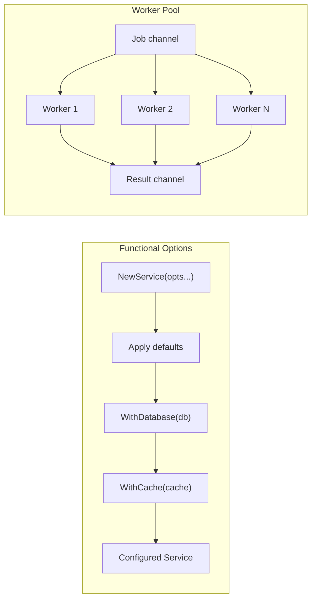

# Module 23 — Design Patterns in Go

## TL;DR

Go favors **composition over inheritance** — many Gang of Four (GoF) patterns simplify or disappear. Master **Functional Options**, **interface-based Strategy**, **Worker Pool**, and **Decorator** (middleware). Avoid pattern cargo-culting — Go idioms often replace heavy OOP patterns.

## Concept

**Go's approach to GoF patterns:**

| GoF Pattern | Go Idiom |
|-------------|----------|
| Strategy | Interface + multiple implementations |
| Factory | Constructor functions (`NewXxx`) |
| Singleton | `sync.Once` (rarely needed) |
| Decorator | Function wrapping (`http.Handler`) |
| Observer | Channels + goroutines |
| Builder | **Functional Options** |
| Adapter | Wrapper struct embedding interface |
| Command | Closure or function type |

**Functional Options** — the most important Go pattern:

```go
type Server struct {
    addr    string
    timeout time.Duration
    logger  *slog.Logger
}

type Option func(*Server)

func WithTimeout(d time.Duration) Option {
    return func(s *Server) { s.timeout = d }
}

func WithLogger(l *slog.Logger) Option {
    return func(s *Server) { s.logger = l }
}

func NewServer(addr string, opts ...Option) *Server {
    s := &Server{
        addr:    addr,
        timeout: 30 * time.Second,
        logger:  slog.Default(),
    }
    for _, opt := range opts {
        opt(s)
    }
    return s
}

// Usage
srv := NewServer(":8080", WithTimeout(10*time.Second), WithLogger(customLogger))
```

## How It Really Works (Internals)



**Why Go doesn't need some patterns:**
- **No inheritance** → no Template Method; use composition or interfaces.
- **First-class functions** → Strategy/Command are just functions.
- **Channels** → Observer/Pub-Sub without event bus frameworks.
- **Implicit interfaces** → Adapter is often a thin wrapper.

## Why / When / Trade-offs

| Pattern | Use When | Avoid When |
|---------|----------|------------|
| Functional Options | Configurable constructors with defaults | Only 1-2 required params — use struct |
| Worker Pool | Bounded concurrency, job processing | Few goroutines — `errgroup` suffices |
| Repository | Abstract data access | Simple CRUD with one DB |
| Circuit Breaker | Protect against cascading failures | Every external call (overhead) |
| Middleware/Decorator | Cross-cutting HTTP/gRPC concerns | Deep nesting hurts readability |

**Senior principle**: Patterns should solve a problem you have, not problems you might have.

## Worked Scenario

Repository + Strategy + Worker Pool for an order processing system:

```go
// Strategy pattern via interface
type PaymentProcessor interface {
    Charge(ctx context.Context, amount int64) (string, error)
}

type StripeProcessor struct { client *stripe.Client }
type PayPalProcessor struct { client *paypal.Client }

func (s *StripeProcessor) Charge(ctx context.Context, amount int64) (string, error) {
    // stripe-specific logic
    return "ch_stripe_123", nil
}

// Repository pattern
type OrderRepository interface {
    Save(ctx context.Context, order Order) error
    FindByID(ctx context.Context, id string) (Order, error)
}

type PostgresOrderRepo struct{ db *sql.DB }

func (r *PostgresOrderRepo) Save(ctx context.Context, order Order) error {
    _, err := r.db.ExecContext(ctx,
        `INSERT INTO orders (id, amount, status) VALUES ($1, $2, $3)`,
        order.ID, order.Amount, order.Status,
    )
    return err
}

// Worker pool for async order fulfillment
type FulfillmentWorker struct {
    jobs    chan Order
    repo    OrderRepository
    payment PaymentProcessor
}

func NewFulfillmentWorker(workers int, repo OrderRepository, payment PaymentProcessor) *FulfillmentWorker {
    w := &FulfillmentWorker{
        jobs:    make(chan Order, 100),
        repo:    repo,
        payment: payment,
    }
    for i := 0; i < workers; i++ {
        go w.run()
    }
    return w
}

func (w *FulfillmentWorker) Submit(order Order) {
    w.jobs <- order
}

func (w *FulfillmentWorker) run() {
    for order := range w.jobs {
        ctx := context.Background()
        if _, err := w.payment.Charge(ctx, order.Amount); err != nil {
            order.Status = "payment_failed"
        } else {
            order.Status = "fulfilled"
        }
        _ = w.repo.Save(ctx, order)
    }
}

// Functional options for service configuration
type OrderService struct {
    repo    OrderRepository
    payment PaymentProcessor
    worker  *FulfillmentWorker
}

type ServiceOption func(*OrderService)

func WithPaymentProcessor(p PaymentProcessor) ServiceOption {
    return func(s *OrderService) { s.payment = p }
}

func NewOrderService(repo OrderRepository, opts ...ServiceOption) *OrderService {
    s := &OrderService{repo: repo}
    for _, opt := range opts {
        opt(s)
    }
    return s
}
```

## Gotchas & Failure Modes

- **Over-engineering with patterns**: 3-line factory for 1 implementation — just use a struct.
- **Functional options order matters**: If options conflict, last wins — document behavior.
- **Worker pool without backpressure**: Unbounded job channel → OOM under load.
- **Interface proliferation**: `Reader`, `Writer`, `ReadWriter`, `ReadWriteCloser`... keep interfaces small.
- **sync.Once for everything**: Global state is an anti-pattern — prefer dependency injection.
- **Deep middleware chains**: Hard to debug request flow — log at each layer.

## Interview Q&A

**Q: Explain the Functional Options pattern and why it's popular in Go.**
A: Variadic `Option func(*T)` applied in constructor after defaults. Benefits: backward-compatible API extension, no builder boilerplate, readable call sites. Used by gRPC, zap, and most Go libraries.
↳ How does it compare to a config struct? Options for optional params with defaults; config struct when most fields are required or validated as a group.

**Q: How does Go implement Strategy without classes?**
A: Define a small interface, provide multiple implementations, inject at construction. The context struct holds the strategy interface field. No inheritance — just composition.
↳ Example in stdlib? `io.Reader` — `os.File`, `bytes.Buffer`, `strings.Reader` are strategies for reading.

**Q: When would you use a Worker Pool vs spawning goroutines per task?**
A: Worker pool when you need bounded concurrency, resource limits (DB connections), or ordered result processing. Per-task goroutines when tasks are few, short, or naturally limited.
↳ How do you shut down a worker pool? Close jobs channel, use `sync.WaitGroup`, respect context cancellation.

**Q: Which GoF patterns are unnecessary in Go?**
A: Singleton (use DI), Factory hierarchy (constructors), Template Method (composition), Observer (channels), Visitor (type switches). Go's interfaces and functions subsume many OOP patterns.
↳ Is there a pattern Go adds? Pipeline pattern with channels — stages connected by goroutines.

## Verify

```bash
cd labs/13-design-patterns
go test ./... -v -race
go test -run TestFunctionalOptions -v ./internal/server/
go test -run TestWorkerPool -v ./internal/worker/
```

## Further Reading

- [Go Proverbs](https://go-proverbs.github.io/)
- [Functional Options in Go](https://dave.cheney.net/2014/10/17/functional-options-for-friendly-apis)
- [GoF Patterns — Go Adaptations](https://github.com/tmrts/go-patterns)
- [Google Go Style Guide](https://google.github.io/styleguide/go/)
