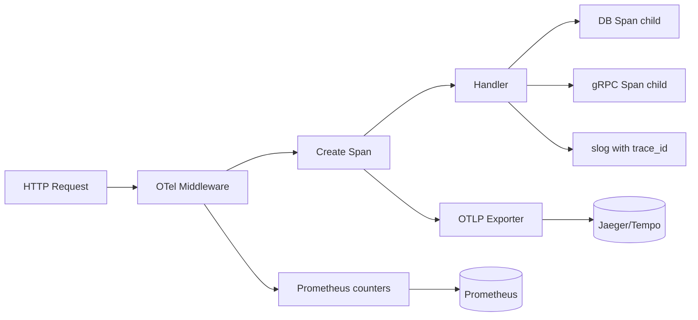

# Module 24 — Observability

## TL;DR

Production Go services need three pillars: **structured logging** (`slog`), **metrics** (Prometheus), and **distributed tracing** (OpenTelemetry). Instrument at boundaries — HTTP handlers, gRPC interceptors, DB calls. Correlate with **trace IDs** across services. Logs are for humans; metrics for alerting; traces for latency debugging.

## Concept

**Structured logging with slog** (Go 1.21+):

```go
logger := slog.New(slog.NewJSONHandler(os.Stdout, &slog.HandlerOptions{
    Level: slog.LevelInfo,
}))

logger.Info("request processed",
    "method", r.Method,
    "path", r.URL.Path,
    "status", status,
    "duration_ms", elapsed.Milliseconds(),
    "trace_id", traceID,
)
```

**Prometheus metrics**:

```go
var (
    httpRequestsTotal = promauto.NewCounterVec(
        prometheus.CounterOpts{
            Name: "http_requests_total",
            Help: "Total HTTP requests",
        },
        []string{"method", "path", "status"},
    )
    httpRequestDuration = promauto.NewHistogramVec(
        prometheus.HistogramOpts{
            Name:    "http_request_duration_seconds",
            Buckets: prometheus.DefBuckets,
        },
        []string{"method", "path"},
    )
)
```

**OpenTelemetry tracing**:

```go
tracer := otel.Tracer("order-service")

func handleOrder(ctx context.Context, orderID string) error {
    ctx, span := tracer.Start(ctx, "handleOrder",
        trace.WithAttributes(attribute.String("order.id", orderID)),
    )
    defer span.End()

    if err := validateOrder(ctx, orderID); err != nil {
        span.RecordError(err)
        span.SetStatus(codes.Error, err.Error())
        return err
    }
    return fulfillOrder(ctx, orderID)
}
```

| Pillar | Tool | Purpose |
|--------|------|---------|
| Logs | `slog`, zap | Debugging, audit trail |
| Metrics | Prometheus + Grafana | Alerting, dashboards, SLOs |
| Traces | OpenTelemetry → Jaeger/Tempo | Latency breakdown, dependency map |

## How It Really Works (Internals)



- **Trace context propagation**: W3C `traceparent` header carries trace ID across HTTP/gRPC calls.
- **Span**: Unit of work with start/end time, attributes, events, and parent-child relationships.
- **Histogram buckets**: Define SLO thresholds — e.g., buckets at 50ms, 100ms, 250ms, 1s.
- **Cardinality explosion**: Never label metrics with user IDs — use bounded labels (method, status, route template).
- **slog levels**: Debug (dev), Info (normal), Warn (recoverable), Error (action needed).

## Why / When / Trade-offs

| Signal | Alert On | Don't Use For |
|--------|----------|---------------|
| Metrics | SLO breaches, error rate spikes | Individual request debugging |
| Logs | Error messages, audit events | High-cardinality analytics |
| Traces | Latency outliers (tail sampling) | Business reporting |

**Sampling**: Trace 100% in dev; sample 1-10% in prod with tail-based sampling (keep errors and slow traces).

**Trade-offs:**
- **slog vs zap**: slog is stdlib, good enough for most; zap is faster for extreme throughput.
- **Push vs pull metrics**: Prometheus pulls — need `/metrics` endpoint; Pushgateway for batch jobs only.

## Worked Scenario

Full observability stack for an HTTP microservice:

```go
func main() {
    ctx := context.Background()

    // OpenTelemetry setup
    shutdown, err := initTracer(ctx, "order-service")
    if err != nil {
        log.Fatal(err)
    }
    defer shutdown(ctx)

    logger := slog.New(slog.NewJSONHandler(os.Stdout, nil))
    slog.SetDefault(logger)

    mux := http.NewServeMux()
    mux.Handle("GET /orders/{id}", otelhttp.NewHandler(
        instrumentedHandler(getOrderHandler), "getOrder",
    ))
    mux.Handle("/metrics", promhttp.Handler())

    srv := &http.Server{Addr: ":8080", Handler: loggingMiddleware(mux)}
    log.Fatal(srv.ListenAndServe())
}

func loggingMiddleware(next http.Handler) http.Handler {
    return http.HandlerFunc(func(w http.ResponseWriter, r *http.Request) {
        start := time.Now()
        sw := &statusWriter{ResponseWriter: w, status: 200}
        next.ServeHTTP(sw, r)

        duration := time.Since(start)
        span := trace.SpanFromContext(r.Context())

        logger := slog.Default().With(
            "trace_id", span.SpanContext().TraceID().String(),
            "method", r.Method,
            "path", r.URL.Path,
        )
        logger.Info("request",
            "status", sw.status,
            "duration_ms", duration.Milliseconds(),
        )

        httpRequestsTotal.WithLabelValues(
            r.Method, r.URL.Path, strconv.Itoa(sw.status),
        ).Inc()
        httpRequestDuration.WithLabelValues(r.Method, r.URL.Path).Observe(duration.Seconds())
    })
}

type statusWriter struct {
    http.ResponseWriter
    status int
}

func (w *statusWriter) WriteHeader(code int) {
    w.status = code
    w.ResponseWriter.WriteHeader(code)
}
```

Prometheus alerting rule example:

```yaml
groups:
  - name: order-service
    rules:
      - alert: HighErrorRate
        expr: rate(http_requests_total{status=~"5.."}[5m]) / rate(http_requests_total[5m]) > 0.05
        for: 2m
        labels:
          severity: critical
```

## Gotchas & Failure Modes

- **High-cardinality labels**: `path="/users/12345"` — use route templates `/users/{id}`.
- **Logging in hot loops**: Debug logs in inner loops — guard with level check or sampling.
- **Missing trace propagation**: Outgoing HTTP calls without injecting context — broken traces.
- **Metric naming**: Follow Prometheus conventions — `_total` suffix for counters, `_seconds` for durations.
- **Blocking log writes**: JSON to stdout is sync — use buffered handler or async sink at extreme scale.
- **Alert fatigue**: Too many alerts → ignored — alert on symptoms (latency, errors), not causes (CPU).
- **PII in logs**: Never log passwords, tokens, full credit card numbers — mask or omit.

## Interview Q&A

**Q: How do you implement the three pillars of observability in a Go microservice?**
A: slog for structured JSON logs with trace_id correlation. Prometheus client for RED metrics (Rate, Errors, Duration). OpenTelemetry SDK with OTLP exporter for distributed traces. Instrument at HTTP/gRPC middleware layer.
↳ What's RED vs USE? RED for services (Rate, Errors, Duration); USE for resources (Utilization, Saturation, Errors).

**Q: How does distributed tracing work across services?**
A: Root span created at entry point. Trace context (trace ID, span ID) propagated via HTTP headers (`traceparent`) or gRPC metadata. Each service creates child spans. Collector assembles the full trace tree.
↳ How do you handle async (message queues)? Inject trace context into message headers; extract on consumer side.

**Q: slog vs zap — when to choose each?**
A: slog (stdlib) for new projects — adequate performance, no dependency. zap for extreme throughput (>100k logs/sec) or if already in ecosystem. Both support structured logging.
↳ Can you bridge them? `slog` handlers can wrap zap; OTel integrates with both.

**Q: How do you avoid cardinality explosion in Prometheus metrics?**
A: Bounded label sets — use route patterns not full paths, status code classes not every code, no user/request IDs as labels. Use logs or traces for high-cardinality data.
↳ What's an example of a cardinality disaster? `http_requests_total{user_id="..."}` with millions of users.

## Verify

```bash
cd labs/09-http-api
go run ./cmd/server
curl -s http://localhost:8080/orders/1
curl -s http://localhost:8080/metrics | grep http_requests
# If Jaeger running:
# open http://localhost:16686
```

## Further Reading

- [Go slog package](https://pkg.go.dev/log/slog)
- [Prometheus Go client](https://github.com/prometheus/client_golang)
- [OpenTelemetry Go](https://opentelemetry.io/docs/languages/go/)
- [Google SRE — Monitoring](https://sre.google/sre-book/monitoring-distributed-systems/)
