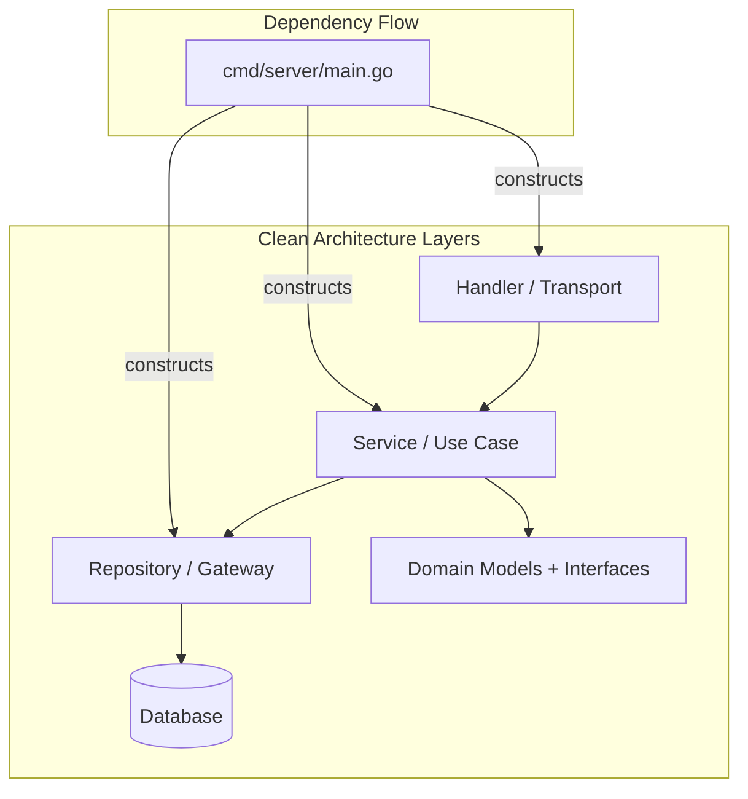

# Module 25 — Project Architecture

## TL;DR

Structure Go projects with **`cmd/`** for binaries, **`internal/`** for private code, and clear layers (handler → service → repository). Use **dependency injection** via constructors, not frameworks. Manage config with **environment variables** and validation. Choose **chi/gin** for routing; consider **go-kit** for microservice transport abstraction.

## Concept

**Standard project layout:**

```
my-service/
├── cmd/
│   └── server/
│       └── main.go           # wire dependencies, start server
├── internal/
│   ├── config/
│   │   └── config.go         # env parsing, validation
│   ├── handler/              # HTTP/gRPC handlers (thin)
│   ├── service/              # business logic
│   ├── repository/           # data access
│   └── domain/               # entities, interfaces
├── api/
│   └── openapi.yaml          # API contract
├── migrations/
├── go.mod
└── Dockerfile
```

**Dependency Injection** — explicit constructor wiring:

```go
func main() {
    cfg, err := config.Load()
    if err != nil {
        log.Fatal(err)
    }

    db, err := repository.NewPostgresDB(cfg.DatabaseURL)
    if err != nil {
        log.Fatal(err)
    }
    defer db.Close()

    userRepo := repository.NewUserRepo(db)
    userSvc := service.NewUserService(userRepo, cfg.JWTSecret)
    userHandler := handler.NewUserHandler(userSvc)

    router := chi.NewRouter()
    router.Route("/api/v1", func(r chi.Router) {
        r.Get("/users/{id}", userHandler.GetUser)
        r.Post("/users", userHandler.CreateUser)
    })

    srv := &http.Server{Addr: cfg.Addr, Handler: router}
    log.Fatal(srv.ListenAndServe())
}
```

**Config management:**

```go
type Config struct {
    Addr        string        `env:"ADDR" envDefault:":8080"`
    DatabaseURL string        `env:"DATABASE_URL,required"`
    JWTSecret   string        `env:"JWT_SECRET,required"`
    Timeout     time.Duration `env:"TIMEOUT" envDefault:"30s"`
}

func Load() (*Config, error) {
    var cfg Config
    if err := env.Parse(&cfg); err != nil {
        return nil, fmt.Errorf("parse config: %w", err)
    }
    return &cfg, nil
}
```

## How It Really Works (Internals)



| Framework | Strength | Use When |
|-----------|----------|----------|
| **chi** | Lightweight, stdlib-compatible, great middleware | REST APIs, microservices |
| **gin** | Fast, popular, binding/validation | Rapid API development |
| **echo** | Similar to gin, good middleware | REST APIs |
| **go-kit** | Transport-agnostic service layer | Multiple transports (HTTP, gRPC, NATS) |
| **stdlib mux** | Zero deps, Go 1.22+ routing | Simple services |

**API versioning strategies:**
- URL path: `/api/v1/users` (most common)
- Header: `Accept: application/vnd.api+json;version=1`
- Never version individual fields — version the API surface.

## Why / When / Trade-offs

| Decision | Recommendation |
|----------|----------------|
| `internal/` vs `pkg/` | `internal/` unless truly reusable across modules |
| Monolith vs microservices | Start monolith with clear boundaries; split when needed |
| Interface location | Defined by consumer, not producer |
| Global state | Avoid — inject dependencies |
| Config source | Env vars for 12-factor; files for local dev |

**go-kit pattern**: Separate `endpoint.Endpoint` (business), `service.Service` (logic), and `transport` (HTTP/gRPC). Powerful but verbose — worth it for multi-transport services.

## Worked Scenario

Layered architecture with API versioning and interface-based DI:

```go
// internal/domain/user.go
package domain

type User struct {
    ID    string
    Email string
    Name  string
}

type UserRepository interface {
    FindByID(ctx context.Context, id string) (User, error)
    Create(ctx context.Context, user User) error
}

// internal/service/user.go
package service

type UserService struct {
    repo   domain.UserRepository
    logger *slog.Logger
}

func NewUserService(repo domain.UserRepository, logger *slog.Logger) *UserService {
    return &UserService{repo: repo, logger: logger}
}

func (s *UserService) GetUser(ctx context.Context, id string) (domain.User, error) {
    user, err := s.repo.FindByID(ctx, id)
    if err != nil {
        return domain.User{}, fmt.Errorf("get user %s: %w", id, err)
    }
    return user, nil
}

// internal/handler/user_v1.go
package handler

type UserHandlerV1 struct {
    svc *service.UserService
}

func (h *UserHandlerV1) GetUser(w http.ResponseWriter, r *http.Request) {
    id := chi.URLParam(r, "id")
    user, err := h.svc.GetUser(r.Context(), id)
    if err != nil {
        http.Error(w, "not found", http.StatusNotFound)
        return
    }
    json.NewEncoder(w).Encode(user)
}

// cmd/server/main.go — versioned routes
func setupRoutes(v1 *handler.UserHandlerV1) http.Handler {
    r := chi.NewRouter()
    r.Route("/api/v1", func(r chi.Router) {
        r.Get("/users/{id}", v1.GetUser)
    })
    r.Route("/api/v2", func(r chi.Router) {
        // v2 handlers with breaking changes
    })
    return r
}
```

## Gotchas & Failure Modes

- **Anemic domain**: All logic in handlers — fat handlers, untestable services.
- **Circular imports**: `service` imports `handler` imports `service` — interfaces in domain break cycles.
- **Leaking ORM models**: GORM structs in handlers — map to domain types at repository boundary.
- **God `main.go`**: 500-line main — extract wiring to `internal/app` or `wire.go`.
- **Config without validation**: Missing required env var discovered at runtime — use `required` tags.
- **Premature microservices**: Distributed monolith with network overhead — start modular monolith.
- **Version sprawl**: Too many API versions maintained — sunset policy required.

## Interview Q&A

**Q: How do you structure a production Go microservice?**
A: `cmd/` for entrypoints, `internal/` for private packages, layered architecture (handler → service → repository), domain interfaces defined by consumer, config from env vars, migrations in versioned SQL files.
↳ When do you use `pkg/`? Only for code intentionally shared across multiple modules in the same repo.

**Q: How do you implement dependency injection in Go without a framework?**
A: Constructor functions accepting interfaces. Wire in `main()`. Use `google/wire` or `uber/fx` for large apps if manual wiring becomes unwieldy — but explicit is preferred.
↳ What's wrong with DI frameworks in Go? Hide dependencies, harder to trace, fight Go's explicit philosophy.

**Q: Compare chi, gin, and go-kit for building APIs.**
A: chi: thin router on stdlib, excellent middleware, my default. gin: faster binding, larger ecosystem, slightly non-stdlib patterns. go-kit: transport abstraction for services exposed via HTTP + gRPC + queues — more ceremony, more flexibility.
↳ When is stdlib mux enough? Simple services, few routes, Go 1.22+ method+path patterns.

**Q: How do you handle API versioning in Go services?**
A: URL path versioning (`/api/v1/`) is simplest. Separate handler packages per version sharing service layer. Deprecation headers (`Sunset`, `Deprecation`) for migration periods.
↳ How long to maintain old versions? Business decision — typically 6-12 months with migration guide.

## Verify

```bash
cd labs/09-http-api
go run ./cmd/server
curl -s http://localhost:8080/api/v1/users/1 | jq .
curl -s -X POST http://localhost:8080/api/v1/users -d '{"email":"a@b.com"}' -H "Content-Type: application/json"
go test ./... -v -race
```

## Further Reading

- [Standard Go Project Layout](https://github.com/golang-standards/project-layout)
- [go-chi/chi](https://github.com/go-chi/chi)
- [go-kit](https://gokit.io/)
- [12-Factor App](https://12factor.net/)
