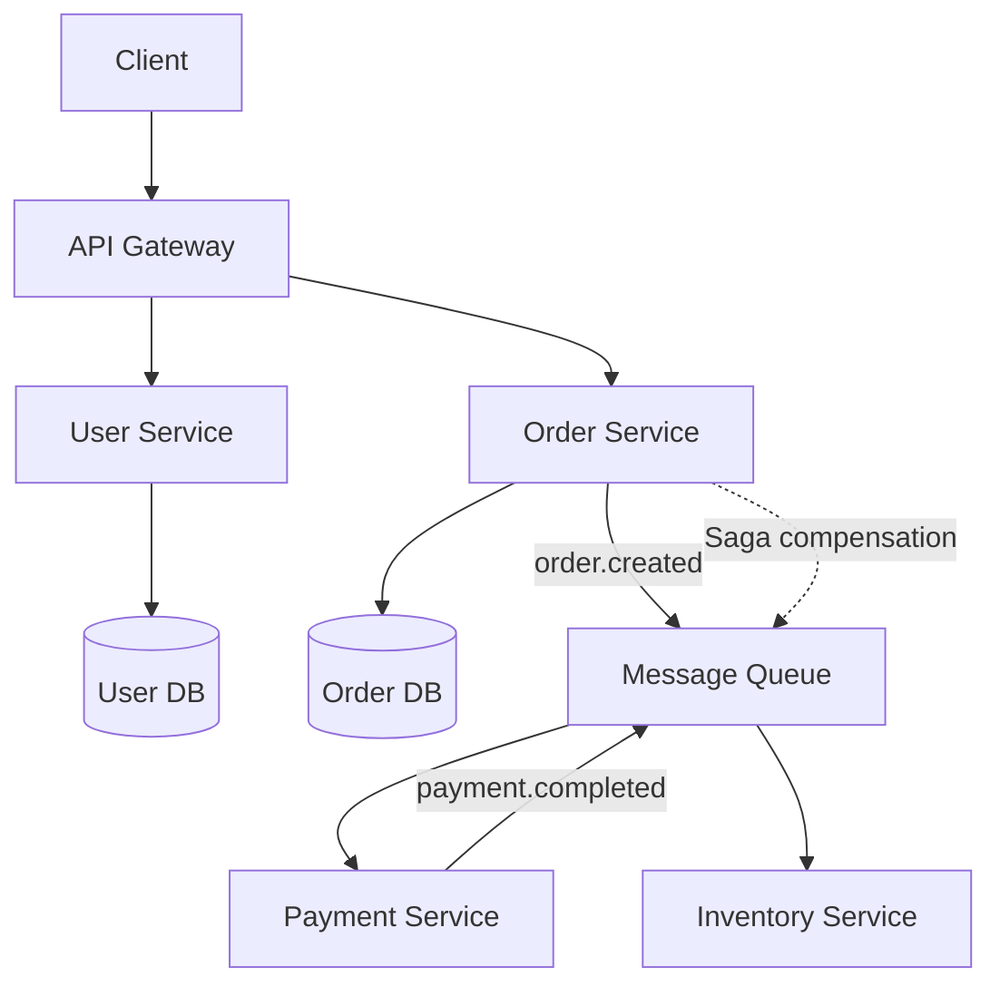

# Module 26 — Microservices in Go

## TL;DR

Microservices trade monolith simplicity for independent deployability. Each service owns its data (**database-per-service**), communicates via **gRPC/REST/events**, and coordinates distributed transactions with **Saga** patterns. Use an **API Gateway** for external clients, **service discovery** for internal routing, and **contract testing** to prevent integration breakage.

## Concept

**Core patterns:**

| Pattern | Purpose |
|---------|---------|
| Database per service | Data isolation, independent schema evolution |
| API Gateway | Single entry point, auth, rate limiting, routing |
| Service Discovery | Dynamic service location (Consul, K8s DNS) |
| Saga | Distributed transactions via compensating actions |
| CQRS | Separate read/write models for scale |
| Event Sourcing | State as sequence of events (optional) |

**Saga — choreographed example:**

```go
// Order service publishes event after creating order
func (s *OrderService) CreateOrder(ctx context.Context, req CreateOrderRequest) error {
    order := Order{ID: uuid.New().String(), Status: "pending"}
    if err := s.repo.Save(ctx, order); err != nil {
        return err
    }
    return s.publisher.Publish(ctx, "order.created", OrderCreatedEvent{
        OrderID: order.ID,
        Items:   req.Items,
    })
}

// Payment service listens and publishes result
func (s *PaymentService) HandleOrderCreated(ctx context.Context, evt OrderCreatedEvent) error {
    chargeID, err := s.gateway.Charge(ctx, evt.Total)
    if err != nil {
        return s.publisher.Publish(ctx, "payment.failed", PaymentFailedEvent{
            OrderID: evt.OrderID,
            Reason:  err.Error(),
        })
    }
    return s.publisher.Publish(ctx, "payment.completed", PaymentCompletedEvent{
        OrderID: evt.OrderID,
        ChargeID: chargeID,
    })
}
```

**API Gateway** (e.g., Kong, Envoy, custom Go gateway):

```go
func gatewayHandler(userSvc, orderSvc *url.URL) http.Handler {
    userProxy := httputil.NewSingleHostReverseProxy(userSvc)
    orderProxy := httputil.NewSingleHostReverseProxy(orderSvc)

    mux := http.NewServeMux()
    mux.Handle("/api/users/", authMiddleware(userProxy))
    mux.Handle("/api/orders/", authMiddleware(orderProxy))
    return rateLimitMiddleware(mux)
}
```

## How It Really Works (Internals)



**Service discovery in Kubernetes:**
- Services get DNS: `user-service.default.svc.cluster.local`
- Go client: standard HTTP/gRPC to service name — kube-proxy handles load balancing.
- Health checks: liveness (`/healthz`) and readiness (`/readyz`) probes.

**CQRS**: Write model handles commands (normalized DB); read model is denormalized (cache, Elasticsearch) updated by events. Eventually consistent.

**Contract testing** (Pact):

```go
// Consumer test defines expected interaction
pact.
    AddInteraction().
    Given("user exists").
    UponReceiving("a request for user").
    WithRequest("GET", "/users/42").
    WillRespondWith(200, func(b *consumer.V2ResponseBuilder) {
        b.JSONBody(map[string]any{"id": "42", "name": "Alice"})
    })
```

## Why / When / Trade-offs

| Benefit | Cost |
|---------|------|
| Independent deployment | Distributed debugging |
| Technology flexibility | Network latency, partial failures |
| Team autonomy | Data consistency complexity |
| Fault isolation | Operational overhead |

**When NOT to microservice**: Small team, unclear domain boundaries, low traffic. Start with a well-structured monolith; extract services when scaling or team boundaries demand it.

## Worked Scenario

Order-Payment-Inventory saga with compensating transactions:

```go
type SagaOrchestrator struct {
    orderRepo   OrderRepository
    paymentCli  paymentpb.PaymentServiceClient
    inventoryCli inventorypb.InventoryServiceClient
    publisher   EventPublisher
}

func (s *SagaOrchestrator) PlaceOrder(ctx context.Context, req PlaceOrderRequest) error {
    order := Order{ID: uuid.New().String(), Status: StatusPending}
    if err := s.orderRepo.Create(ctx, order); err != nil {
        return err
    }

    // Step 1: Reserve inventory
    _, err := s.inventoryCli.Reserve(ctx, &inventorypb.ReserveRequest{
        OrderId: order.ID,
        Items:   toProtoItems(req.Items),
    })
    if err != nil {
        order.Status = StatusFailed
        _ = s.orderRepo.Update(ctx, order)
        return fmt.Errorf("reserve inventory: %w", err)
    }

    // Step 2: Charge payment
    _, err = s.paymentCli.Charge(ctx, &paymentpb.ChargeRequest{
        OrderId: order.ID,
        Amount:  req.Total,
    })
    if err != nil {
        // Compensate: release inventory
        _, _ = s.inventoryCli.Release(ctx, &inventorypb.ReleaseRequest{OrderId: order.ID})
        order.Status = StatusFailed
        _ = s.orderRepo.Update(ctx, order)
        return fmt.Errorf("charge payment: %w", err)
    }

    order.Status = StatusConfirmed
    return s.orderRepo.Update(ctx, order)
}
```

Service registration with Consul:

```go
client, _ := api.NewClient(api.DefaultConfig())
registration := &api.AgentServiceRegistration{
    ID:      "order-service-1",
    Name:    "order-service",
    Port:    8080,
    Address: "10.0.0.5",
    Check: &api.AgentServiceCheck{
        HTTP:     "http://10.0.0.5:8080/healthz",
        Interval: "10s",
    },
}
client.Agent().ServiceRegister(registration)
```

## Gotchas & Failure Modes

- **Distributed monolith**: Services must deploy together — worse than a monolith.
- **Saga without idempotency**: Duplicate events cause double charges — use idempotency keys.
- **Shared database**: Defeats independence — resist the temptation.
- **Synchronous chains**: A→B→C→D latency adds up — prefer async events where possible.
- **Missing correlation IDs**: Can't trace requests across services — propagate in all calls.
- **No contract tests**: Consumer breaks producer silently — Pact in CI.
- **Event ordering**: Don't assume — design for out-of-order delivery.

## Interview Q&A

**Q: Explain the database-per-service pattern and its implications.**
A: Each microservice has its own database — no direct cross-service queries. Services share data via APIs or events. Enables independent schema changes but requires accepting eventual consistency.
↳ How do you query across services? API composition at gateway, CQRS read models, or materialized views fed by events.

**Q: What is the Saga pattern and when do you use it?**
A: Manages distributed transactions as a sequence of local transactions with compensating actions on failure. Choreography (events) or orchestration (central coordinator). Use when ACID across services isn't possible.
↳ Saga vs 2PC? 2PC blocks and doesn't scale; Saga is eventually consistent with compensation — better for microservices.

**Q: How does service discovery work in Kubernetes for Go services?**
A: K8s Services get stable DNS names. Pods are ephemeral — clients connect to service name, kube-proxy/load balancer routes to healthy pods. Readiness probes remove unhealthy pods from rotation.
↳ What about outside K8s? Consul, etcd, or managed discovery (AWS Cloud Map).

**Q: What is contract testing and why is it critical for microservices?**
A: Consumer-driven contracts verify service interactions without full integration tests. Pact records consumer expectations; provider verifies against them in CI. Catches breaking API changes early.
↳ How is it different from integration tests? Faster, no need to run all services; tests the interface contract, not full behavior.

## Verify

```bash
cd labs/14-microservices
docker compose up -d
go test ./... -v -tags=integration
# Run contract tests
go test ./contracts/... -v
curl -s http://localhost:8000/api/orders -X POST -d '{"items":[{"sku":"ABC","qty":1}]}' -H "Content-Type: application/json"
```

## Further Reading

- [Microservices Patterns — Chris Richardson](https://microservices.io/patterns/)
- [Pact Go](https://github.com/pact-foundation/pact-go)
- [go-kit transports](https://gokit.io/examples/stringsvc.html)
- [Saga Pattern — Microsoft](https://learn.microsoft.com/en-us/azure/architecture/reference-architectures/saga/saga)
