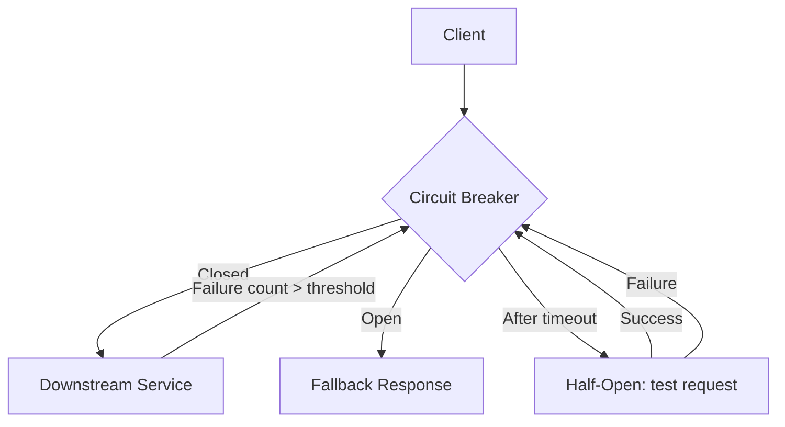

# Module 27 — Security & Distributed Systems

## TL;DR

Secure Go services with **JWT/OAuth2** for auth, **mTLS** for service-to-service trust, and the **crypto/** packages for cryptographic operations. Build resilient distributed systems with **circuit breakers**, **retries with backoff**, and **bulkheads**. Never roll your own crypto — use vetted libraries and established patterns.

## Concept

**JWT authentication:**

```go
func generateJWT(userID string, secret []byte) (string, error) {
    claims := jwt.MapClaims{
        "sub": userID,
        "exp": time.Now().Add(24 * time.Hour).Unix(),
        "iat": time.Now().Unix(),
    }
    token := jwt.NewWithClaims(jwt.SigningMethodHS256, claims)
    return token.SignedString(secret)
}

func authMiddleware(secret []byte, next http.Handler) http.Handler {
    return http.HandlerFunc(func(w http.ResponseWriter, r *http.Request) {
        tokenStr := strings.TrimPrefix(r.Header.Get("Authorization"), "Bearer ")
        token, err := jwt.Parse(tokenStr, func(t *jwt.Token) (any, error) {
            if _, ok := t.Method.(*jwt.SigningMethodHMAC); !ok {
                return nil, fmt.Errorf("unexpected signing method")
            }
            return secret, nil
        })
        if err != nil || !token.Valid {
            http.Error(w, "unauthorized", http.StatusUnauthorized)
            return
        }
        claims := token.Claims.(jwt.MapClaims)
        ctx := context.WithValue(r.Context(), userIDKey, claims["sub"])
        next.ServeHTTP(w, r.WithContext(ctx))
    })
}
```

**OAuth2 client** (delegated authorization):

```go
config := &oauth2.Config{
    ClientID:     os.Getenv("OAUTH_CLIENT_ID"),
    ClientSecret: os.Getenv("OAUTH_CLIENT_SECRET"),
    RedirectURL:  "https://app.example.com/callback",
    Scopes:       []string{"openid", "profile"},
    Endpoint:     google.Endpoint,
}
url := config.AuthCodeURL("state-token", oauth2.AccessTypeOffline)
// Exchange code for token after callback
token, err := config.Exchange(ctx, authCode)
```

**Resilience patterns:**

| Pattern | Purpose | Go Library |
|---------|---------|------------|
| Circuit Breaker | Stop calling failing service | `sony/gobreaker` |
| Retry + Backoff | Transient failure recovery | `cenkalti/backoff`, `avast/retry-go` |
| Bulkhead | Isolate resource pools | Semaphore, `golang.org/x/sync/semaphore` |
| Timeout | Bound wait time | `context.WithTimeout` |

## How It Really Works (Internals)



**mTLS**: Both client and server present certificates — mutual authentication. In Go:

```go
cert, _ := tls.LoadX509KeyPair("client.crt", "client.key")
caCert, _ := os.ReadFile("ca.crt")
caPool := x509.NewCertPool()
caPool.AppendCertsFromPEM(caCert)

tlsConfig := &tls.Config{
    Certificates: []tls.Certificate{cert},
    RootCAs:      caPool,
    MinVersion:   tls.VersionTLS12,
}
conn, _ := grpc.Dial("service:50051",
    grpc.WithTransportCredentials(credentials.NewTLS(tlsConfig)),
)
```

**Circuit breaker states:**
- **Closed**: Normal operation, track failures
- **Open**: Fail fast, don't call downstream
- **Half-open**: Allow one test request after cooldown

**Message queues** (NATS, RabbitMQ, Kafka via `segmentio/kafka-go`):

```go
// Idempotent consumer with deduplication
func (c *Consumer) HandleMessage(ctx context.Context, msg Message) error {
    if c.dedup.Seen(msg.ID) {
        return nil // already processed
    }
    if err := c.process(ctx, msg); err != nil {
        return err // will retry
    }
    return c.dedup.Mark(msg.ID)
}
```

## Why / When / Trade-offs

| Security Measure | When | Trade-off |
|------------------|------|-----------|
| JWT | Stateless API auth | Can't revoke without blocklist/short TTL |
| OAuth2 | Third-party login, delegated access | Complexity, token management |
| mTLS | Service mesh, zero-trust internal | Certificate rotation overhead |
| bcrypt/argon2 | Password hashing | CPU cost (intentional) |
| Circuit breaker | External service calls | May reject valid requests during recovery |

**Retry rules**: Only retry idempotent operations. Use exponential backoff with jitter. Cap max retries. Distinguish transient (503, timeout) from permanent (400, 404) errors.

## Worked Scenario

Resilient HTTP client with circuit breaker, retry, and bulkhead:

```go
var cb = gobreaker.NewCircuitBreaker(gobreaker.Settings{
    Name:        "payment-service",
    MaxRequests: 3,
    Interval:    10 * time.Second,
    Timeout:     30 * time.Second,
    ReadyToTrip: func(counts gobreaker.Counts) bool {
        return counts.ConsecutiveFailures > 5
    },
})

type ResilientClient struct {
    httpClient *http.Client
    sem        *semaphore.Weighted // bulkhead
}

func NewResilientClient(maxConcurrent int64) *ResilientClient {
    return &ResilientClient{
        httpClient: &http.Client{Timeout: 5 * time.Second},
        sem:        semaphore.NewWeighted(maxConcurrent),
    }
}

func (c *ResilientClient) Call(ctx context.Context, url string) ([]byte, error) {
    if err := c.sem.Acquire(ctx, 1); err != nil {
        return nil, fmt.Errorf("bulkhead full: %w", err)
    }
    defer c.sem.Release(1)

    result, err := cb.Execute(func() (any, error) {
        return c.callWithRetry(ctx, url)
    })
    if err != nil {
        return nil, err
    }
    return result.([]byte), nil
}

func (c *ResilientClient) callWithRetry(ctx context.Context, url string) ([]byte, error) {
    var resp *http.Response
    err := retry.Do(
        func() error {
            req, _ := http.NewRequestWithContext(ctx, http.MethodGet, url, nil)
            var err error
            resp, err = c.httpClient.Do(req)
            if err != nil {
                return err // retry
            }
            if resp.StatusCode >= 500 {
                return fmt.Errorf("server error: %d", resp.StatusCode)
            }
            return nil
        },
        retry.Attempts(3),
        retry.DelayType(retry.BackOffDelay),
        retry.Context(ctx),
    )
    if err != nil {
        return nil, err
    }
    defer resp.Body.Close()
    return io.ReadAll(resp.Body)
}
```

Password hashing:

```go
import "golang.org/x/crypto/bcrypt"

func HashPassword(password string) (string, error) {
    hash, err := bcrypt.GenerateFromPassword([]byte(password), bcrypt.DefaultCost)
    return string(hash), err
}

func CheckPassword(hash, password string) bool {
    return bcrypt.CompareHashAndPassword([]byte(hash), []byte(password)) == nil
}
```

## Gotchas & Failure Modes

- **JWT in localStorage**: XSS vulnerability — use HttpOnly cookies for browser apps.
- **Algorithm confusion**: Accept only expected signing method — reject `none` algorithm.
- **Retrying non-idempotent POST**: Double charges — use idempotency keys.
- **Circuit breaker too aggressive**: Opens on single timeout — tune thresholds.
- **No jitter on backoff**: Thundering herd when service recovers.
- **Hardcoded secrets**: Use env vars, Vault, or K8s secrets — never commit.
- **TLS verification disabled**: `InsecureSkipVerify: true` in production — never.
- **Weak random**: Use `crypto/rand`, not `math/rand` for tokens/keys.

## Interview Q&A

**Q: How do you implement authentication in a Go microservice architecture?**
A: OAuth2/OIDC for user auth at API gateway. JWT for stateless service-to-service or API auth with short TTL. mTLS in service mesh for internal trust. Validate tokens at gateway and optionally at each service.
↳ How do you revoke JWTs? Short TTL + refresh tokens, or maintain a revocation blocklist in Redis.

**Q: Explain circuit breaker, retry, and bulkhead patterns.**
A: Circuit breaker stops calling a failing service (fail fast). Retry with exponential backoff handles transient failures on idempotent ops. Bulkhead limits concurrent calls to prevent resource exhaustion.
↳ How do they interact? Retry inside circuit breaker; bulkhead limits total concurrent retries across callers.

**Q: When do you use mTLS vs JWT for service-to-service auth?**
A: mTLS for infrastructure-level trust (service mesh, zero-trust network). JWT for application-level identity and authorization claims. Often both: mTLS for transport, JWT for user context.
↳ How do you rotate mTLS certs? cert-manager in K8s, or SPIFFE/SPIRE for automatic rotation.

**Q: How do you handle message queue consumers reliably?**
A: At-least-once delivery + idempotent handlers + deduplication by message ID. Manual ack after successful processing. Dead letter queue for poison messages. Context cancellation for graceful shutdown.
↳ What about exactly-once? Practically achieved via idempotent processing, not broker guarantees.

## Verify

```bash
cd labs/14-microservices
go test ./internal/auth/... -v
go test ./internal/resilience/... -v -race
go test -run TestCircuitBreaker -v ./...
curl -s -H "Authorization: Bearer $(go run ./cmd/gentoken)" http://localhost:8080/api/protected
```

## Further Reading

- [golang-jwt/jwt](https://github.com/golang-jwt/jwt)
- [golang.org/x/oauth2](https://pkg.go.dev/golang.org/x/oauth2)
- [sony/gobreaker](https://github.com/sony/gobreaker)
- [OWASP Go Security Cheat Sheet](https://cheatsheetseries.owasp.org/cheatsheets/Go_Security_Cheat_Sheet.html)
