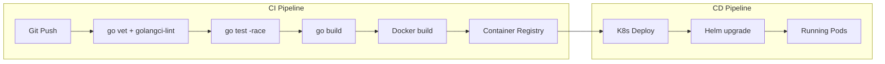

# Module 28 — Tooling, CI/CD & Containers

## TL;DR

Ship Go services with **multi-stage Dockerfiles** (tiny distroless/scratch images), **Docker Compose** for local dev, and **CI/CD pipelines** that run `go test -race`, lint, and build. Deploy to **Kubernetes** with Deployments, Services, and **Helm charts** for templated releases. Go's static binaries make containerization trivial.

## Concept

**Multi-stage Dockerfile:**

```dockerfile
# Build stage
FROM golang:1.22-alpine AS builder
WORKDIR /app
COPY go.mod go.sum ./
RUN go mod download
COPY . .
RUN CGO_ENABLED=0 GOOS=linux go build -ldflags="-s -w" -o /server ./cmd/server

# Runtime stage
FROM gcr.io/distroless/static-debian12
COPY --from=builder /server /server
USER nonroot:nonroot
EXPOSE 8080
ENTRYPOINT ["/server"]
```

**Docker Compose for local dev:**

```yaml
services:
  app:
    build: .
    ports:
      - "8080:8080"
    environment:
      DATABASE_URL: postgres://user:pass@db:5432/app?sslmode=disable
    depends_on:
      db:
        condition: service_healthy
  db:
    image: postgres:16-alpine
    environment:
      POSTGRES_USER: user
      POSTGRES_PASSWORD: pass
      POSTGRES_DB: app
    healthcheck:
      test: ["CMD-SHELL", "pg_isready -U user"]
      interval: 5s
      retries: 5
```

**CI/CD pipeline** (GitHub Actions example):

```yaml
name: CI
on: [push, pull_request]
jobs:
  test:
    runs-on: ubuntu-latest
    steps:
      - uses: actions/checkout@v4
      - uses: actions/setup-go@v5
        with:
          go-version: '1.22'
      - run: go vet ./...
      - run: go test ./... -race -coverprofile=coverage.out
      - run: go build -o /dev/null ./cmd/...
```

## How It Really Works (Internals)



**Kubernetes basics:**

| Resource | Purpose |
|----------|---------|
| Deployment | Manages pod replicas, rolling updates |
| Service | Stable network endpoint for pods |
| ConfigMap | Non-sensitive configuration |
| Secret | Sensitive data (base64, use external secrets in prod) |
| Ingress | External HTTP routing |
| HPA | Horizontal Pod Autoscaler |

**Helm chart structure:**

```
charts/my-service/
├── Chart.yaml
├── values.yaml
├── templates/
│   ├── deployment.yaml
│   ├── service.yaml
│   ├── ingress.yaml
│   └── _helpers.tpl
```

**Go build flags for production:**
- `CGO_ENABLED=0` — static binary, no C deps
- `-ldflags="-s -w"` — strip debug info (~30% smaller)
- `-ldflags="-X main.version=$VERSION"` — inject build metadata

## Why / When / Trade-offs

| Choice | Pros | Cons |
|--------|------|------|
| distroless/scratch | Minimal attack surface, ~10MB images | No shell for debugging |
| alpine | Small, has shell | musl vs glibc issues with CGO |
| Docker Compose | Fast local dev | Not for production orchestration |
| K8s | Production-grade orchestration | Complexity, operational cost |
| Helm | Templated, versioned releases | Learning curve, chart maintenance |

**CI best practices for Go:**
1. Cache `go mod` between runs
2. Run `-race` in CI always
3. `golangci-lint` with project config
4. Build only changed packages when possible
5. Scan images with Trivy/Grype

## Worked Scenario

Complete deployment setup — Dockerfile, Compose, K8s manifests, and Helm:

```dockerfile
FROM golang:1.22-alpine AS builder
RUN apk add --no-cache git ca-certificates
WORKDIR /src
COPY go.mod go.sum ./
RUN go mod download
COPY . .
ARG VERSION=dev
RUN CGO_ENABLED=0 GOOS=linux go build \
    -ldflags="-s -w -X main.version=${VERSION}" \
    -o /bin/server ./cmd/server

FROM gcr.io/distroless/static-debian12:nonroot
COPY --from=builder /bin/server /server
COPY --from=builder /etc/ssl/certs/ca-certificates.crt /etc/ssl/certs/
EXPOSE 8080
USER nonroot:nonroot
ENTRYPOINT ["/server"]
```

```yaml
# k8s/deployment.yaml
apiVersion: apps/v1
kind: Deployment
metadata:
  name: order-service
spec:
  replicas: 3
  selector:
    matchLabels:
      app: order-service
  template:
    metadata:
      labels:
        app: order-service
    spec:
      containers:
        - name: server
          image: registry.example.com/order-service:v1.2.3
          ports:
            - containerPort: 8080
          envFrom:
            - configMapRef:
                name: order-service-config
            - secretRef:
                name: order-service-secrets
          livenessProbe:
            httpGet:
              path: /healthz
              port: 8080
            initialDelaySeconds: 5
            periodSeconds: 10
          readinessProbe:
            httpGet:
              path: /readyz
              port: 8080
            initialDelaySeconds: 3
            periodSeconds: 5
          resources:
            requests:
              cpu: 100m
              memory: 128Mi
            limits:
              cpu: 500m
              memory: 256Mi
```

```yaml
# helm/values.yaml
replicaCount: 3
image:
  repository: registry.example.com/order-service
  tag: "v1.2.3"
  pullPolicy: IfNotPresent
service:
  type: ClusterIP
  port: 8080
ingress:
  enabled: true
  host: api.example.com
  path: /orders
resources:
  requests:
    cpu: 100m
    memory: 128Mi
autoscaling:
  enabled: true
  minReplicas: 3
  maxReplicas: 10
  targetCPUUtilization: 70
```

```bash
# Deploy with Helm
helm upgrade --install order-service ./helm/order-service \
  --set image.tag=v1.2.3 \
  --namespace production \
  --wait
```

## Gotchas & Failure Modes

- **CGO in Docker**: Alpine + CGO needs `gcc musl-dev` — prefer `CGO_ENABLED=0`.
- **Running as root in container**: Security risk — use `USER nonroot`.
- **No health checks**: K8s routes traffic to starting/crashed pods — always define probes.
- **Latest tag in prod**: Non-reproducible deploys — pin image digests or semver tags.
- **Secrets in ConfigMap**: Use K8s Secrets or external secret managers (Vault, AWS SM).
- **Missing `.dockerignore`**: Sends `vendor/`, `.git/` to build context — slow builds.
- **No resource limits**: Noisy neighbor pods — always set requests and limits.
- **Graceful shutdown missing**: SIGTERM kills mid-request — handle in app, set `terminationGracePeriodSeconds`.

## Interview Q&A

**Q: How do you build minimal, secure Docker images for Go applications?**
A: Multi-stage build: compile with `golang` image, copy static binary to `distroless` or `scratch`. `CGO_ENABLED=0`, `-ldflags="-s -w"`, run as non-root. Result: ~10-20MB image with minimal attack surface.
↳ How do you debug distroless containers? Sidecar debug container, or use `distroless/debug` variant with busybox.

**Q: What should a Go CI pipeline include?**
A: `go vet`, `golangci-lint`, `go test -race -cover`, `go build`, integration tests (tagged), Docker build, image scan, deploy to staging. Cache modules, fail fast on lint.
↳ How do you handle integration tests in CI? `testcontainers-go` or docker-compose service containers in GitHub Actions.

**Q: Explain Kubernetes Deployment rolling updates and how Go apps should handle them.**
A: K8s gradually replaces old pods with new ones. App must handle SIGTERM: stop accepting, drain in-flight requests (`server.Shutdown`), then exit. Set `terminationGracePeriodSeconds` > shutdown timeout.
↳ What about database migrations? Run as K8s Job before Deployment update, or use init container — never auto-migrate in app startup without coordination.

**Q: When do you use Helm vs raw K8s manifests?**
A: Helm for templated, parameterized deployments across environments (dev/staging/prod). Raw manifests for simple services or GitOps (Kustomize). Helm adds release management and rollback.
↳ How do you manage secrets in Helm? External Secrets Operator, Sealed Secrets, or Helm secrets plugin — never plain text in values.yaml in git.

## Verify

```bash
cd labs/16-docker
docker build -t my-service:dev .
docker compose up -d
curl -s http://localhost:8080/healthz
docker compose down
# K8s (if cluster available):
kubectl apply -f k8s/
kubectl get pods -l app=order-service
helm template ./helm/order-service | kubectl apply --dry-run=client -f -
```

## Further Reading

- [Docker Multi-stage Builds](https://docs.docker.com/build/building/multi-stage/)
- [Kubernetes Documentation](https://kubernetes.io/docs/home/)
- [Helm Documentation](https://helm.sh/docs/)
- [Distroless Images](https://github.com/GoogleContainerTools/distroless)
