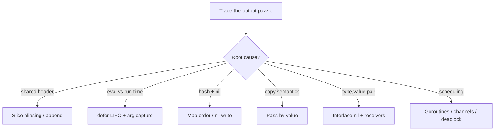

# Module 29 — Gotchas & Trace-the-Output

## TL;DR

Interviewers love "what does this print?" puzzles because they expose whether you understand Go's **value semantics**, **evaluation timing**, and **concurrency scheduling** — not just syntax. Almost every trap reduces to one of a few root causes: slices share a backing array, `defer` evaluates arguments immediately but runs LIFO at return, maps randomize iteration and panic on nil writes, everything is passed **by value** (including headers and interface pairs), and goroutines/channels deadlock when nobody is on the other side. Learn the root cause and you can trace any variant.

## Concept

Every puzzle below uses the same shape:

- a small runnable snippet,
- the **Output** it actually produces (or that it panics / deadlocks),
- **Why**, cross-linked to the module that explains the internals.

Run any snippet yourself by pasting it into a `main` function (`go run .`). Behavior notes assume **Go 1.22+** unless stated otherwise (loop-variable semantics changed in 1.22).

## How It Really Works (Internals)



| Root cause | Symptom you see | Deep-dive module |
|------------|-----------------|------------------|
| Shared backing array | Subslice mutated by `append` | [M7](07-slices-maps-internals.md) |
| Args eval at defer | "old" value printed | [M3](03-functions-methods.md) |
| Map hash seed | Different order each run | [M7](07-slices-maps-internals.md) |
| Pass by value | Caller not mutated | [M4](04-pointers-value-semantics.md) |
| (type,value) interface pair | `i != nil` when you expect nil | [M6](06-interfaces-polymorphism.md) |
| No receiver / all blocked | `fatal error: ...deadlock!` | [M10](10-goroutines-scheduler.md), [M11](11-channels-select.md) |

---

## Slices

### 1. append aliasing (shared backing array)

```go
base := []int{1, 2, 3}
base = base[:2]           // len 2, cap 3 — still points at same array
extra := append(base, 99) // cap available → writes into shared array
fmt.Println(base, extra, base[:3])
```

**Output:** `[1 2] [1 2 99] [1 2 99]` — `3` was overwritten by `99`.

**Why:** `base` has spare capacity, so `append` writes in place at index 2 instead of reallocating. Anyone still viewing that array sees the change. See [M7](07-slices-maps-internals.md). Fix with a full slice expression `base[:2:2]` to force a copy on the next `append`.

### 2. append that reallocates is NOT visible to the original

```go
s := []int{1, 2, 3}
func(x []int) { x = append(x, 4) }(s) // reallocates locally
fmt.Println(s)
```

**Output:** `[1 2 3]` — the caller's header never changes.

**Why:** the slice **header** is passed by value. `append` returns a new header assigned only to the local `x`. See [M4](04-pointers-value-semantics.md).

### 3. mutating elements through a copy IS visible

```go
s := []int{1, 2, 3}
func(x []int) { x[0] = 99 }(s)
fmt.Println(s)
```

**Output:** `[99 2 3]`.

**Why:** the copied header still points at the same backing array; element writes go through the shared pointer. See [M4](04-pointers-value-semantics.md).

### 4. nil vs empty slice in JSON

```go
var a []int          // nil
b := []int{}         // non-nil, len 0
ja, _ := json.Marshal(a)
jb, _ := json.Marshal(b)
fmt.Println(string(ja), string(jb))
```

**Output:** `null []`.

**Why:** a nil slice marshals to `null`; an allocated empty slice marshals to `[]`. Both have `len == 0`, so `len` can't distinguish them. See [M7](07-slices-maps-internals.md).

---

## Defer

### 5. LIFO order + arguments evaluated immediately

```go
for i := 0; i < 3; i++ {
    defer fmt.Println(i)
}
```

**Output:**
```
2
1
0
```

**Why:** each `defer` snapshots `i` **at the moment it runs** (arguments are evaluated eagerly), then executes in **LIFO** order at function return. See [M3](03-functions-methods.md).

### 6. defer modifies a NAMED return value

```go
func f() (n int) {
    defer func() { n *= 2 }()
    return 5
}
// fmt.Println(f())
```

**Output:** `10`.

**Why:** `return 5` sets `n = 5` first, then the deferred closure runs and mutates the named return before the function actually returns. See [M3](03-functions-methods.md).

### 7. defer with a value receiver / eager args vs closure

```go
x := 1
defer fmt.Println("eager:", x) // captures 1 now
defer func() { fmt.Println("closure:", x) }() // reads x at run time
x = 42
```

**Output:**
```
closure: 42
eager: 1
```

**Why:** `fmt.Println("eager:", x)` evaluates `x` when the `defer` statement executes; the closure reads `x` later, after it became `42`. LIFO makes the closure print first. See [M3](03-functions-methods.md).

### 8. defer + recover swallows a panic

```go
func safe() (err error) {
    defer func() {
        if r := recover(); r != nil {
            err = fmt.Errorf("recovered: %v", r)
        }
    }()
    panic("boom")
}
// fmt.Println(safe())
```

**Output:** `recovered: boom`.

**Why:** `recover` is only effective inside a deferred function; it stops the panic and lets us set the named return. See [M3](03-functions-methods.md).

---

## Maps

### 9. randomized iteration order

```go
m := map[string]int{"a": 1, "b": 2, "c": 3}
for k := range m {
    fmt.Print(k, " ")
}
```

**Output:** non-deterministic, e.g. `c a b ` (changes between runs).

**Why:** the runtime randomizes the starting bucket/offset per range to stop code from depending on order. Sort keys for determinism. See [M7](07-slices-maps-internals.md).

### 10. writing to a nil map panics; reading does not

```go
var m map[string]int
fmt.Println(m["missing"]) // read: fine
m["x"] = 1                // write: panic
```

**Output:** `0`, then `panic: assignment to entry in nil map`.

**Why:** a nil map has no backing hash table. Reads return the zero value; writes need buckets that don't exist. Initialize with `make`. See [M7](07-slices-maps-internals.md).

### 11. absent key returns the zero value (use the comma-ok form)

```go
m := map[string]int{"a": 0}
fmt.Println(m["a"], m["z"]) // both 0
_, ok1 := m["a"]
_, ok2 := m["z"]
fmt.Println(ok1, ok2)
```

**Output:**
```
0 0
true false
```

**Why:** indexing never signals presence — a stored zero and a missing key look identical. Only `v, ok := m[k]` distinguishes them. See [M7](07-slices-maps-internals.md).

---

## Pass by value vs reference

Go is **always pass by value**. The only question is *what* is being copied: a whole struct/array, or a small header/pointer that still points at shared data.

### 12. struct copy vs pointer receiver

```go
type Counter struct{ n int }
func (c Counter) IncVal()  { c.n++ }
func (c *Counter) IncPtr() { c.n++ }

c := Counter{}
c.IncVal()
c.IncVal()
c.IncPtr()
fmt.Println(c.n)
```

**Output:** `1`.

**Why:** `IncVal` mutates a copy that is discarded; only `IncPtr` mutates the original through its address. See [M4](04-pointers-value-semantics.md).

### 13. array is copied, slice header is copied (but shares data)

```go
arr := [3]int{1, 2, 3}
sl := []int{1, 2, 3}
func(a [3]int, s []int) { a[0] = 99; s[0] = 99 }(arr, sl)
fmt.Println(arr, sl)
```

**Output:** `[1 2 3] [99 2 3]`.

**Why:** the array is copied whole (mutation lost); the slice header is copied but its pointer still targets the shared backing array (mutation visible). See [M4](04-pointers-value-semantics.md).

---

## Pass by value vs reference on interfaces

### 14. the classic nil-interface gotcha

```go
type MyErr struct{}
func (*MyErr) Error() string { return "boom" }

func do() error {
    var p *MyErr = nil
    return p // non-nil interface wrapping a nil pointer
}

func main() {
    err := do()
    fmt.Println(err == nil)
}
```

**Output:** `false`.

**Why:** an interface value is a `(type, value)` pair. Here the type is `*MyErr` (non-nil) even though the value is a nil pointer, so `err == nil` is false. Return a literal `nil`, not a typed nil pointer. See [M6](06-interfaces-polymorphism.md).

### 15. value stored in an interface is a copy

```go
type Point struct{ X int }
func (p Point) String() string { return fmt.Sprint(p.X) }

p := Point{X: 1}
var s fmt.Stringer = p // copies p into the interface
p.X = 99
fmt.Println(s.String())
```

**Output:** `1`.

**Why:** assigning a value type to an interface copies it. Later mutations to `p` don't touch the copy held by the interface. Store `&p` (with a pointer receiver) to share. See [M6](06-interfaces-polymorphism.md).

### 16. method set: value cannot satisfy a pointer-receiver interface

```go
type Speaker interface{ Speak() }
type Dog struct{}
func (d *Dog) Speak() {}

var _ Speaker = &Dog{} // ok
// var _ Speaker = Dog{} // compile error: Dog does not implement Speaker
```

**Output:** the commented line fails to compile: `Dog does not implement Speaker (method Speak has pointer receiver)`.

**Why:** a `*Dog`'s method set includes pointer-receiver methods; a `Dog` value's method set does not. See [M6](06-interfaces-polymorphism.md).

---

## Goroutines & deadlocks

### 17. loop-variable capture (Go 1.22+ vs pre-1.22)

```go
var wg sync.WaitGroup
for i := 0; i < 3; i++ {
    wg.Add(1)
    go func() { defer wg.Done(); fmt.Print(i, " ") }()
}
wg.Wait()
```

**Output (Go 1.22+):** `0 1 2 ` in some order — each iteration has its own `i`.
**Output (Go ≤ 1.21):** often `3 3 3 ` — all closures shared one `i`.

**Why:** since Go 1.22 the `for` loop variable is **per-iteration**. On older versions you had to write `i := i` inside the loop to copy it. See [M10](10-goroutines-scheduler.md).

### 18. main exits before goroutine runs

```go
go fmt.Println("hello from goroutine")
fmt.Println("main done")
```

**Output:** `main done` (the goroutine line usually never prints).

**Why:** when `main` returns the program exits immediately; it does not wait for other goroutines. Synchronize with a `WaitGroup` or channel. See [M10](10-goroutines-scheduler.md).

### 19. unbuffered send with no receiver → deadlock

```go
ch := make(chan int)
ch <- 1 // blocks forever; no receiver
fmt.Println("never reached")
```

**Output:** `fatal error: all goroutines are asleep - deadlock!`

**Why:** an unbuffered channel send blocks until a receiver is ready. With only the main goroutine, nobody can receive, and the runtime detects that every goroutine is blocked. See [M11](11-channels-select.md).

### 20. range over a channel that is never closed → deadlock

```go
ch := make(chan int, 2)
ch <- 1
ch <- 2
for v := range ch { // never terminates: channel not closed
    fmt.Println(v)
}
```

**Output:** `1`, `2`, then `fatal error: all goroutines are asleep - deadlock!`

**Why:** `range` over a channel ends only when the channel is **closed**. Without `close(ch)`, the loop blocks waiting for a value that never comes. See [M11](11-channels-select.md).

### 21. closing a channel: receive returns zero + ok=false

```go
ch := make(chan int, 1)
ch <- 7
close(ch)
v1, ok1 := <-ch // buffered value still drained
v2, ok2 := <-ch // closed + empty
fmt.Println(v1, ok1, v2, ok2)
```

**Output:** `7 true 0 false`.

**Why:** receiving from a closed channel first drains buffered values, then returns the element's zero value with `ok == false`. Sending on a closed channel panics; closing twice panics. See [M11](11-channels-select.md).

---

## Bonus traps

### 22. `for range` copies each element

```go
type Item struct{ n int }
items := []Item{{1}, {2}, {3}}
for _, it := range items {
    it.n *= 10 // mutates the copy
}
fmt.Println(items)
```

**Output:** `[{1} {2} {3}]`.

**Why:** `range` copies each element into `it`. Index into the slice (`items[i].n *= 10`) to mutate in place. See [M4](04-pointers-value-semantics.md).

### 23. integer division and untyped constant overflow

```go
fmt.Println(5 / 2)        // int division
fmt.Println(5.0 / 2)      // float
var b byte = 255
b++
fmt.Println(b)            // wraps
```

**Output:**
```
2
2.5
0
```

**Why:** `/` on ints truncates toward zero; a float operand promotes to float arithmetic; unsigned `byte` wraps modulo 256. See [M2](02-types-control-flow.md).

### 24. `time.After` in a select without a default

```go
select {
case <-time.After(10 * time.Millisecond):
    fmt.Println("timeout")
}
```

**Output:** `timeout` (after ~10ms).

**Why:** with no ready case and no `default`, `select` blocks until one case fires — here the timer channel after the delay. Adding a `default` would make it non-blocking and print nothing. See [M11](11-channels-select.md).

---

## Interview Q&A

**Q: `s := []int{1,2,3}; s2 := s[:2]; s2 = append(s2, 99)` — what is `s`?**
A: `[1 2 99]`. `s2` had spare capacity, so `append` wrote into the shared backing array at index 2, overwriting `s[2]`.
↳ How do you prevent it? Use a three-index slice `s[:2:2]` to cap capacity and force a copy on append.

**Q: A function returns a `*MyError` that is nil, assigned to an `error`. Is `err == nil`?**
A: No. The interface holds type `*MyError` with a nil value, so the pair is non-nil. Return an untyped `nil` instead.
↳ How would you detect this in review? Watch for functions declared to return a concrete pointer type stored into `error`; return `nil` explicitly on the success path.

**Q: What prints? `for i := 0; i < 3; i++ { defer fmt.Println(i) }`**
A: `2 1 0`. Arguments are evaluated when each `defer` executes, and deferred calls run LIFO.
↳ What if it were `defer func(){ fmt.Println(i) }()` on Go 1.21? It would print `3 3 3` because the closure captured the shared loop variable read after the loop.

**Q: Why does ranging a non-closed channel deadlock but ranging a closed one doesn't?**
A: `range` blocks for the next value and only stops when the channel is closed. An unclosed, drained channel leaves every goroutine blocked, which the runtime reports as a deadlock.
↳ Who should close a channel? The sender, never the receiver, and only once.

**Q: Does a method with a value receiver mutate the original?**
A: No — it operates on a copy. Use a pointer receiver to mutate the caller's value.
↳ Can a `T` value satisfy an interface whose method has a pointer receiver? No; only `*T`'s method set includes pointer-receiver methods.

## Verify

Paste any snippet into a scratch `main.go` and run it — predicting the output first, then checking:

```bash
# Create a scratch module and run a snippet
mkdir -p /tmp/gotchas && cd /tmp/gotchas
go mod init gotchas 2>/dev/null
# ...paste snippet into main.go...
go run .

# Concurrency traps: prove data races and vet issues
go vet ./...
go run -race .        # flags the loop-var / shared-map cases

# Check your Go version (loop-var semantics changed in 1.22)
go version
```

For the deadlock puzzles (#19, #20) expect the program to exit non-zero with `fatal error: all goroutines are asleep - deadlock!` — that is the intended, correct outcome.

## Further Reading

- [Go Slices: usage and internals](https://go.dev/blog/slices-intro)
- [Defer, Panic, and Recover](https://go.dev/blog/defer-panic-and-recover)
- [Go maps in action](https://go.dev/blog/maps)
- [Fixing the loop variable in Go 1.22](https://go.dev/blog/loopvar-preview)
- [The Go Memory Model](https://go.dev/ref/mem)
- *100 Go Mistakes and How to Avoid Them* — Teiva Harsanyi
- Related modules: [M3](03-functions-methods.md), [M4](04-pointers-value-semantics.md), [M6](06-interfaces-polymorphism.md), [M7](07-slices-maps-internals.md), [M10](10-goroutines-scheduler.md), [M11](11-channels-select.md)
