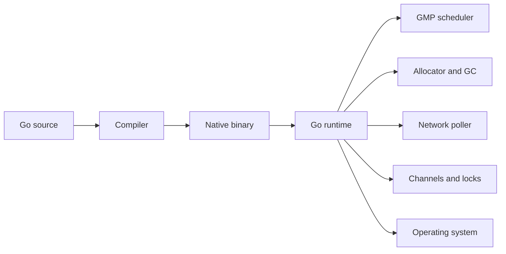
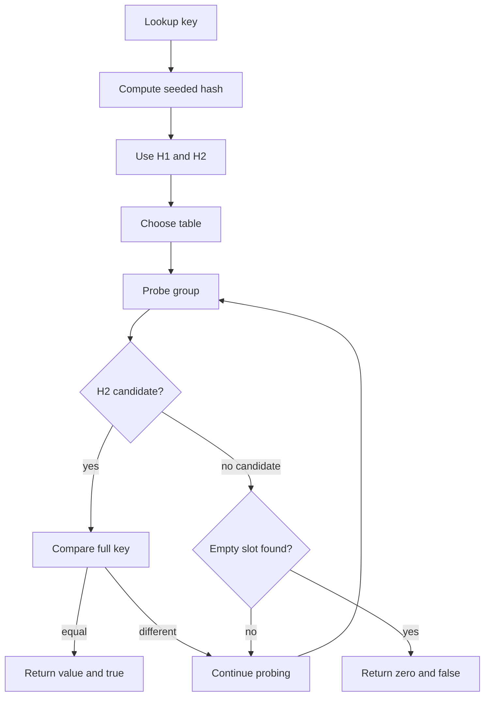
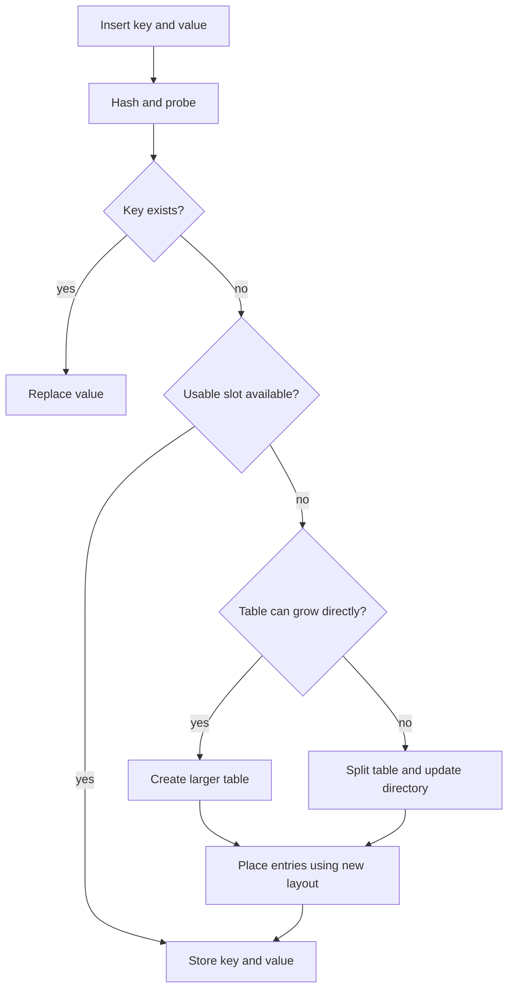
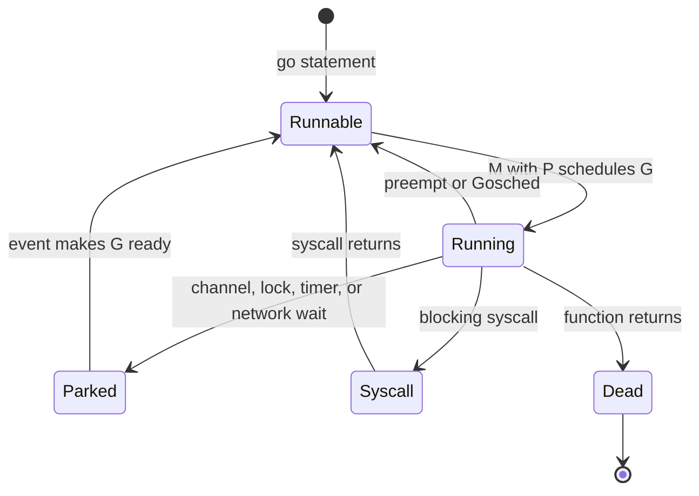
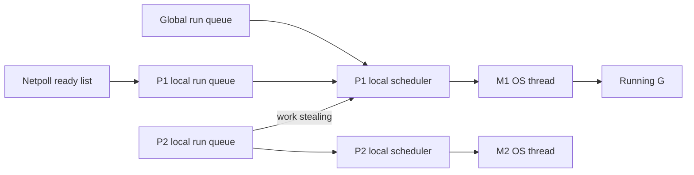
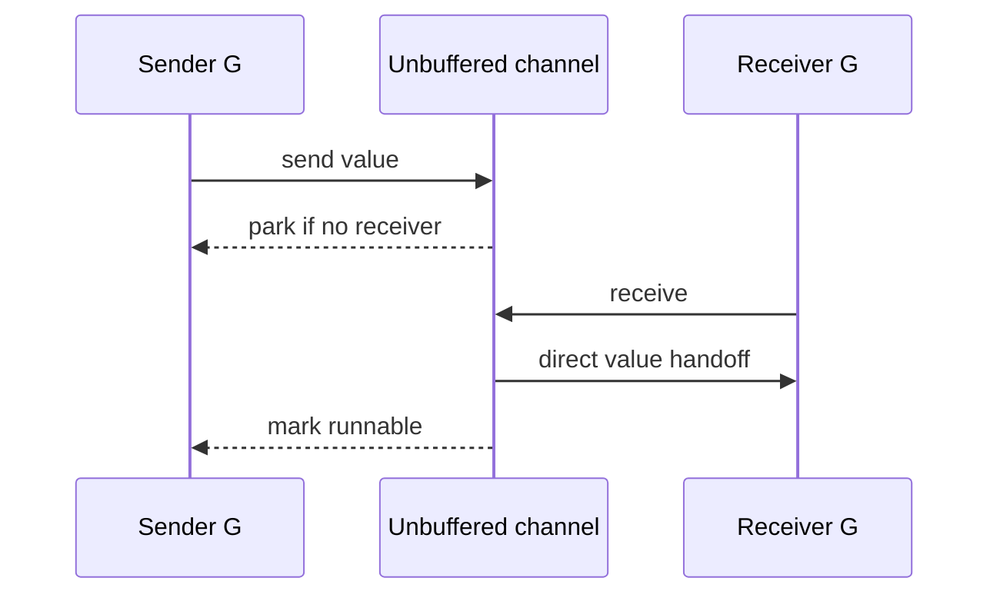
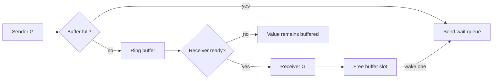
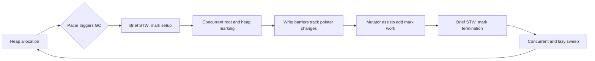
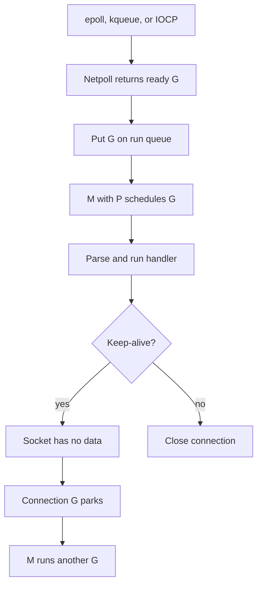

# Module 30 — Go Runtime Internals

## TL;DR

Go looks simple at source level because the runtime does substantial work underneath:

- A **map** hashes a key and searches compact groups of slots. Its iteration order is intentionally unspecified and randomized.
- The **GMP scheduler** multiplexes many goroutines (G) over operating-system threads (M) using logical execution resources (P).
- A **channel** contains synchronization state, optional buffered storage, and queues of waiting senders and receivers.
- The **garbage collector** traces reachable heap objects concurrently with the application, using write barriers to remain correct while pointers change.
- Network packages use a **netpoller**—`epoll` on Linux, `kqueue` on BSD/macOS, and IOCP on Windows—so a goroutine can wait for a socket without permanently occupying an OS thread.

These are runtime implementation details, not permanent language promises. Learn the mental models, but confirm exact layouts against the source for the Go version you use.

## Concept: Source Go vs the Runtime

Consider a small HTTP handler:

```go
var counts = map[string]int{}

func handler(w http.ResponseWriter, r *http.Request) {
    result := make(chan int, 1)
    go func() {
        result <- expensiveWork()
    }()

    counts[r.URL.Path]++ // requires synchronization in real concurrent code
    fmt.Fprintln(w, <-result)
}
```

The source does not show:

1. how `counts` locates a key,
2. which OS thread runs the new goroutine,
3. how the channel parks and wakes goroutines,
4. how temporary heap objects are reclaimed, or
5. how the server waits for thousands of sockets.

The compiler and runtime supply those mechanisms.



### Vocabulary used in this module

- **Runtime**: support code linked into a Go program for scheduling, memory management, channels, timers, networking integration, and other services.
- **Mutator**: application code that allocates objects and changes pointers while the garbage collector is running.
- **Park**: suspend a goroutine because it cannot currently make progress.
- **Ready**: put a parked goroutine back into a runnable queue.
- **Run queue**: a queue of goroutines that can run when processing capacity is available.
- **Netpoller**: the runtime layer that waits for network readiness/completion events from the OS.
- **Implementation detail**: behavior that may change between Go releases without changing valid Go programs.

---

## Map Internals and Random Iteration

### Plain-language mental model

A map is like a collection of small numbered storage areas. Go:

1. hashes the key into a number,
2. uses part of that number to choose where to search,
3. compares a small fingerprint before doing full key comparisons, and
4. returns the matching value or reports that the key is absent.

Hashing narrows a potentially huge search to a small area. Collisions are expected: two different keys can lead to the same area, so the runtime must probe additional slots and compare actual keys.

### Language guarantee vs runtime implementation

The Go language specifies map behavior such as lookup, insertion, deletion, comparability of keys, and deliberately unspecified iteration order. It does **not** specify a bucket size, probing algorithm, load factor, or memory layout.

The implementation changed significantly:

- **Go 1.23 and earlier** used an `hmap` with arrays of buckets, commonly eight key/value slots per bucket, plus overflow buckets.
- **Go 1.24 and newer** use a Swiss Table-inspired design in `internal/runtime/maps`: groups of slots, compact control metadata, open addressing, and multiple tables organized by a directory as large maps grow.

Code must not depend on either layout. This section describes both so older interview material does not conflict with newer runtime source.

### Swiss Table terms (Go 1.24+)

- **Map object**: runtime metadata reached by a Go `map` value.
- **Directory**: references one or more tables. Larger maps can split one table without copying the entire map at once.
- **Table**: a set of groups searched using open addressing.
- **Group**: currently eight candidate slots plus compact control metadata.
- **Control metadata**: one small marker per slot indicating empty/deleted state or holding a short hash fingerprint.
- **H1**: the part of the hash used to choose and probe groups.
- **H2**: a short fingerprint stored in control metadata to reject non-matches cheaply.
- **Probe sequence**: the order in which additional groups are checked after a collision.

These names explain the design; exact widths and layout remain version-specific.

### Lookup, step by step

For `v, ok := m[key]`:

1. If the map is nil or empty, return the value type's zero value and `false`.
2. Hash `key` using the map's per-map hash seed.
3. Use directory/hash information to select a table.
4. Use H1 to choose the first group in that table.
5. Compare H2 with the group's control metadata. This quickly identifies possible slots.
6. Compare the full key only for slots whose fingerprints match.
7. If a key matches, return its value and `true`.
8. If an empty marker proves the probe cannot find the key, return the zero value and `false`.
9. Otherwise, continue through the probe sequence.



The old bucket implementation followed the same broad mental model—hash, narrow the search, compare candidate keys—but handled collisions with bucket slots and overflow buckets instead of Swiss-style probing.

### Insert and growth, step by step

For `m[key] = value`:

1. A write to a nil map panics because no map storage exists.
2. Hash the key and search as if performing a lookup.
3. If the key exists, replace its value.
4. Otherwise, choose a suitable empty or deleted slot and store the key/value.
5. Update control metadata so future lookups can recognize the slot.
6. If the table has too little usable space, grow it.
7. A smaller table may replace itself with a larger table.
8. At the implementation's maximum table size, a table can split; the directory is updated so portions of the hash address the correct table.



Growth preserves logical map contents but can move entries. Holding pointers into runtime map storage would therefore be unsafe; Go does not let ordinary code take the address of a map element.

### Why iteration is random

The language specification says map iteration order is **not specified** and is not guaranteed to be the same from one iteration to the next. The runtime starts iteration from randomized positions so programs reveal accidental order dependencies early.

Randomized iteration also prevents the current physical table layout from becoming an unofficial API. It is not a cryptographic shuffle and must not be used as a source of randomness.

```go
m := map[string]int{"b": 2, "a": 1, "c": 3}

for k := range m {
    fmt.Print(k, " ") // order is unspecified
}
```

Even if a small map happens to produce the same order several times, no guarantee has been created.

For deterministic output:

```go
keys := make([]string, 0, len(m))
for k := range m {
    keys = append(keys, k)
}
slices.Sort(keys)

for _, k := range keys {
    fmt.Printf("%s=%d\n", k, m[k])
}
```

### Map concurrency

Concurrent reads are safe only when no goroutine writes. An unsynchronized read/write or write/write is a data race and may also trigger a runtime failure such as `concurrent map read and map write`.

Use a mutex, ownership by one goroutine, sharding, or `sync.Map` for workloads that match `sync.Map`'s intended cases. The runtime's internal map machinery is not a substitute for application synchronization.

### Why this matters

- Never test or serialize a map by assuming range order.
- Preallocate with `make(map[K]V, hint)` when a useful size estimate exists.
- Use the comma-ok form when a stored zero value must differ from absence.
- Treat runtime layout questions as version-specific interview follow-ups, not language rules.

Deep dive: [M7 — Slices & Maps Internals](07-slices-maps-internals.md).

---

## GMP Scheduler and Goroutines

### Why Go needs its own scheduler

Creating one OS thread for every concurrent task is expensive: threads have larger stacks, kernel scheduling costs, and platform-specific limits. Go instead creates many lightweight goroutines and multiplexes them over a smaller, dynamically managed set of OS threads.

### G, M, and P

- **G (goroutine)**: the task—its stack, instruction position, and scheduling state.
- **M (machine)**: an operating-system thread that executes instructions.
- **P (processor)**: the runtime resource required for an M to execute Go code. A P owns scheduler and allocator state, including a local run queue.

A useful analogy is:

- G = a job,
- M = a worker,
- P = a workstation with the tools required to perform Go work.

The analogy has limits: an M is a real OS thread, a P is runtime metadata rather than a CPU core, and goroutines can move between Ms over time.

`GOMAXPROCS` controls the number of Ps and therefore how many goroutines can execute Go code in parallel. It does not limit the number of goroutines or all OS threads.

### A goroutine's lifecycle

For `go work()`:

1. The compiler turns the `go` statement into a runtime goroutine-creation call.
2. The runtime allocates or reuses a G descriptor and gives it a small growable stack.
3. The G becomes runnable, usually on the current P's local run queue or high-priority `runnext` slot.
4. An M holding a P selects a runnable G and executes it.
5. If the G waits on a channel, mutex, timer, or network operation, it parks.
6. The M can immediately run another G; the parked G does not need to retain the M.
7. When the awaited event occurs, the runtime marks the G runnable and places it on a run queue.
8. Some M/P pair eventually resumes it.
9. When the function returns, the G becomes dead and runtime structures can be reused.





### Local queues, global queue, and work stealing

Local queues reduce contention: most goroutine creation and scheduling can happen on the current P. The scheduler still checks the global queue periodically so globally injected work is not starved.

When a P has no local work, it can:

1. check global runnable work,
2. check timers and network readiness, and
3. steal roughly part of another P's runnable work.

Work stealing balances load without forcing every scheduling operation through one global lock.

### Preemption

A CPU-bound goroutine must not monopolize a P. The runtime can request preemption and stop a goroutine at safe points. Modern Go also supports asynchronous preemption for many long-running loops.

Preemption does not make data access safe. Two goroutines can still interleave at many points, so shared mutable data requires synchronization.

### Blocking syscalls

When a goroutine enters a syscall that really blocks an OS thread:

1. its M may block in the kernel,
2. the runtime detaches the P from that M,
3. another M acquires the P and runs other goroutines, and
4. when the syscall returns, the original G competes to become runnable again.

This is different from pollable network I/O, where the goroutine normally parks through the netpoller without keeping an M blocked.

### Growable stacks

A goroutine commonly starts with a small stack (historically around 2 KiB, but this is an implementation detail). At function-entry checks, the runtime can detect insufficient room, allocate a larger stack, copy live stack data, adjust pointers, and continue.

Stacks can also shrink. This makes large goroutine counts practical, but each goroutine still consumes memory and runtime bookkeeping. A leaked blocked goroutine is not free.

### Why this matters

- `GOMAXPROCS` limits parallel Go execution, not concurrency.
- A parked goroutine usually does not occupy an OS thread.
- CPU loops, excessive runnable goroutines, and blocking CGO/syscalls have different scheduler costs.
- Diagnose latency with scheduler traces and `go tool trace`, not guesses.

Deep dive: [M10 — Goroutines & the Scheduler](10-goroutines-scheduler.md).

---

## Channel Internals

### Plain-language mental model

A channel coordinates ownership of values between goroutines. It is not merely a queue:

- an **unbuffered** channel performs a rendezvous—a sender and receiver must meet,
- a **buffered** channel adds finite storage between them, and
- both forms maintain queues of goroutines that currently cannot proceed.

### Conceptual `hchan` layout

The runtime channel object is commonly called `hchan`. Conceptually it contains:

- the number of queued values,
- buffer capacity,
- a pointer to the ring buffer,
- send and receive indexes,
- element type/size information,
- a closed flag,
- a queue of waiting receivers,
- a queue of waiting senders, and
- a lock protecting channel state.

A **sudog** is a runtime waiting record that connects a goroutine to a particular synchronization operation. It can contain the waiting G, the relevant element location, and queue links. It is not a user-visible goroutine type.

Exact field layout is internal and may change.

### Unbuffered send and receive

For `ch <- value` on an unbuffered channel:

1. Lock the channel.
2. If a receiver is already waiting, pair with it.
3. Copy the value directly to the receiver's destination.
4. Mark the receiver runnable.
5. Unlock; the sender can continue.
6. If no receiver exists, create/reuse a sudog for the sender.
7. Put it on the send wait queue and park the sender.
8. A future receiver performs the handoff and readies the sender.

Receiving follows the mirror image: use a waiting sender immediately, or enqueue and park.



The sender and receiver synchronize, but one need not execute immediately after the other. “Runnable” means eligible for scheduling, not guaranteed to run next.

### Buffered send and receive

For a buffered send:

1. Lock the channel.
2. If a receiver is waiting, hand the value directly to it.
3. Otherwise, if the ring buffer has space, copy the value at the send index.
4. Advance the send index with wraparound and increment the queued count.
5. Unlock and continue.
6. If the buffer is full, enqueue the sender's sudog and park.

For a buffered receive:

1. Lock the channel.
2. If the buffer contains a value, copy from the receive index.
3. Clear that slot when needed for GC safety.
4. Advance the receive index and decrement the queued count.
5. If a sender was blocked because the buffer was full, move its value into the newly available slot and ready it.
6. If the buffer is empty and a sender is waiting, perform a direct handoff.
7. If neither source exists, enqueue and park the receiver.



### Close semantics

`close(ch)`:

1. locks and marks the channel closed,
2. wakes blocked receivers, which can drain buffered values and then receive zero values with `ok == false`,
3. wakes blocked senders, which resume and panic because sending on a closed channel is invalid, and
4. rejects a second close with a panic.

Closing does not erase already buffered values. A nil channel has no channel object at all, so sends and receives block forever; `close(nil)` panics.

### How `select` works conceptually

For a `select` statement:

1. Evaluate channel operands and send values once.
2. Build a pseudo-random polling order to avoid consistently favoring the first source case.
3. Lock involved channels in a stable order to avoid deadlocking the runtime itself.
4. Check whether any operation can proceed immediately.
5. If one or more are ready, choose a ready case according to the runtime's selection logic.
6. If none is ready and `default` exists, execute `default`.
7. Otherwise, register waiting records on relevant channels and park.
8. The operation that wins wakes the goroutine; registrations for losing cases are removed.

This machinery is why `select` is more than a sequence of ordinary `if` statements.

### Why this matters

- Channel capacity is part of synchronization behavior, not just a performance knob.
- A goroutine blocked on a channel is parked, but it still consumes memory and can leak.
- `len(ch)` is only a momentary observation and is rarely a safe coordination decision.
- Sending while another goroutine may close the channel requires an ownership protocol.

Deep dive: [M11 — Channels & select](11-channels-select.md).

---

## Garbage Collector Internals

### Stack, heap, and why collection is needed

Function-local values can live on a goroutine's stack when the compiler proves they do not outlive the relevant call. Stack space is reclaimed automatically as calls return.

Values whose lifetime cannot be bounded that way may **escape** to the heap. Examples include values referenced after a function returns or captured by longer-lived closures. Heap objects can be shared by many goroutines, so the runtime needs to determine when nothing reachable refers to them.

Go uses a tracing collector: start from known **roots** and follow pointers. Anything reachable is live; unreachable heap storage can be reused.

Typical roots include goroutine stacks and runtime/global data. Exact root handling is implementation-specific.

### Tri-color marking

The colors describe the collector's logical progress:

- **White**: not yet proven reachable.
- **Gray**: reachable, but its outgoing pointers still need scanning.
- **Black**: reachable and already scanned.

They are algorithm states, not literal color fields in every object.

### One GC cycle, step by step

1. **Trigger**: allocation growth and the GC pacer decide that a cycle should begin.
2. **Brief stop-the-world mark setup**: goroutines pause while the runtime enables marking and write barriers and prepares root work.
3. **Concurrent marking**: GC workers scan roots and heap objects while application goroutines continue.
4. **Write barriers**: pointer writes by mutators record enough information to prevent reachable objects from being missed.
5. **Mutator assists**: a goroutine allocating quickly may perform some marking work, keeping allocation and collection progress balanced.
6. **Brief mark termination**: goroutines pause while the runtime completes marking and changes phase safely.
7. **Sweep**: spans containing unmarked objects are reclaimed, mostly concurrently and often lazily as allocation needs them.
8. **Pacing for the next cycle**: observed allocation and marking rates help choose when the next cycle should begin.



### Why write barriers are needed

Imagine the collector has scanned object A, making it black. While marking continues, application code changes A to point to white object B. Without coordination, the collector might never revisit A and could incorrectly treat B as garbage.

A **write barrier** is a small piece of compiler-inserted runtime logic around pointer writes during marking. Go's exact barrier algorithm can evolve, but its purpose is to preserve the collector's reachability invariant while mutators change the object graph.

The barrier adds CPU cost during marking in exchange for short stop-the-world pauses.

### GC workers and assists

Dedicated/idle GC workers use available CPU to mark concurrently. The runtime aims to reserve enough marking capacity while still letting application goroutines run.

If an application goroutine allocates faster than marking can keep up, **mark assist** charges it proportional marking work. This backpressure prevents unlimited allocation from outrunning the collector. Allocation latency can therefore include GC work even outside an obvious stop-the-world pause.

### `GOGC` with a numeric example

`GOGC` controls how much new heap growth is allowed relative to the live heap and other scannable roots. A useful simplified model is:

```text
target ≈ live heap + (live heap + roots) × GOGC / 100
```

For an easy approximation, if the last cycle leaves 100 MiB live and root costs are ignored:

- `GOGC=100` targets roughly 200 MiB before the next cycle.
- `GOGC=50` targets roughly 150 MiB.
- `GOGC=200` targets roughly 300 MiB.

Lower values usually use less memory but spend more CPU collecting. Higher values usually reduce collection frequency but use more memory. The runtime's real pacer accounts for roots, allocation rate, goals, and implementation adjustments.

### `GOMEMLIMIT` with a numeric example

`GOMEMLIMIT` is a soft limit on runtime-managed memory. Suppose:

- the container limit is 512 MiB,
- non-Go memory, stacks, executable pages, and safety margin need about 112 MiB.

A starting point might be `GOMEMLIMIT=400MiB`, leaving headroom instead of setting it equal to the container limit.

As managed memory approaches the limit, the runtime lowers the effective heap goal and runs GC more aggressively. It is soft, not an OOM-proof hard cap. If the live set itself is too large, collection cannot free it.

Use `GOGC` to express the normal CPU/memory trade-off and `GOMEMLIMIT` as a memory boundary. They work together.

### Collector evolution

Go's collector is commonly described as non-generational, concurrent tracing/mark-and-sweep. Internal marking organization and experimental improvements can change across releases. The stable lesson is reachability tracing with mostly concurrent work and short coordination pauses—not a promise about a particular source file or queue layout.

### Why this matters

- Reduce the **live heap**, not only allocation count, when GC CPU and memory remain high.
- Avoid retaining small subslices of huge backing arrays.
- Use escape analysis and profiles before forcing pooling or manual reuse.
- `sync.Pool` may be cleared by GC and is not a durable cache.
- A low latency spike can come from assists, allocation, or scheduler delay—not only stop-the-world time.

Deep dive: [M22 — GC, Runtime & Performance](22-gc-runtime-performance.md).

---

## HTTP, Netpoller, and OS Event Mechanisms

### The scalability problem

A simple blocking model assigns one OS thread to each socket and lets every thread sleep in `read`. With tens of thousands of mostly idle connections, thread stacks and kernel scheduling become expensive.

Go still presents a blocking API:

```go
n, err := conn.Read(buf)
```

But for supported network descriptors, the runtime can park only the goroutine and let the M run something else. The netpoller later reports that the socket is ready or that an operation completed.

### Platform mechanisms

- **Linux — epoll**: readiness-based. The runtime registers file descriptors and asks the kernel which are ready for reading or writing.
- **BSD/macOS — kqueue**: readiness/event-based mechanism serving a similar role.
- **Windows — IOCP**: completion-based. The OS reports completion of overlapped I/O rather than matching epoll's readiness model exactly.

The runtime hides these differences behind its network polling abstraction. Saying “Go uses epoll” is correct only for relevant Unix networking on Linux, not for every platform or every kind of file I/O.

### One HTTP/1.x request, end to end

1. `http.Server` listens on a TCP socket.
2. Its accept loop waits for a connection. When it cannot accept immediately, the goroutine can park through the network poller.
3. The OS reports a connection event; the runtime makes the accept goroutine runnable.
4. `net/http` accepts the connection and starts a connection-serving goroutine.
5. That goroutine tries to read an HTTP request.
6. If no bytes are available, the internal poll descriptor registers interest and parks the goroutine.
7. The M continues running another runnable G.
8. The OS later reports read readiness/completion.
9. The netpoller finds the waiting G and injects it into a run queue.
10. An M with a P schedules it; `net/http` parses the request line, headers, and body.
11. Middleware and the selected `Handler` execute in that goroutine for HTTP/1.x.
12. If the handler waits on a database socket, the same park/netpoll/wakeup pattern can occur again.
13. Response bytes are written. A blocked network write can park the goroutine until writable/completed.
14. With keep-alive, the connection goroutine loops and waits for the next request; otherwise it closes the connection.

```mermaid
sequenceDiagram
    participant Client
    participant Kernel as OS network mechanism
    participant Poller as Go netpoller
    participant Scheduler as GMP scheduler
    participant ConnG as Connection G
    participant Handler

    Client->>Kernel: TCP data arrives
    ConnG->>Poller: read would block; park
    Poller-->>Scheduler: M can run another G
    Kernel->>Poller: fd ready or I/O complete
    Poller->>Scheduler: make connection G runnable
    Scheduler->>ConnG: run on M with P
    ConnG->>ConnG: parse HTTP request
    ConnG->>Handler: ServeHTTP
    Handler-->>ConnG: response
    ConnG->>Kernel: write response bytes
    Kernel-->>Client: HTTP response
```



### HTTP/1.x vs HTTP/2

The “one goroutine per connection” description is a useful HTTP/1.x simplification: requests on a connection are generally processed in sequence.

HTTP/2 multiplexes multiple streams over one connection. The HTTP/2 server has connection-level coordination and can run stream handling concurrently. The same netpoller still handles socket waiting, but goroutine structure above the socket differs.

### What netpoll does not solve

- Handler CPU work still consumes P time.
- Unbounded handler goroutines can exhaust memory or downstream resources.
- Some file I/O and blocking syscalls can still block an M.
- CGO calls may block OS threads.
- Missing deadlines can leave goroutines parked indefinitely.
- Slow clients can retain connections and goroutines, so server timeouts are essential.

### Why this matters

- Go can support many idle network connections without one blocked thread per connection.
- “One goroutine per connection” is not “one OS thread per connection.”
- Set `ReadHeaderTimeout`, `ReadTimeout`, `WriteTimeout`, and `IdleTimeout`.
- Use request context cancellation and bound downstream concurrency.

Deep dives: [M10 — Goroutines & the Scheduler](10-goroutines-scheduler.md) and [M19 — Networking & HTTP](19-networking-http.md).

---

## Why / When / Trade-offs

| Mechanism | Benefit | Cost or trade-off |
|-----------|---------|-------------------|
| Hash map | Fast average lookup | No order guarantee; resizing and hashing cost |
| Per-P scheduling | Low-contention local work | Complex runtime scheduling and diagnostic behavior |
| Goroutine parking | Cheap blocking abstraction | Leaked goroutines still retain memory/resources |
| Channels | Communication plus synchronization | Locking, copying, queues, and design complexity |
| Concurrent GC | Short pauses | Concurrent CPU, barriers, and assist overhead |
| Netpoller | Many sockets over fewer threads | OS-specific implementation and readiness complexity |

Use these internals to explain observed behavior and choose diagnostics. Do not bypass safe public APIs merely because you know an internal struct name.

---

## Worked Scenario: A Busy HTTP Endpoint

Suppose 10,000 clients hold keep-alive connections to a service:

```go
func userHandler(w http.ResponseWriter, r *http.Request) {
    user, err := repository.Find(r.Context(), r.PathValue("id"))
    if err != nil {
        http.Error(w, "lookup failed", http.StatusInternalServerError)
        return
    }
    json.NewEncoder(w).Encode(user)
}
```

End-to-end:

1. Most connection goroutines are parked waiting for socket data; they do not each hold an M.
2. `epoll`, `kqueue`, or IOCP reports active connections to the netpoller.
3. Their Gs become runnable and are distributed among Ps.
4. An M with a P executes a handler.
5. The repository's network read parks the handler G while the database socket waits.
6. Another runnable handler uses that P.
7. Database readiness wakes the original handler.
8. JSON encoding creates temporary values; escape analysis decides stack vs heap placement.
9. Heap growth contributes to a future GC cycle.
10. During concurrent marking, write barriers and possible assists keep tracing correct.
11. The response write may park if the client/socket is not currently writable.
12. After writing, the connection returns to keep-alive waiting.

This is why high request latency can have different causes:

- run queue delay when CPU is saturated,
- downstream I/O wait,
- channel/mutex contention,
- GC assists or allocation pressure,
- slow-client writes, or
- application-level work.

Use traces and profiles to distinguish them.

---

## Gotchas & Failure Modes

- **Treating internals as specification**: layouts and algorithms change; rely on documented behavior.
- **Assuming map order is stable**: it may differ between loops, processes, versions, or after mutation.
- **Concurrent map writes**: runtime detection is not synchronization; use `-race` and proper locking.
- **Confusing concurrency with parallelism**: many Gs can exist while only `GOMAXPROCS` Ps execute Go code in parallel.
- **Assuming parked means free**: parked goroutines retain stacks and referenced objects.
- **Using channel capacity to hide deadlocks**: a larger buffer delays blocking; it does not fix ownership.
- **Reading `len(ch)` to make a synchronization decision**: the value can become stale immediately.
- **Setting `GOMEMLIMIT` equal to the container limit**: leave headroom for non-managed memory and transient peaks.
- **Blaming all pauses on GC**: inspect scheduler, block, mutex, CPU, and goroutine evidence.
- **Saying epoll is Go's universal async I/O system**: it is Linux-specific; Windows uses IOCP and BSD/macOS use kqueue.
- **No HTTP deadlines**: the netpoller efficiently parks a stuck goroutine, but it cannot decide when your request should time out.

---

## Interview Q&A

**Q: How does a Go map lookup work internally?**
A: The runtime hashes the key, narrows the search to a table/group or older bucket, checks compact hash metadata to find candidates, and compares full keys only for likely matches. Collision handling and growth are runtime-version details.
↳ How did Go 1.24 change the answer? Newer maps use a Swiss Table-inspired design with groups, control metadata, open addressing, and split tables; older maps used buckets and overflow buckets.

**Q: Why is map iteration random?**
A: The specification deliberately leaves order unspecified, and the runtime randomizes iteration start/order so programs do not depend on physical map layout. Order can differ between separate iterations, not only separate runs.
↳ How do you produce deterministic output? Collect keys, sort them, then index the map in that order.

**Q: Explain G, M, and P.**
A: G is a goroutine, M is an OS thread, and P is the runtime execution resource an M needs to run Go code. P owns local scheduling/allocator state, and the number of Ps is controlled by `GOMAXPROCS`.
↳ Does `GOMAXPROCS=2` mean only two goroutines exist? No. Any number can exist, but at most two Ps execute Go code in parallel at a time.

**Q: What happens when a goroutine blocks on network I/O?**
A: For pollable sockets, it parks with the netpoller. Its M can run another G. When the OS reports readiness/completion, the runtime makes the parked G runnable again.
↳ Is that the same as a blocking syscall? No. A truly blocking syscall can block the M; the runtime detaches its P so another M can continue Go work.

**Q: What is inside a channel conceptually?**
A: Synchronization state, optional ring-buffer storage, element metadata, send/receive indexes, a closed flag, queues of waiting senders and receivers, and a lock. Waiting operations are represented with runtime records called sudogs.
↳ Does an unbuffered channel contain one value slot? Conceptually it is a rendezvous: a sender hands the value to a waiting receiver rather than retaining ordinary queued capacity.

**Q: What happens to a sender when a channel is full?**
A: The runtime adds its waiting record to the send queue and parks the G. A future receive frees space, transfers work, and makes a sender runnable.
↳ Does it resume immediately? Not necessarily. Runnable means eligible for the scheduler.

**Q: Explain Go's garbage collector in simple terms.**
A: It starts from roots, traces reachable heap objects, and reclaims unmarked storage. Most marking and sweeping happen concurrently with application code, with brief stop-the-world coordination phases.
↳ Why is a write barrier necessary? Application pointer writes occur during concurrent marking; the barrier records enough information so a newly reachable object is not missed.

**Q: What is a GC assist?**
A: An allocating application goroutine may be required to perform marking work when allocation is outpacing collection. It keeps GC progress proportional to allocation.
↳ Why can it affect latency? The goroutine performs collector work on its own allocation path.

**Q: How can Go serve many HTTP connections without one OS thread each?**
A: Each connection can have a goroutine, but waiting socket goroutines park through the runtime netpoller. A smaller set of Ms keeps running ready goroutines on Ps.
↳ Which OS mechanism is used? Commonly epoll on Linux, kqueue on BSD/macOS, and IOCP on Windows.

---

## Verify

### Observe scheduler behavior

PowerShell:

```powershell
$env:GODEBUG = "schedtrace=1000,scheddetail=1"
go run .
Remove-Item Env:GODEBUG
```

Bash:

```bash
GODEBUG=schedtrace=1000,scheddetail=1 go run .
```

The trace reports Ps, threads, runnable queues, and goroutine states. Use a short demo; detailed scheduler output is verbose.

### Capture an execution trace

```bash
go test -trace=trace.out ./...
go tool trace trace.out
```

Inspect goroutine latency, network blocking, synchronization blocking, syscalls, and GC activity.

### Observe garbage collection

PowerShell:

```powershell
$env:GODEBUG = "gctrace=1"
$env:GOGC = "100"
$env:GOMEMLIMIT = "400MiB"
go run .
Remove-Item Env:GODEBUG, Env:GOGC, Env:GOMEMLIMIT
```

Bash:

```bash
GODEBUG=gctrace=1 GOGC=100 GOMEMLIMIT=400MiB go run .
```

Use `runtime/metrics` or production observability for durable measurements; `gctrace` is mainly diagnostic.

### Detect unsafe map access

```bash
go test -race ./...
go run -race .
```

The race detector is more useful than waiting for a runtime `concurrent map` failure, because not every race produces that failure.

### Inspect runtime source for your installed version

```bash
go version
go env GOROOT
go doc runtime
```

Relevant source areas include:

- `src/internal/runtime/maps` for newer maps,
- `src/runtime/map.go` and related files for older implementations,
- `src/runtime/proc.go` for scheduling,
- `src/runtime/chan.go` and `src/runtime/select.go` for channels,
- `src/runtime/mgc*.go` for GC, and
- `src/runtime/netpoll*.go` plus `src/internal/poll` for network polling.

File names can change; search the source belonging to the exact Go release under study.

## Further Reading

- [Go Language Specification — Map types](https://go.dev/ref/spec#Map_types)
- [Go 1.24 Release Notes — Runtime](https://go.dev/doc/go1.24#runtime)
- [Go runtime map source](https://go.dev/src/internal/runtime/maps/)
- [Go Scheduler Design Document](https://go.dev/s/go11sched)
- [Go runtime scheduler source](https://go.dev/src/runtime/proc.go)
- [Go runtime channel source](https://go.dev/src/runtime/chan.go)
- [The Go Memory Model](https://go.dev/ref/mem)
- [A Guide to the Go Garbage Collector](https://go.dev/doc/gc-guide)
- [Go execution tracer](https://go.dev/doc/diagnostics#execution-tracer)
- [Go runtime netpoll source](https://go.dev/src/runtime/netpoll.go)
- [net/http package](https://pkg.go.dev/net/http)
- Related modules: [M7](07-slices-maps-internals.md), [M10](10-goroutines-scheduler.md), [M11](11-channels-select.md), [M19](19-networking-http.md), [M22](22-gc-runtime-performance.md)
